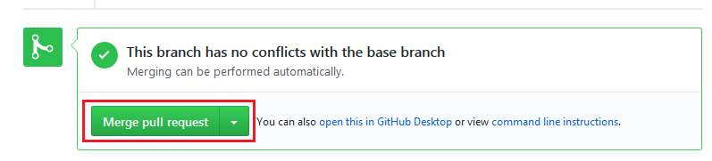

**************************
Hilf dem CometVisu Projekt
**************************

Die Mitarbeit am CometVisu Projekt ist problemlos möglich und auch höchst willkommen!
Hierbei sind nicht nur Entwickler angesprochen, die neue Features oder Bugfixes beitragen möchten, sondern
auch Anwender, die ihre eigenen Erfahrungen in die Verbesserung der Dokumentation einfliessen lassen möchten.

Allgemeine Vorbereitungen
-------------------------

Grundsätzlich gibt es keinen Unterschied in der Vorgehensweise, zwischen Änderungen am Sourcecode und Änderungen an
der Dokumentation, daher werden die Vorbereitungen dazu hier in allgemeiner Weise beschrieben. Die im folgenden beschriebenen
Schritte müssen einmalig gemacht werden.

Sowohl der Sourcecode als auch die Dokumentation werden im offiziellen Github-Repository des CometVisu-Projekts verwaltet:
`<https://github.com/CometVisu/CometVisu>`__

Um Mitzuarbeiten braucht man also einen kostenlosen Account bei Github. Ist dieser erstellt, muss man das CometVisu-Projekt
*forken*. Dazu führt man folgende Schritte aus:

#. Auf github.com einloggen
#. Auf diese Seite gehen `<https://github.com/CometVisu/CometVisu>`__
#. Auf den "Fork"-Button oben rechts klicken und den Anweisungen folgen

Damit hat man eine private Kopie des CometVisu-Repositories erstellt in dem man nach belieben eigene Ändungen vornehmen kann.
Natürlich ist es einfacher, wenn man die Dateien auf seinem lokalen Rechner hat um sie dort bearbeiten zu können.
Dazu muss man seine private Kopie des CometVisu-Repositories *clonen*. Zum lokalen Arbeiten mit den Dateien braucht man einen
*git client*. Diesen gibt es z.B. für die Kommandozeile aber auch in diversen grafischen Ausführungen. Da die Vorgehensweisen
und Begriffe bei allen Clients ähnlich sind, wird im weiteren Verlauf der Kommandozeilen-Client als Referenz benutzt.
Zum 'clonen' des Repositories führt man folgende Schritte aus:

#. Kommandozeile öffnen
#. in einen Ordner gehen in dem der Unterordner des Projekts erstellt werden soll
#. ``git clone https://github.com/<ihr-github-benutzername>/CometVisu.git`` (<ihr-github-benutzername> ersetzen durch den eigenen Benutzernamen)
#. in den Projekt-Ordner gehen und die Submodule (Icons und Qooxdoo-Framework) wie folgt nachladen
#. ``git submodule init``
#. ``git submodule update``
 
das wars schon, die lokale Arbeitskopie liegt dann im *CometVisu* Unterordner. Damit sind alle Vorbereitungen getroffen.

Allgemeine Vorgehensweise
-------------------------

Wenn man nun eine Änderung durchführen möchte, sollte man sich an die hier beschriebene Vorgehensweise halten. Auch
wenn Sie auf den ersten Blick unnötig kompliziert erscheinen, vor allem wenn man nur Kleinigkeiten ändern möchte.
Die Erfahrungswerte zeigen, dass man auf Dauer weniger Probleme hat, wenn man sich immer an diesen Workflow hält und
er damit zu Gewohnheit wird. Und so sieht der Workflow aus, zunächst als Übersicht ohne Details:

1. Neuen *branch* erstellen
2. die gewünschten Änderungen durchführen
3. Änderungen im lokalen Repository speichern (das ist was anderes als "Datei speichern")
4. Die Schritte 2. + 3. können beliebig oft wiederholt werden, bis man der Meinung ist, das man alle Änderungen gemacht hat
5. Änderungen ins private Github Repository laden
6. beantragen, dass die Änderungen ins offizielle Repository übernommen werden

Und nun noch einmal dieselben Schritte im Detail:

1. Auf Kommandozeile in das Verzeichnis mit dem lokalen Repository wechseln
   ``git checkout -b name-des-branches`` (Der Name des neuen Branches kann frei gewählt werden, es darf nur kein existierender sein)
2. Die gewünschten Dateien mit einem Editor nach Wahl bearbeiten und speichern
3. ``git commit -a -m "Kurze Beschreibung der Änderung"`` (Die Beschreibung nach Möglichkeit auf Englisch formulieren). 
   Mit ``git status`` kann zunächst nochmal geprüft werden, welche Änderungen alle *commited* werden. 
4. s.o.
5. ``git push``
6. Auf die Github-Seite des private Repositories gehen und auf *new pull request* klicken.
   Auf der folgenden Seite *Comparing changes* rechts neben dem Button *head fork: <benutzername>/CometVisu* findet
   sich der Button *compare: <branch-name>*. Drauf klicken und den Branch mit den Änderungen auswählen.
   Dann bekommt man nochmal eine Übersicht mit den Änderungen und kann auf den grünen Button namens
   *Create pull request* (grüner Button oben links) klicken.
   Dann kann man nochmal Beschreiben, welche Änderungen der Pull-Request beeinhaltet.
   In der Regel ist das aber bereits ausreichend vorausgefüllt und man kann durch klicken auf
   "Create pull request" (grüner Button unten rechts). Damit ist der Pull-Request erstellt

Jetzt muss man warten bis einer der Maintainer des CometVisu-Projekts des Pull-Request *reviewed*.
Außerdem werden einige automatisierte Checks auf dem Pull-Request ausgeführt um mögliche Probleme zu erkennen.
Sollte alles in Ordnung sein, wird der Pull-Request vom Maintainer *gemerged* und damit sind die Änderungen
Teil des CometVisu-Projekts. Sollte der Maintainer Verbesserungsvorschläge haben, wird er dies durch Kommentare
im Pull-Request tun. Ist dies der Fall, kommt nun der Vorteil des im Schritt 1. erstellen extra Branches zum Tragen.
Man muss nähmlich nur die Schritte 2., 3. und 5. ausführen um die Korrekturwünsche des Maintainers auszuführen.
Damit sind die Änderungen automatisch Teil des vorhandenen Pull-Requests.

Sind alle Änderungen abgestimmt und übernommen worden, kann der Branch gelöscht werden.
``git branch -D name-des-branches``

Wenn man z.B. schon mit neuen Änderungen in einem neuen Branch begonnen hat, kann man beliebig zwischen den Branches
hin und her wechseln und so sogar mehrere Pull-Requests und Änderungen gleichzeitig bearbeiten ohne diese inhaltlich
zu vermischen. In einen anderen Branch wechseln kann man immer nach einem commit (siehe Schritt 3.) mit
``git checkout name-des-branches``.

Repositories synchron halten
----------------------------

Über github.com
^^^^^^^^^^^^^^^

Um die von anderen Entwicklern *gemergeden* Änderungen mit dem eigenen Fork synchron zu halten, muss ein Pull-Request  
vom privaten Repository aus gemacht werden. In der Zeile *This branch is ... commits ahead of CometVisu:develop.* zeigt 
an, wieviele Änderungen seit der letzten Synchronisierung vorgenommen wurden. Direkt daneben befindet sich der Link zum *Pull Request*, 
welcher in der darauffolgenden Seite die Änderungen anzeigt, die in das private Repository *gemerged* werden können. 

.. figure:: doc/_static/pull_request_sync.png

	Pull Request für Synchronisation zwischen Haupt- und privaten Repository

.. figure:: doc/_static/github_sync2.png

	Vergleich der Änderungen

.. IMPORTANT::

	Wichtig bei diesem Vergleich ist, dass der eigene *base fork* links und der offizielle *head fork* rechts steht.

	Merge pull request erzeugen

Das Akzeptieren aller Änderungen synchronisiert die Änderungen vom Haupt-Repository auf das private Repository.   

.. figure:: doc/_static/github_sync4.png

	Merge bestätigen

.. figure:: doc/_static/github_sync5.png

	Erfolgreiche Synchronisierung   
     
Die lokale Kopie des privaten Repositories muss dann ebenso aktualisiert werden. Dazu muss im lokalen Repository in den Branch 
*develop* gewechselt werden (``git checkout develop``), dort werden alle abgestimmten Änderungen der Entwickler *gemerged*.
Mit dem Befehl ``git pull`` erfolgt die Synchronisation zwischen lokalem und privatem Repository. Nachdem nun alle Repositories 
wieder synchron sind, kann wie oben unter 1. beschrieben mit neuen Änderungen an der Dokumentation fortgefahren werden.

Über die Kommandozeile
^^^^^^^^^^^^^^^^^^^^^^

Natürlich kann man den lokalen Klon seines Repositories auch rein über Kommandozeilenbefehle komfortabel synchron halten.
Um dieses möglichst einfach zu machen, muss man die *Remotes* seines lokalen Klons entsprechend konfigurieren.

.. HINT::
    Für die folgenden Beispiele wird angenommen, dass man den Usernamen ``gh-user`` hat und das CometVisu Repository über SSH
    geklont wurde (``git clone git@github.com:gh-user/CometVisu.git``). Wenn über HTTPS geklont wurde
    (``https://github.com/CometVisu/CometVisu.git``) sehen die URLs entsprechend anders aus.

Zusammenfassung
"""""""""""""""

.. code-block:: bash

    # aktuelle Einstellungen abfragen
    git remote -v
    >>> origin	git@github.com:gh-user/CometVisu.git (fetch)
    >>> origin	git@github.com:gh-user/CometVisu.git (push)

    # Aktualisierungen vom original Repository holen
    git remote set-url origin git@github.com:CometVisu/CometVisu.git

    # aktuelle Einstellungen prüfen
    git remote -v
    >>> origin	git@github.com:CometVisu/CometVisu.git (fetch)
    >>> origin	git@github.com:gh-user/CometVisu.git (push)

    # develop branch mit original Repository synchronisieren
    git checkout develop
    git pull

Ausführliche Vorgehensweise
"""""""""""""""""""""""""""

Die aktuellen Einstellungen kann man mit dem Befehl ``git remote -v`` abfragen.
Üblicherweise liefert das folgende Werte:

.. code-block:: bash

    origin	git@github.com:gh-user/CometVisu.git (fetch)
    origin	git@github.com:gh-user/CometVisu.git (push)

Das bedeuted, dass git beim Aktualisieren (*fetch*, *pull*) und auch beim *pushen* den Fork des Users auf github benutzt.
Man möchte nun aber möglichst einfach Änderungen auf dem Haupt-Repository in den lokalen Klon laden. Dazu ändert man die
*fetch* URL des remotes mit folgendem Befehl: ``git remote set-url origin git@github.com:CometVisu/CometVisu.git``.
Danach sollte ``git remote -v`` folgende Ausgabe liefern:

.. code-block:: bash

    origin	git@github.com:CometVisu/CometVisu.git (fetch)
    origin	git@github.com:gh-user/CometVisu.git (push)

Damit sind die Vorraussetzungen erfüllt und man kann seinen lokalen *develop* Branch (dieser enthält die neuesten Weiterenwicklungen)
ganz einfach durch ein ``git pull`` aktualisieren.

.. HINT::
    Diese Vorgehensweise ist nur ratsam, wenn man nur an einem Rechner Änderungen an der CometVisu vornimmt.
    Wenn man gleichzeitig mehrere Rechner benutzt, muss man zwangsläufig die Änderungen die man von dem anderen Rechner
    in den eigenen Fork *gepushed* hat in den lokalen Klon bekommen. Dazu kann man ein zweites Remote einrichten mit
    ``git remote add fork git@github.com:gh-user/CometVisu.git`` und dann davon *pullen*
    ``git pull fork develop``

.. TODO::

    * weitere nützliche Git-Befehle (branches löschen, status, ...)
    * Merge-Konflikte
    * Ablauf-Diagramm für Workflow Änderung -> Pull-Request

Mithilfe bei der Dokumentation
------------------------------

Die CometVisu Dokumentation wird mit Hilfe des `Sphinx - Python Documentation Generators <http://www.sphinx-doc.org/>`__
erzeugt. Geschrieben wird die Dokumentation daher im reStructuredText-Format (kurz. RST). Hierbei handelt es sich
um eine vereinfachte Auszeichnungssprache, die in der reinen Textform gut lesbar ist und den Vorteil hat, einfach
in andere Formate umgewandelt zu werden [RST-Wiki]_ .

Zum tieferen Einstieg in die Syntax des RST-Formats sind folgende Links geeignet:

* `Cheat sheet <http://openalea.gforge.inria.fr/doc/openalea/doc/_build/html/source/sphinx/rest_syntax.html>`__
* `Sphinx Dokumentation <http://www.sphinx-doc.org/en/stable/rest.html>`__

Eine allgemeine Einführung, welche sowohl die wichtigsten Grundlagen der Syntax liefert, als auch auf spezielle
in der CometVisu Dokumentation benutzten Besonderheiten eingeht, soll jedoch dieser Abschnitt liefern.
Mit dem Wissen dieses Abschnitts sollte es möglich sein, eigene Beiträge für die Dokumentation zu schreiben.

.. toctree::
    :maxdepth: 2

    doc/rst

.. toctree::
    :hidden:

    todos

Lokales Erzeugen der HTML-Doku
^^^^^^^^^^^^^^^^^^^^^^^^^^^^^^

.. TODO::

    * Lokales Erzeugen der HTML-Doku, inkl. Screenshots

Über den Befehl ``./cv doc`` wird die deutsche Dokumentation aus den RST nach
HTML übersetzt. Für die englische Version muss ``./cv doc -l en`` aufgerufen
werden. Zum ausführen der Befehle muss man sich im Hauptverzeichnis der
CometVisu befinden.

Wenn alles gut funktioniert, sollte das script wie folgt starten.

.. figure:: doc/_static/start_docu_build.png

    Start building

Nach dem Build Prozess sollte die neue Dokumentation unter 
``doc/manual/de/_build/html/`` und/oder ``doc/manual/en/_build/html/``
zu finden sein.

.. IMPORTANT::

    Sollte das Projekt richtig eingerichtet sein, die Dokumentationserzeugung
    dennoch aufgrund unerfüllter Abhängigkeiten fehlschlagen, so ist zu prüfen,
    ob die gleichen Python Versionen (insb. Python 2 vs. Python 3) verwendet
    werden.

Dokumentation schreiben mit VisualStudio Code
^^^^^^^^^^^^^^^^^^^^^^^^^^^^^^^^^^^^^^^^^^^^^

Der Editor `Visual Studio Code <https://code.visualstudio.com>`__ bietet ein Plugin, mit dessen Hilfe man sich eine
Live Preview der geschriebenen Dokumentation anzeigen lassen kann. 

.. IMPORTANT::

      Einige der verwendeten Tools stehen nur unter Linux zur Verfügung. Das Live Preview steht daher in Visual Studio 
      Code unter Windows derzeit nicht zur Verfügung. Für Windows Anwender wird daher Visual Studio Code in einer 
      Virtual Machine mit Linux (Ubuntu, Mint, ...) empfohlen. 
      Siehe :doc:`VM Einrichten <howto-vm>` für eine detaillierte Vorgehensweise.

Nach Installation des Editors muss darin die Extension ``restructuredtext`` (über Shft + Ctrl + X
oder den Menüpunkt Anzeigen -> Extensions) installiert werden. Suche nach
*restructuredtext* innerhalb der extensions. Zusätzlich wird noch eine Spell checking
Extension empfohlen.

.. figure:: doc/_static/visual_studio_install_ext.png

    Install extensions

Nach einmaligem Neuladen des Editors steht diese zur Verfügung.

Damit die Live Preview funktioniert muss Python installiert sein.
Eine Anleitung um die nötigen Vorraussetzungen zu schaffen findet man hier:
`Install Sphinx <https://github.com/vscode-restructuredtext/vscode-restructuredtext/blob/master/docs/sphinx.md>`__. 
Um die erforderlichen Tools zu installieren, den Befehl ``sudo -H pip install -r utils/requirements.txt`` im 
CometVisu Verzeichnis ausführen. 

Wenn Sphinx korrekt arbeitet, so bekommt man in der Fußzeile eine Auswahl
der Configs angezeigt

.. figure:: doc/_static/visual_studio_sphinx_select1.png

Durch Klicken auf die Fußzeile kann zwischen *de* oder *en* config 
für die Vorschau gewählt werden. Wenn Sie also an der deutschen Dokumentation
arbeiten, stellen Sie dies sicher das *de* ist ausgewählt, andernfalls wird die
korrekte Vorschau nicht angezeigt.

.. figure:: doc/_static/visual_studio_sphinx_select2.png

    Select a Sphinx config

Ist alles korrekt eingerichtet, kann man eine RST-Datei aus der Dokumentation öffnen und mit ``Strg+Shift r`` das Live-Preview Fenster öffnen.
Änderungen an der RST-Datei, sollten dann mit kurzer Verzögerung automatisch in Preview Fenster zu sehen sein.

.. figure:: doc/_static/visual_studio_live_preview.png

   Ansicht des Editors mit Live-Preview

.. toctree::
    :hidden:

    howto-vm

Mithilfe bei der Entwicklung
----------------------------

.. TODO::

    * Beschreibung der Grundstruktur, wo was zu finden ist.
    * Einführung ins Build-Systemmit *grunt*
    * Style-Guide
    * JSDoc inkl. widget-examples
    * ..

.. toctree::
    :glob:

    dev/test

Fehlerbericht erstellen
-----------------------

Fehlerberichte sollten nach Möglichkeit durch Anlegen eines Issues auf `github.com <https://github.com/CometVisu/CometVisu/issues>`__
erfolgen. Bevorzugte Sprache ist hier Englisch. Der Fehlerbericht sollte aus folgenden Teilen bestehen, die so detailliert wie möglich
ausformuliert sind.

1. Welche Schritte sind nötig um das Fehlverhalten hervorzurufen
2. Eine detaillierte Fehlerbeschreibung
3. Wie würde das korrekte Verhalten aus Sicht des Autors aussehen
4. [Optional] eine Logdatei mit aufgezeichnetem Fehler

.. HINT::

    Bei Unsicherheiten bzgl. des Fehlers kann zunächst im `KNX-User-Forum <https://knx-user-forum.de/forum/supportforen/cometvisu>`__
    oder auf `Gitter <https://gitter.im/CometVisu/CometVisu_DE>`__ um Rat gefragt werden.

Fehlerberichte mit Replay-Dateien
^^^^^^^^^^^^^^^^^^^^^^^^^^^^^^^^^

Ab Version 0.11.0 steht eine zusätzliche Möglichkeit zur Verfügung, den Entwicklern die Fehlersuche zu erleichtern
und die Fehlerberichte zu verbessern. Benutzer können das Verhalten der CometVisu aufzeichnen und eine sogenannte
Replay-Datei zu Verfügung stellen (am besten als Anhang an das Issue hängen).

.. HINT::

    Sie Aufzeichnung der Replay-Dateien kann mit dem URL-Parameter ``reporting=true`` aktiviert werden
    (siehe: :ref:`URL-Parameter <reporting>`). Sobald man den Fehler nachgestellt hat, kann die Replay-Datei durch Eingabe
    des Befehls ``downloadLog()`` in der Browserkonsole (öffnen mit F12-Taste) heruntergeladen werden.
    Neben dem automatischen Download der Datei, wird der Inhalt ebenfalls auf der Konsole
    ausgegeben. So kann man kontrollieren, welche Daten enthalten sind.

Die Replay-Dateien enthalten die Konfigurationsdatei, sämtliche Kommunikation mit dem Backend und die Benutzerinteraktionen
(z.B. Klicks auf Widgets usw.). Daher muss der Benutzer damit einverständen sein diese Daten zu veröffentlichen.
Eventuell ist es daher ratsam, denn Fehler mit einer abgewandelten Konfigurationsdatei zu erstellen, die z.B. keine
sensiblen Daten enthält.
Der große Vorteil dieser replay-Dateien ist aber, dass die Entwickler beim Abspielen eine originalgetreue
Nachbildung des Benutzersystems haben und somit in der Regel auch direkt den Fehler sehen, diesen beheben und direkt
testen können, ob die Fehlerkorrektur auch wirkt.

Natürlich gibt es auch Einschränkungen, denn nicht alles kann durch die Replay-Dateien aufgezeichnet werden.
Wenn ein Nutzer z.B. die vorhandenen Designs angepasst hat, eigene Icons/Bilder benutzt, die nicht Teil der
CometVisu sind, so fehlen diese beim Abspielen, da sie nicht Teil der Aufzeichnung sind.

.. [RST-Wiki] https://de.wikipedia.org/wiki/ReStructuredText
