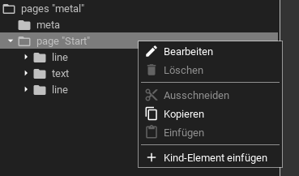

.. _editor:

Grafischer Editor
=================

Der grafische Editor wird über den :ref:`Manager <manager>` aufgerufen, wo es
alternativ auch einen Text-Editor gibt. Im Editor lässt sich eine Konfiguration
anpassen ohne dass man sich mit den Regeln der :ref:`XML Syntax <xml-format>`
auseinander setzen muss.

Aufbau
------

Der Editor besteht aus zwei Bereichen:

Links wird die Struktur der Konfiguration eingestellt, rechts wird eine Vorschau der Konfiguration angezeigt.
Oberhalb der Struktur auf der Linken Seite befindet sich noch ein Suchfeld mit dem eine textuelle Suche nach
einzelnen Widgets getätigt werden kann. Darüber ist eine Tab-Bar mit einigen Funktionen im Schnellzugriff:

Die Optionen der Menüleiste sind:

Editieren
  Öffnet den Bearbeiten-Dialog für die Attribute des gerade ausgewählten Elements in der Struktur. Sollte der Button
  ausgegraut sein, ist entweder kein Element ausgewählt, oder dieses kann nicht bearbeitet werden.

Löschen
  Löscht das gerade ausgewählte Element. Sollte der Button ausgegraut sein, dann ist entweder gerade kein Element
  ausgewählt, oder es darf nicht gelöscht werden.

Expertenansicht
  Schaltet erweiterte Konfigurationsmöglichkeiten frei.

Refresh
  Aktualisiert die Vorschau (die Vorschau wird nicht automatisch nach jeder Änderung aktualisiert, dies muss manuell
  über diesen Button geschehen)

Bedienung
---------

Man kann Elemente in der Struktur ausklappen indem man auf das kleine Dreieck-Icon ganz links klickt. Durch einen
Doppelklick öffnet sich der Dialog mit dem die Attribute eines Elements bearbeitet werden können. Erweiterte Funktionen
zu einem ausgewählten Element stehen per Kontextmenü, welches mit rechter Maustaste oder einen Klick + gedrückt halten
der Linken Maustaste (bzw. dem Finger auf Touchscreens) geöffnet werden kann.

Das Kontextmenü stellt folgenden Optionen zur Verfügung:

Bearbeiten
  Öffnet den Bearbeiten Dialog für die Attribute dieses Elements (sofern es editierbare Attribute gibt).

Löschen
  Löscht das Element

Ausschneiden
  Löscht das Element und kopiert es für die spätere Verwendung in die Zwischenablage.

Kopieren
  Kopiert das Element in die Zwischenablage

Einfügen
  Fügt das Element aus der Zwischenablage als neues Kind-Element des aktuell ausgewählten Elements ein.

Kind-Element einfügen
  Fügt dem aktuell ausgewählten Element ein neues Kind-Element hinzu.

Elemente können ebenfalls per Drag&Drop verschoben werden. Das Icon mit dem zwei parallelen Strichen rechts neben
einem jeweiligen Element zeigt an das dieses Icon via Drag&Drop verschoben werden kann. Fehlt dieses Icon, dann ist
das Verschieben dieses Elements nicht erlaubt.
Das Hinzufügen eines neuen Elements ist ebenfalls möglich indem man eine Drag&Drop Geste auf dem + Button
am unteren Rand der linken Seite startet und an der Ziel-Position beendet.

Erweitertes Setup
-----------------

Der Editor versucht den Anwender zu unterstützen in dem manche Daten als
Drop-Down-Liste vorbefüllt werden. Die meisten Daten kann der Editor
selbständig ableiten, manche benötigen aber eine Unterstützung durch den Anwender.

Adressen *(cgi-bin Backend für eibd/knxd)*
^^^^^^^^^^^^^^^^^^^^^^^^^^^^^^^^^^^^^^^^^^

Die KNX Gruppen-Adressen für die ``<address>`` Elemente können auf dem
WireGate der dort vorhandenen Datenbank entnommen werden. Auf anderen Systemen,
die das cgi-bin Backend verwenden,
können damit kompatible Dateien über den :doc:`Manager <manager>` unter den
Medien-Dateien hochgeladen werden. Hierzu sind diese drei Dateien nötig:

eibga.conf
""""""""""

Diese Datei enthält eine Liste aller Gruppenadressen mit Beschreibung und
Datenpunkt:

.. code-block:: ini

    [1/0/42]
    short = Wohnzimmer
    DPTSubId = 1.001
    ga = 1/0/42
    name = Wohnzimmer - Indirekte Beleuchtung - EinAus
    DPTId = 1
    DPT_SubTypeName = DPT_Switch

    [1/3/42]
    short = Wohnzimmer
    DPTSubId = 5.001
    ga = 1/3/42
    name = Wohnzimmer - Indirekte Beleuchtung - Rückmeldung Wert
    DPTId = 5
    DPT_SubTypeName = DPT_Scaling

    [1/5/42]
    short = Wohnzimmer
    DPTSubId = 5.001
    ga = 1/5/42
    name = Wohnzimmer - Indirekte Beleuchtung - Wert
    DPTId = 5
    DPT_SubTypeName = DPT_Scaling

    ...

eibga_hg.conf
"""""""""""""

Diese Datei enthält die Liste der Hauptgruppen:

.. code-block:: ini

    [0]

    name = Zentral

    [1]

    name = Beleuchtung

    ...

eibga_mg.conf
"""""""""""""

Diese Datei enthält die Liste der Mittelgruppen:

.. code-block:: ini

    [0]

    name = Kontakt

    [1]

    name = Rückmeldung

    ...