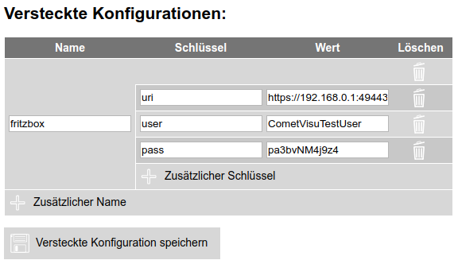

.. _hidden-config:

Versteckte Konfigurationen
==========================

Hintergrund
-----------

Die "Versteckten Konfigurationen" sind Konfigurationsdaten die nicht an den Client übertragen werden und auf dem
Server bleiben. Daher werden diese vor dem Anwender "versteckt", sind aber auf dem Server selbst im Klartext lesbar.
Auch im Manager sind diese Informationen im Klartext lesbar.

Dies erzeugt für sich noch keine sichere Umgebung. Jedoch lässt sich hierdurch eine sichere Umgebung aufbauen, in
dem der Webserver so konfiguriert sein muss, dass der Anwender keinen Zugriff auf den Manager erhält.

.. IMPORTANT::

    Wenn im Rahmen des Support ein :ref:`Fehler-Log <reporting>` an die Entwickler übergeben wird, so ist der Inhalt
    der versteckten Konfiguration nicht enthalten und bleiben somit auch vor den Entwicklern versteckt.

Ob und in welcher Form Widgets und Plugins Informationen aus der versteckten
Konfiguration benötigen wird in deren jeweiligen Dokumentation beschrieben.

Aufbau
------

Die versteckten Konfigurationen werden in der Datei ``config/hidden.php`` abgelegt. Diese Datei kann sowohl
über einen normalen Text-Editor als auch über den :ref:`Manager <manager>` editiert werden.

Der Inhalt besteht aus mehreren Einträgen die einen *Name* mit mehreren *Schlüssel* und *Wert* Paaren enthalten.
In der Datei selbst werden diese Informationen als PHP Array abgelegt:

.. code-block:: php

    <?php
    // File for configurations that shouldn't be shared with the user
    $hidden = array(
      'fritzbox' => array('uri' => 'https://192.168.0.1:49443/', 'user' => 'CometVisuTestUser', 'pass' => 'pa3bvNM4j9z4')
      'influx' => array('user' => 'InfluxDBTestUser', 'pass' => 'Xsdwfw324SEs')
    );
    ?>

Manager
-------

Komfortabel lässt sich der Inhalt der versteckten Konfiguration über den :ref:`Manager <manager>` editieren.

Bekannte ``Name`` Einträge
--------------------------

Auch wenn die Wahl für den ``Name`` grundsätzlich frei ist, so gibt es dafür übliche Einträge, bei denen es sich
anbietet diesem Schema zu folgen. So können manche Widgets bzw. Plugins ohne eine explizite Konfiguration in dem
für dafür üblichen Namen nach Einträgen suchen, wodurch sich der Konfigurations-Aufwand reduzieren lässt.

========  ==============  =======
Name      Verwendung      Default
========  ==============  =======
fritzbox  :ref:`tr064`
influx    :ref:`diagram`  X
========  ==============  =======
