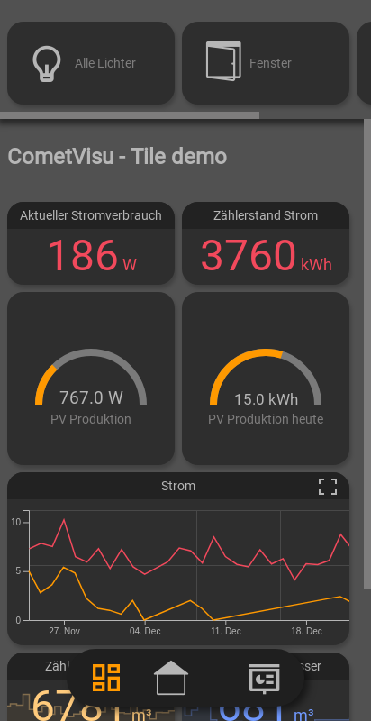

.. replaces:: CometVisu/0.8.x/manual/de
    CometVisu/Examples

***************************
Konfiguration der CometVisu
***************************

.. toctree::
    :hidden:

    manager
    editor

Die Konfiguration der CometVisu erfolgt durch Bearbeiten der XML-formatierten
Konfigurationsdatei „visu_config.xml“ im jeweiligen Unterverzeichnis "./config"
der CometVisu-Installation. Dies kann entweder mit einem textbasierten Editor oder
mit dem integrierten grafischen Editor erfolgen. Die Verwendung des grafischen Editors
setzt jedoch voraus, dass die CometVisu von einem PHP-fähigen Webserver (z.B Apache oder
Lighttpd) ausgeliefert wird und die Konfigurationsdatei durch diesen beschreibbar ist.

Am einfachsten greift man auf die verschiedenen Konfigurationsdateien über den
:doc:`Manager <manager>` zu.

Je nach verwendetem Backend und der Vorgehensweisen bei der Installation befindet
sich der CometVisu-Verzeichnisbaum an unterschiedlichen Stellen:

- Soll die CometVisu mit Hilfe des knxd-daemons unmittelbar an den KNX-Bus-Telegrammverkehr angebunden werden
  (KNX ist dann das Backend), wird die CometVisu manuell in den Verzeichnisbaum "/var/www/visu…" des Webservers
  (z.B. Apache oder Lighttpd) installiert. Der Webserver lauscht in der default-Einstellung in der Regel am Port 80.

- Da ab Version 0.12 kein spezielles Binding mehr benötigt wird, um die CometVisu mit openHAB als Backend zu benutzen,
  gelten hier die selben Regeln wir bei anderen Backends. Es wird empfohlen den Docker-Container zu benutzen,
  wie man diesen installiert und openHAB als Backend konfiguriert wird :ref:`hier <Docker_OpenHAB_Installation>` beschrieben.

Soll die XML-formatierte Konfigurationsdatei „visu_config.xml“ durch den
(fortgeschrittenen) Anwender direkt bearbeitet werden, ist es sehr ratsam,
hierzu einen XML-fähigen Editor zu verwenden, welcher u.a. die Syntax der besseren
Lesbarkeit einfärbt (z.B. Textwrangler auf MacOSX, WordPad++, Notepad++ oder
MS XML Editor 2007 unter Windows und unter Linux z.B. vi mit ":syntax on").

Allgemeine Informationen über das CometVisu XML Format findet man
:doc:`hier <xml-format>`, Informationen zu den einzelnen
Widgets in den jeweiligen Unterseiten.

Manche Widgets und Plugins benötigen noch zusätzliche Informationen, die nicht in der Config-Datei enthalten sein
sollen, da diese frei lesbar an den Web-Browser übertragen wird (je nach installierter Umgebung kann der Transport
verschlüsselt mit HTTPS erfolgen, jedoch ist der Inhalt durch den Benutzer am Browser mit entsprechenden Tricks
lesbar). Durch die Verwendung der :doc:`Versteckten Konfigurationen <hidden-config>` können diese Informationen auf dem besser
geschützten Server verbleiben.

Nach dem Speichern ist keinerlei Neustart von Prozessen nötig, jedoch
sollte man die Seite neu laden und den Browser-Cache löschen.

Wenn die XML Datei ungültig ist wird beim Laden der Visu im Webbrowser
eine Fehlermeldung angezeigt. Diese gibt im Normalfall schon genaue
Hinweise wo in der Datei der Fehler liegt. Man kann die Überprüfung (und
Darstellung) auch mit dem Link "Check Config" in der Fußzeile oder
durch Anhängen von check_config.php an den URL erzwingen.

.. toctree::
    :hidden:

    hidden-config
    url-params

Genaue Beschreibungen zu den verfügbaren URL-Parameter sind unter :doc:`URL-Parameter <url-params>` zu finden.

.. _visu-config-details:

Grundsätzliches
---------------

Zur Visualisierung und zum Auslösen von Aktionen wie z.B. Schalten oder
Jalousien verfahren bedient sich CometVisu sogenannter Widgets.
Widgets können als grafische Bausteine verstanden werden, die auf einer
darzustellenden Seite (= page) angeordnet werden. Ein Widget besteht aus
dem eigentlichen sichtbaren Bereich, der Maus- oder Tastereignisse empfängt
und weiterleitet und aus nicht sichtbaren Objekten, durch welche die
Funktionsweise des Widget detaillierter festgelegt werden.

Es wird zwischen Widgets zur

- Bedienung (hier z.B. das switch-Widget zum Schalten),

- Darstellung (diese haben ausschließlich informative Funktion),

- Anordnung oder Gruppierung anderer Widgets oder zur Navigation innerhalb der verschiedenen Seiten der Visualisierung (Sonstige Widgets)

unterschieden.

Eine kleine Ausnahme stellen die Plugin-Widgets dar. Diese müssen vor Verwendung
in der “meta-Sektion” der Konfigurationsdatei eingebunden sein.

Unterschiedliche Arten der Konfigurationsdatei
^^^^^^^^^^^^^^^^^^^^^^^^^^^^^^^^^^^^^^^^^^^^^^

Die CometVisu unterstützt unterschiedliche Arten von Konfigurationsdateien, im folgenden auch Strukturen genannt.
Die verfügbaren Strukturen "Pure" und "Tile" unterstützen unterschiedliche Designs:

+-------------------+----------------------------------+------------------------+
| **Struktur**      | Pure                             | Tile                   |
+-------------------+----------------------------------+------------------------+
| **Designs**       | :doc:`Metal <examples/swiss>`    | Tile                   |
+-------------------+----------------------------------+------------------------+
|                   | Pure                             |                        |
+-------------------+----------------------------------+------------------------+

.. HINT::

    Diese beiden Strukturen sind nicht miteinander kompatibel, d.h. je nachdem welches Design man nutzen möchte muss
    man sich eine Konfigurationsdatei in der Struktur anlegen, welche von diesem Design unterstützt wird.

Pure-Struktur
-------------

Der Aufbau der xml-formatierte Konfigurationsdatei ist in mehrere
Sektionen unterteilt, innerhalb derer alle weiteren Einträge verschachtelt und durch
Tags umschlossen aufgenommen werden:

-  :ref:`Der xml-Header <xml-format_header>`
-  :ref:`Plugins <xml-format_plugins>`
-  :ref:`Mappings <xml-format_mappings>`
-  :ref:`Stylings <xml-format_stylings>`
-  :ref:`Icons <xml-format_icons>`
-  :ref:`Statusbar <xml-format_statusbar>`
-  :ref:`Aufbau der Visu-Seiten <xml-format_pages>`

.. toctree::
    :hidden:

    xml-format

Navigationselemente in der Pure-Struktur
^^^^^^^^^^^^^^^^^^^^^^^^^^^^^^^^^^^^^^^^

Zur Navigation stehen in der Cometvisu zahlreiche Möglichkeiten für die Navigation durch den Benutzer zur Verfügung:  

-  Das :ref:`Page-Widget <page>` ruft die zugehörige Unterseite auf.
-  Die Top-Navigation Anzeige: zeigt den aktuellen Pfad und erlaubt auf übergeordnete Seiten
   zurück zu navigieren .
-  Der Zurück-Button des Browsers bzw. des Betriebssystems (zB. iOS, Android)  
-  Das Navbar-Widget in Verbindung mit Pagejump-Widgets
-  Das :ref:`Pagejump-Widget <pagejump>` erlaubt den Aufruf einer beliebigen Unterseite.
-  Das :ref:`Group-Widget <group>` kann mit der Option ``target=`` ebenfalls eine beliebige Unterseite aufrufen.
-  Eine Besonderheit ist der :ref:`Statusbar <xml-format_statusbar>` am unteren Bildschirmrand. Von dort können zB. externe URL aufgerufen werden.

.. figure:: _static/Navigation_withDescription.png
    
   Übersicht der wichtigsten Navigationselemente.

Ebenso sind verschiedene Funktionalitäten implementiert, die eine Navigation ohne Benutzereingriff bewirken:

-  Per KNX Gruppenadresse kann auf eine Unterseite gesprungen werden, wenn das Attribut ``ga=x/y/z`` in der zugehörigen 
   :ref:`Page Definition <page>` eingetragen ist.
-  Die Optionen ``screensave_time`` und ``screensave_page``. Damit wird nach Ablauf einer definierten Zeit eine festgelegte 
   Seite aufgerufen. 
-  Das :ref:`timeout-Plugin <timeout>` funktioniert ähnlich der screensave-Funktion, wird aber auch ausgeführt, wenn die Unterseite
   per GA aufgerufen wurde. 

Änderung der Metal-Designs
^^^^^^^^^^^^^^^^^^^^^^^^^^

In der Version 0.12 wurde das Metal-Design überarbeitet. Die Änderungen bestanden im Wesentlichen darin
Farbverläufe, Text-Schatten und die Schriftart zu verändern um eine moderate Modernisierung zu erreichen.

Die Änderungen können jedoch wieder zurückgesetzt werden indem eine zusätzliche CSS-Datei geladen wird.
Dies wird erreicht durch Hinzufügen des folgenden Texts in den Meta-Bereich der Konfigurationsdatei.

.. code-block:: xml

    <meta>
        <files>
            <file type="css">resource/designs/metal/version1.css</file>
        </files>
        ...
    </meta>

Grundlegende Elemente zum Gestalten des Layouts
^^^^^^^^^^^^^^^^^^^^^^^^^^^^^^^^^^^^^^^^^^^^^^^

In der CometVisu kann die Größe und Anordnung der Widgets mit dem Kind-Element ``Layout`` gesteuert werden. 
Damit kann ein "responsives Design" realisiert werden, dass sich an die Displaygröße des Endgerätes anpasst, vom dem
aus die CometVisu betrachtet wird. Dies erfolgt nicht nur zum Zeitpunkt des URL-Aufrufs, sondern dynamisch
zB. auch beim Drehen des Endgerätes vom Quer- ins Hochformat bzw. beim Ändern der Fenstergröße am PC.   

Innerhalb der Widgets stehen noch verschiedene Attribute wie ``width``, ``height``, etc. zur Verfügung. Damit kann
die Größe des Widgetinhalts (zB. Bild- und Diagrammgröße, etc.) gesteuert werden.

Detaillierte Beschreibungen zur Formatierung der Widgetgrößen- und -inhalte:

.. toctree::
    :hidden:

    layout
    size-attributes
 
-  :doc:`Layout <layout>` legt die Größe und Anordnung der Widgets fest 
-  :doc:`Width und Height <size-attributes>` beeinflusst die Größe des Widgetinhalts

Elemente für Konvertierung und Formatierung
^^^^^^^^^^^^^^^^^^^^^^^^^^^^^^^^^^^^^^^^^^^

In der CometVisu können Werte auf verschiedenste Art und Weisen
dargestellt werden. Hierfür können genutzt werden:

.. toctree::
    :hidden:

    flavour
    format
    mapping
    styling

-  :doc:`Format <format>` von Werten z.B. auf Anzahl der
   Nachkommastellen, Einheiten etc.
-  :doc:`Mapping <mapping>` erlaubt das Ersetzen von
   Zahlenwerten durch Texte (z.B. An/Aus statt 1/0) und Icons. (z.B. für
   Fensterkontakte)
-  :doc:`Styling <styling>` erlaubt das wertabhängige
   Färben von Werten (z.B. An in rot und Aus in Grün)
-  :doc:`Flavour <flavour>` ermöglicht in einigen Designs
   für einige Widgets noch zusätzliche Optionen.

Widgets in der Pure-Struktur
^^^^^^^^^^^^^^^^^^^^^^^^^^^^

Widgets sind die einzelnen Elemente aus denen eine CometVisu-Site
zusammengebaut wird. Diese können entweder fest in der CometVisu
eingebaut sein oder per Plugin-Schnittstelle integriert.

Die Beschreibung der Widgets kann man hier nachlesen:

.. toctree::

    widgets/index

Für die Konfiguration der Kommunikation des Widgets mit dem Backend werden
``address`` Elemente genutzt die im :ref:`Kapitel Adressen <address>` genauer
beschrieben werden.

.. toctree::
    :hidden:

    address

Pure-Struktur - Beispiele
^^^^^^^^^^^^^^^^^^^^^^^^^

Hier befindet sich mehrere Beispiele von Visualisierungen die sich im produktiven Einsatz befinden.

.. toctree::
    :maxdepth: 1
    :glob:

    examples/*

sonstiges
^^^^^^^^^

.. toctree::
    :maxdepth: 1

    notifications
    rrd_examples
    hydraulik
    customizing

Tile-Struktur
-------------

Die CometVisu bot seit jeher die Möglichkeit weitere Strukturen neben der vorhandenen pure-Struktur einzubinden.
Die Strukturen sind dafür verantwortlich eine Config-Datei im Browser darzustellen. Normalerweise geschieht dies
indem die Config-Datei eingelesen wird und daraus HTML-Code generiert wird.
Die Tile-Struktur geht hier einen anderen Weg, indem sie `Web-Components <https://wiki.selfhtml.org/wiki/HTML/Web_Components>`_
benutzt für spezielle Elemente und ansonsten bereits von Browser darstellbarer HTML-Code ist. Config-Dateien für die Tile-Struktur werden also
nicht in HTML-Code umgewandelt sondern direkt in den Browser geladen.

.. HINT::

    Bisherige Config-Dateien sind nicht mit der Tile-Struktur kompatibel! Dasselbe gilt für die bisher bekannten Plugins!
    Ebenso benötigen die benutzen Features einen modernen Browser (Chrome, Firefox, Safari, Edge in einer aktuellen Version)
    Der Internet Explorer wird in keiner Version unterstützt!

**Einige Vorteile der Tile-Struktur**

* Automatisches Anpassen an alle Bildschirmgrößen (responsives Design). Spezielle Layout-Angaben in der Konfigurationsdatei sind nicht nötig.
* Höhere Geschwindigkeit beim Laden, da die Konfigurationsdatei nicht mehr geparsed werden muss.
* Navigationsmenüs werden automatisch erstellt.
* Spezielle Widgets für Smarthome typische Aufgaben (Schalter, Dimmer, Rollladen, Raumtemperaturregler, Media-Player, Charts).
* Einfaches Erstellen eigener, wiederverwendbarer Widgets ohne Programmierkenntnisse.
* Entworfen nach dem "mobile-first" Ansatz, d.h. die gute Darstellung & Bedienbarkeit auf Handy-Bildschirmen hat oberste Priorität

   Demo der Tile-Struktur auf einem Handydisplay.

.. toctree::
    :maxdepth: 1

    structure-tile/index
