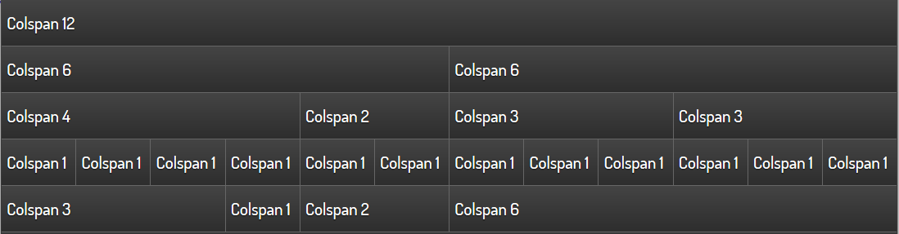
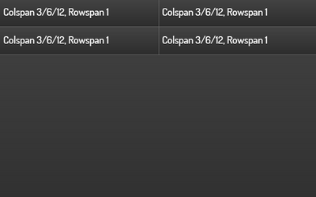

.. _layout:

====================================
Funktionen zur Steuerung des Layouts
====================================

.. TODO::

    * Unterscheidung Standardaufbau vs. 2D Seiten

Jedes Page-Element (=Seite der Visualisierung) wird grundsätzlich in 12 Spalten aufgeteilt. Das gilt auch bei 
Verwendung eines Navbars auf der linken oder rechten Seite. Das Page-Element nimmt in diesem Fall zwar einen 
schmaleren Bereich am Bildschirm ein, hat aber dennoch 12 Spalten. 

Das wichtigste Element zur Beeinflussung des Gesamtlayouts ist das Kind-Element ``layout``, das in allen 
sichtbaren Widgets zur Verfügung steht. Nachstehend sind am Beispiel des Line-Widgets alle Attribute aufgelistet, 
die in den nächsten Abschnitten genauer erklärt werden:

.. elements-information:: line

Das Attribut colspan
--------------------

Mit colspan wird festgelegt, wie viele Spalten das Widget auf einem großen Display einnehmen soll. Der Defaultwert
ist ``colspan="6"``, wenn keine Angabe erfolgt. Dies legt die Widgetbreite auf die Hälfte der Page-Größe fest. 
Somit passen 2 Widgets nebeneinander, erst dann wird die nächste Reihe mit dem nächsten Widget begonnen.

Das Colspan-Attribut kann auch nicht ganzzahlige Angaben enthalten es sollte aber (aus optischen Gründen) darauf 
geachtet werden, dass die Summe der colspan-Definitionen je Reihe wieder 12 ergibt.  

    
   Einfache Text-Widgets mit verschiedenen colspan-Werten

Der Spezialfall ``colpan = "0"`` erzeugt ein Widget mit der Mindestbreite des Inhaltes. 

Für jedes Widget kann mit ``colspan-m`` bzw. ``colspan-s`` auch eine Widgetbreite für kleinere Displays angegeben werden.
Dies ist notwendig, da in der Praxis die Schriftgröße und die Größe der Bedienflächen (zB. Buttongröße) anders skalieren
als die tatsächliche Displaygröße.
Des weiteren kann mit ``colspan-m`` und ``colspan-s`` auch das Layout im Hochformat beeinflusst werden, wenn die gleiche config 
auf mehreren Devices verwendet wird oder auf einem Gerät beim Drehen des Bildschirms die Anzeige anders angeordnet werden
soll.

.. IMPORTANT::

      Ob ein Display als normal, medium oder small erkannt wird, hängt nicht von der physikalischen Auflösung des Displays
      ab,sondern von der Viewport Größe, die für jedes Gerät auf Basis der Displaygröße (Bildschirmdiagonale) definiert 
      ist. Eine Übersicht liefert zB. `<viewportsizes.com>`__

Nachfolgend wird ein Beispiel gezeigt, bei dem die Widgets auf 3 Displaygrößen unterschiedlich angeordnet werden.

.. code-block:: xml

    <text>
        <layout colspan="3" colspan-m="6" colspan-s="12" rowspan="1"/>
        <label>Colspan 3/6/12, Rowspan 1</label>
    </text>
    <text>
        <layout colspan="3" colspan-m="6" colspan-s="12" rowspan="1"/>
        <label>Colspan 3/6/12, Rowspan 1</label>
    </text>
    <text>
        <layout colspan="3" colspan-m="6" colspan-s="12" rowspan="1"/>
        <label>Colspan 3/6/12, Rowspan 1</label>
    </text>
    <text>
        <layout colspan="3" colspan-m="6" colspan-s="12" rowspan="1"/>
        <label>Colspan 3/6/12, Rowspan 1</label>
    </text>

.. figure:: _static/Layout_colspan_screensize_large.png
    
   Darstellung bei einer Auflösung von 1100x640

    
   Darstellung bei einer Auflösung von 640x400 (Smartphone im Querformat)

.. figure:: _static/Layout_colspan_screensize_small_400x640.png
    
   Darstellung bei einer Auflösung von 400x640 (Smartphone im Hochformat)

Das Attribut rowspan
--------------------

Mit ``rowspan`` wird die Anzahl der Zeilen festgelegt, die ein Widget einnimmt. Derzeit sind nur ganzzahlige Angaben für
``rowspan`` erlaubt. Für die meisten Widgets ist die Angabe von ``rowspan`` nicht erforderlich, da der default-Wert 
``rowspan="1"`` ausreichend ist.

Notwendig bzw. sinnvoll kann die Angabe bei folgenden Widgets sein:

-  Image
-  Web
-  Rsslog- und Rss-plugin
-  Diagram-plugin
-  Group

Im nachstehenden Beispiel erzwingt das ``rowspan="5"``, dass das Image-Widget gleich hoch ist, wie die fünf einzelnen
Widgets auf der linken Seite. 

.. figure:: _static/Layout_rowspan_mitImage.png
    
   Image-Widget mit rowspan="5"  

Da die Widget-Anordnung nacheinander in Reihen erfolgt, können bei Anwendung von unterschiedlichen Werten für 
``rowspan`` leere Bereiche entstehen. 

.. figure:: _static/Layout_rowspan.png
    
   Leere Bereiche im Zusammenspiel mit dem rowspan-Element  

Abhilfe schafft in solchen Fällen die Verwendung das Group-Widget in verbindung mit dem nowidget-Attribut. 

.. figure:: _static/Layout_rowspan_mitGroup.png
    
   Steuerung der Anordnung mit einer unsichtbaren Gruppe (Attribut ``nowidget="true"``)

Nachstehend der xml-Code für den Screenshot mit korrekter Anordnung. 

.. code-block:: xml

    <group nowidget="true">
        <layout colspan="6"/>
        <text>
            <layout colspan="6" rowspan="1"/>
            <label>Colspan 6, Rowspan 1</label>
        </text>
        <text>
            <layout colspan="6" rowspan="1"/>
            <label>Colspan 6, Rowspan 1</label>
        </text>
        <text>
            <layout colspan="6" rowspan="1"/>
            <label>Colspan 6, Rowspan 1</label>
        </text>
    </group>
    <text>
        <layout colspan="6" rowspan="3"/>
        <label>Colspan 6, Rowspan 3</label>
    </text>

