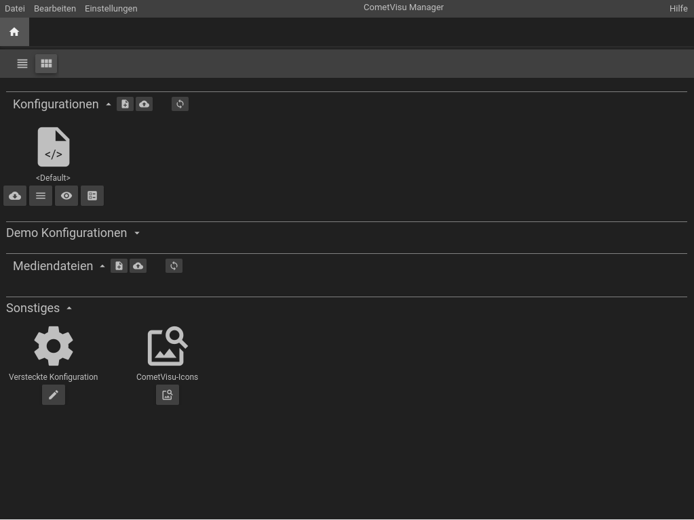
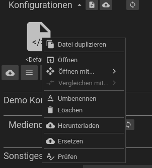
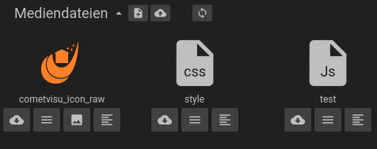
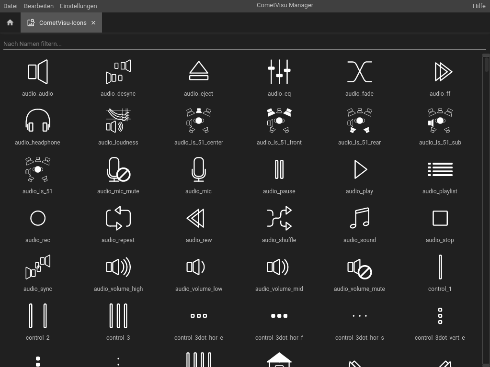

.. _manager:

Der CometVisu Manager
=====================

Der Manager lässt über eine einfache grafische Oberfläche die verschiedensten
Konfigurationsdateien verwalten (anlegen, bearbeiten, ersetzen, löschen).
Außerdem können die die :ref:`versteckten Konfigurationen <hidden-config>` so wie
Medien-Dateien (z.B. Hintergrundbilder) verwaltet werden.

Die jeweiligen Funktionen sind über Menüs, Toolbars oder Buttons erreichbar. Die Startseite des Managers setzt sich aus
folgenden Komponenten zusammen (von oben nach unten):

* Menüleiste ganz oben für generelle Funktionen
* Tab-Leiste zur Anzeige der gerade geöffneten Dateien.
* Tab-Bar zum Wechsel zwischen einer tabellarischen und einer Vorschau-Ansicht.
* Der Liste der Konfigurationsdateien mit eigener Tab-Bar für spezifische Funktionen.
* Der Liste der Demo-Konfigurationsdateien (muss ausgeklappt werden durch Klick auf den Titel)
* Der Liste der Mediendateien (sofern vorhanden)
* Speziellen Funktionen, wie die Versteckte Konfiguration oder eine Ansicht aller Icons.

Verfügbare CometVisu Konfigurationen
------------------------------------

In der Liste werden alle verfügbaren Konfigurationen aufgelistet, aufgeteilt in "normale", editierbare
Konfigurationsdateien und nicht-editierbare Demo-Konfigurationen. Unter jeder Konfigurationsdatei
befindet sich eine Listen mit Buttons, die den Schnellzugriff auf die wichtigsten Funktionen bereitstellen.
Damit kann die Datei heruntergeladen, angesehen oder bearbeitet werden. Weitere Funktionen sind über ein
Kontextmenü, welches über einen Klick mit der rechten Maustaste auf das Datei-Symbol oder einem Klick mit der
linken Maustaste auf den 2. Button unter dem Dateisymbol geöffnet werden kann.

Duplizieren
  Legt eine Kopie der Konfiguration unter anderem Namen an.

Öffnen
  Öffnet die Konfiguration mit dem voreingestellen Standard-Editor (Diese Einstellung kann über die oberste Menüleiste
  unter Einstellungen angepasst werden).

Öffnen mit
  Konfigurationsdateien können normal geöffnet oder in 2 verschiedenen Editoren bearbeitet werden.

Vergleichen mit
  Steht nur zur Verfügung, wenn die Konfigurationsdatei bereits geändert worden ist. Dann kann die aktuelle Version
  mit älteren Versionen verglichen werden, um ein genaueres Bild von den Änderungen zu bekommen.

Umbenennen
  Ändern des Dateinamens.

Löschen
  Löscht die Konfiguration.

Herunterladen
  Lädt die Konfiguration herunter, so dass diese lokal gesichert oder bearbeitet
  werden kann.

Ersetzen
  Lädt eine Konfiguration hoch und ersetzt die bestehende.

Prüfen
  Überprüft die Validität der Konfiguration, also ob die Syntax der
  :ref:`XML-Datei <xml-format>` gültig ist.

Verfügbare Mediendateien
------------------------

Die eigene Konfiguration lässt sich durch Dateien erweitern. Typische Beispiele
sind Hintergrundbilder oder eigene CSS Regeln um ein Design nach persönlichen
Vorlieben abzuändern. Textdateien wie z.B. CSS- oder Javascript-Dateien können
mit dem eingebauten Texteditor direkt bearbeitet werden, anderen Dateien wie z.B. Bilder
können hochgeladen, ersetzt oder gelöscht werden.

Je nach Art der Mediendatei stehen unterschiedliche Möglichkeiten zur Verfügung.
Bilder werden direkt als kleine Vorschau dargestellt, können herunter geladen oder geöffnet werden.
Bei speziellen Text-basierten Bildformaten wie SVG besteht auch die Möglichkeit diese direkt im Texteditor zu bearbeiten.

Versteckte Konfigurationen
--------------------------

Manche Plugins benötigen Konfigurationseinstellungen die nicht an den Browser
übertragen werden sollen. Dies wird im Handbuch unter
:ref:`Versteckte Konfigurationen <hidden-config>` genauer beschrieben.

CometVisu-Icons
---------------

Zeigt eine filterbare Liste mit allen in der CometVisu zur Verfügung stehenden Icons.

