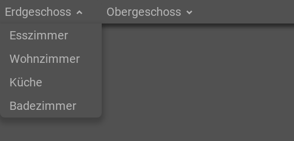

.. _tile-component-menu:

Menu
....

.. api-doc:: cv.ui.structure.tile.components.Menu

Diese Komponente erzeugt ein Navigationsmenü aus einem Modell. Momentan sind folgenden Modelle verfügbar:

=============== =======================================
``pages``       :ref:`tile-nav-menu`
``menuItems``   :ref:`tile-item-menu`
=============== =======================================

.. _tile-nav-menu:

Navigationsmenü aus Seitenstruktur
^^^^^^^^^^^^^^^^^^^^^^^^^^^^^^^^^^

    Navigationsmenü aus Seitenstruktur

.. widget-example::

        <settings design="tile" selector="nav">
            <screenshot name="tile-nav-menu-mobile-closed" screen-width="400">
                <caption>Menü auf kleinen Bildschirmen, geschlossen</caption>
            </screenshot>
            <screenshot name="tile-nav-menu-mobile-open" screen-width="400" clickpath="cv-menu > a.menu" waitfor="cv-menu.responsive li">
                <caption>Menü auf kleinen Bildschirmen, geöffnet</caption>
            </screenshot>
        </settings>
        <header>
            <nav>
                <cv-menu model="pages"/>
            </nav>
        </header>
        <main>
            <cv-page id="eg" name="Erdgeschoss">
                <cv-page id="ez" name="Esszimmer" />
                <cv-page id="wz" name="Wohnzimmer" />
                <cv-page id="ku" name="Küche" />
                <cv-page id="bad" name="Badezimmer" />
            </cv-page>
             <cv-page id="og" name="Obergeschoss">
                <cv-page id="sz" name="Schlafzimmer" />
                <cv-page id="kz1" name="Kinderzimmer 1" />
                <cv-page id="kz2" name="Kinderzimmer 2" />
                <cv-page id="badOg" name="Badezimmer" />
            </cv-page>
        </main>

Es gibt unterschiedliche Darstellungsarten des Menüs, die über das ``appearance``-Attribut gesteuert werden.
Die möglichen Werte sind

=====================   =======================
Darstellungsart         Erklärung
=====================   =======================
text                    Standardeinstellung, Focus liegt auf dem Seitennamen, das Icon wird in der selben Größe neben den Namen angezeigt.
icons                   Focus liegt auf dem Icon, großes Icon und kleinere Seitennamen darunter. Benötigt ein Icon für jede Seite auf der obersten Navigationsebene.
dock                    Nur im `<footer>` möglich, Aussehen wie bei "icons" jedoch wird das Menü in der Mitte über dem Seiteninhalt angezeigt.
=====================   =======================

.. widget-example::

      <settings design="tile" selector="nav">
            <screenshot name="tile-nav-menu-icons" clickpath="cv-menu > ul > li:first-child > .details" waitfor="cv-menu > ul > li:first-child > .details > ul" margin="0 -800 200 0">
                <caption>Icons Darstellungsart</caption>
            </screenshot>
        </settings>
        <header>
            <nav>
                <cv-menu model="pages" appearance="icons"/>
            </nav>
        </header>
        <main>
            <cv-page id="eg" name="Erdgeschoss" icon="knxuf-control_building_modern02_okg_eg">
                <cv-page id="ez" name="Esszimmer" />
                <cv-page id="wz" name="Wohnzimmer" />
                <cv-page id="ku" name="Küche" />
                <cv-page id="bad" name="Badezimmer" />
            </cv-page>
             <cv-page id="og" name="Obergeschoss" icon="knxuf-control_building_modern02_okg_og">
                <cv-page id="sz" name="Schlafzimmer" />
                <cv-page id="kz1" name="Kinderzimmer 1" />
                <cv-page id="kz2" name="Kinderzimmer 2" />
                <cv-page id="badOg" name="Badezimmer" />
            </cv-page>
        </main>

.. widget-example::

      <settings design="tile" selector="nav">
            <screenshot name="tile-nav-menu-dock" selector="cv-menu" waitfor="cv-menu > ul > li:first-child > .details" margin="10 10 10 10">
                <caption>Dock Darstellungsart im Footer</caption>
            </screenshot>
        </settings>
        <main>
            <cv-page id="eg" name="Erdgeschoss" icon="knxuf-control_building_modern02_okg_eg">
                <cv-page id="ez" name="Esszimmer" />
                <cv-page id="wz" name="Wohnzimmer" />
                <cv-page id="ku" name="Küche" />
                <cv-page id="bad" name="Badezimmer" />
            </cv-page>
             <cv-page id="og" name="Obergeschoss" icon="knxuf-control_building_modern02_okg_og">
                <cv-page id="sz" name="Schlafzimmer" />
                <cv-page id="kz1" name="Kinderzimmer 1" />
                <cv-page id="kz2" name="Kinderzimmer 2" />
                <cv-page id="badOg" name="Badezimmer" />
            </cv-page>
        </main>
        <footer>
            <nav>
                <cv-menu model="pages" appearance="dock"/>
            </nav>
        </footer>

.. _tile-item-menu:

Menü aus einzelnen Menü-Items
^^^^^^^^^^^^^^^^^^^^^^^^^^^^^

Das folgende Beispiel fügt einer Kachel ein Menü mit zwei Einträgen hinzu. Dies bietet die Möglichkeit zusätzliche Einstellungen
in einer Kachel unterzubringen. Der erste Menü-Eintrag öffnet ein Popup (welches in diesem Beispiel nicht weiter definiert ist),
der zweite fungiert als Schalter.

.. widget-example::

        <settings design="tile">
            <screenshot name="tile-context-menu-closed" selector="cv-widget">
                <caption>Kachel mit Menü-Button</caption>
            </screenshot>
            <screenshot name="tile-context-menu-open" selector="cv-widget" margin="0 50 0 0" clickpath="cv-menu" waitfor="cv-menu.open > ul.context-menu">
                <caption>Menü geöffnet</caption>
            </screenshot>
        </settings>
        <cv-widget>
            <cv-tile>
                <cv-menu model="menuItems">
                    <cv-menu-item name="Favoriten" action="popup" icon="ri-star-line">
                        <cv-popup title="Favoriten" modal="true"></cv-popup>
                    </cv-menu-item>
                    <cv-menu-item name="Stumm" action="toggleState" icon="ri-volume-mute-line">
                        <cv-address transform="DPT:1.001" mode="readwrite">1/4/0</cv-address>
                    </cv-menu-item>
                </cv-menu>
            </cv-tile>
        </cv-widget>

Erlaubte Attribute
^^^^^^^^^^^^^^^^^^

.. parameter-information:: cv-menu tile

Erlaubte Kind-Elemente und deren Attribute
^^^^^^^^^^^^^^^^^^^^^^^^^^^^^^^^^^^^^^^^^^

.. elements-information:: cv-menu tile
