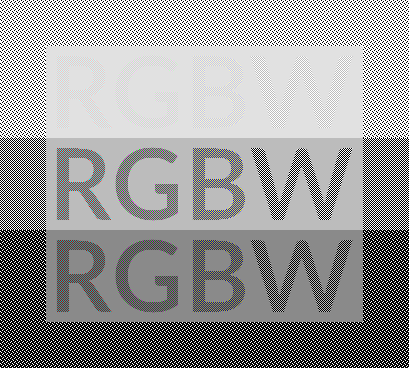
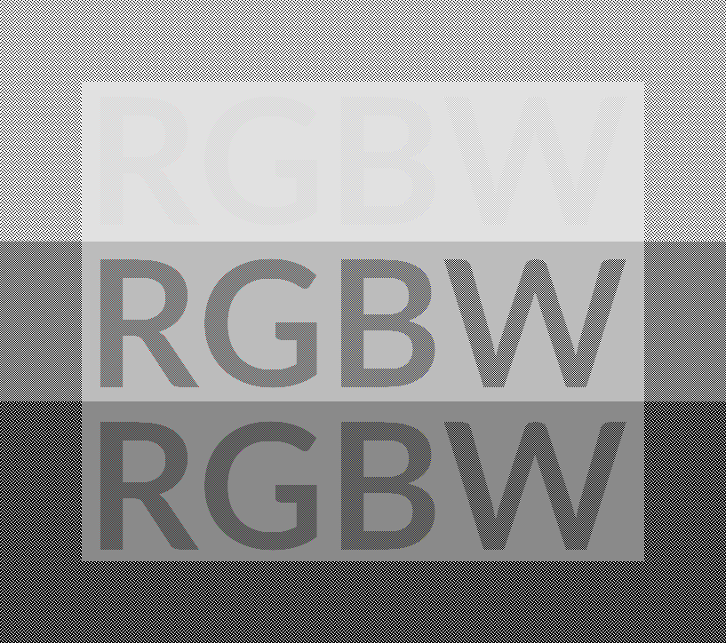

.. replaces:: Colorchooser_(Deutsch)
    CometVisu/0.8.0/ColorChooser/de
    CometVisu/0.8.x/widgets/colorchooser/de/
    CometVisu/ColorChooser
    CometVisu/ColorChooser_(Deutsch)
    CometVisu/Widget/ColorChooser/de
    CometVisu/de/0.11/manual/config/widgets/plugins/colorchooser/

.. _colorchooser:

X.. toctree::
X
X    Einfacher Modus
X    Professioneller Modus

Der ColorChooser
================

.. api-doc:: ColorChooser

Beschreibung
------------

XXXXXXXXXXXXXXXXXXXXXXXXXXXXXXXXXXXXXXXXXXXXXXX
XXXXXXXXXXXXXXXXXXXXXXXXXXXXXXXXXXXXXXXXXXXXXXX
XXXXXXXXXXXXXXXXXXXXXXXXXXXXXXXXXXXXXXXXXXXXXXX

Mit dem ColorChooser lassen sich Farben auswählen und anzeigen, beispielsweise
für eine Effektbeleuchtung. Sowohl eine RGB-Beleuchtung mit roten, grünen und
blauen Lichtern, aber auch eine RGBW-Beleuchtung mit zusätzlichem weißen
Kanal ist möglich.

Einfacher Modus
^^^^^^^^^^^^^^^

Für die meisten Anwendungsfälle wird der einfache Modus ausreichen, da hier
zugunsten einer einfachen Konfiguration auf die Details einer farbverbindlichen
Wiedergabe verzichtet wird.

Widget-Komponenten
""""""""""""""""""

Der ColorChooser bietet verschiedene Möglichkeiten und Kombinationen um eine
Farbe auzuwählen und anzuzeigen. So gibt es Slider für eine direkte, aber
aber welche für eine der menschlischen Wahrnehmung besser entsprechenden
Darstellung:

========== =====================================================================
``RGB-r``  Roter Kanal - direkte Ansteuerung einer RGB-Beleuchtung
``RGB-g``  Grüner Kanal - direkte Ansteuerung einer RGB-Beleuchtung
``RGB-b``  Blauer Kanal - direkte Ansteuerung einer RGB-Beleuchtung
``RGBW-r`` Roter Kanal - direkte Ansteuerung einer RGBW-Beleuchtung
``RGBW-g`` Grüner Kanal - direkte Ansteuerung einer RGBW-Beleuchtung
``RGBW-b`` Blauer Kanal - direkte Ansteuerung einer RGBW-Beleuchtung
``RGBW-w`` Weißer Kanal - direkte Ansteuerung einer RGBW-Beleuchtung
``h``      hue - Farbton des HSV-Farbraums, indirekte Ansteuerung
``s``      saturation - Sättigung des HSV-Farbraums, indirekte Ansteuerung
``v``      value - Helligkeit des HSV-Farbraums, indirekte Ansteuerung
``T``      Farbtemperatur für Weiß, indirekte Ansteuerung
``LCh-L``  lightness - Helligkeit im L*C*h° CIE Farbraum, indirekte Ansteuerung
``LCh-C``  chroma - Buntheit im L*C*h° CIE Farbraum, indirekte Ansteuerung
``LCh-h``  hue - Farbtonwinkel im L*C*h° CIE Farbraum, indirekte Ansteuerung
========== =====================================================================

Der Slider für die Farbtemperatur nimmt eine Sonderrolle ein, da dieser
gleichzeitig den Farbton als auch die Sättigung so einstellt, dass diese
Farbtemperatur mit der Beleuchtung erricht wird.

Statt der einzelnen Slider gibt es auch kombinierende, komplexere Möglichkeiten:

================ ====================================================================================
``box``          Farbwahlrad mit Quadratischem Helligkeits- und Sättigungswähler, HSV-Farbraum
``triangle``     Farbwahlrad mit dreieckigem Helligkeits- und Sättigungswähler, HSV-Farbraum
``LCh-box``      Farbwahlrad mit Quadratischem Helligkeits- und Sättigungswähler, L*C*h° CIE Farbraum
``LCh-triangle`` Farbwahlrad mit dreieckigem Helligkeits- und Sättigungswähler, L*C*h° CIE Farbraum
================ ====================================================================================

.. NOTE::

    Im einfachen Modus sollten das Farbwahlrad im HSV-Farbraum benutzt
    werden, im professionellen Modus, wenn die Farborte der einzelnen Farben
    konfiguriert wurden, im L*C*h°-Farbraum.

Dim-Kurven
""""""""""

Das menschliche Auge nimmt Helligkeit nicht linear sondern logarithmisch war,
dadurch ist es möglich sowohl in dunkler Nacht als auch mittags bei gleißendem
Sonnenschein sehen zu können. Verschiedene Beleuchtungssysteme, wie beispielsweise
DALI, berücksichtigen diese Eigenschaft des Auges und verwenden eine nicht lineare
Dim-Kurve um eine bessere Übereinstimmung zwischen der eingestellten und der
wahrgenommenen Helligkeit zu erreichen. Dieses grundsätzlich sinnvolle Verhalten
ist jedoch bei der Mischung von Farben nachteilig, da hier ein lineares Verhalten
benötigt wird.

Durch die Attribute ``r_curve``, ``g_curve``, ``b_curve`` und ``w_curve`` lassen sich
die Verwendeten Dim-Kurven einstellen um das Verhalten des Beleuchtungssystems
zu kompensieren. Neben der für den professionen Modus gedachten Angabe einer
Dim-Kurve aus Messwerten einer Profilierung lassen sich mit den Schlüsselwerten
``linear``, ``exponential`` und ``logarithmic`` die wichtigsten Kurventypen einstellen.

Welcher Wert richtig ist lässt sich aus der Dokumentation der Beleuchtssystems
entnehmen, wobei hier sowohl die Lampen, die Treiber als auch das Bus-Gateway
zu berücksichtigen sind, da hier an jeder Stelle ein nicht lineares Verhalten
möglich sein kann.

Ob die verwendete Kurve korrekt ist lässt sich grob auch ohne Messgerät leicht
abschätzen. Hierzu muss der rote Kanal auf 100%, der grüne auf 50% und der blaue
auf 0% eingestellt werden (der ggf. vorhandene weiße Kanal muss auch auf 0% stehen).
Die Beleuchtungsfarbe sollte nun, wenn die Dim-Kurven richtig eingestellt sind,
einem satten Orange entsprechen.

Sollte die Farbe nicht passen, so ist real eingestellte Farbe (ohne dass eine
Dim-Kurve konfiguriert wurde) mit dieser Tabelle zu vergleichen und der
Wert aus der letzen Spalte als Dim-Kurve zu verwenden:

.. raw:: html

   

.. role:: exporange
.. role:: linearorange
.. role:: logorange

====================== ====================== =========================================
Soll-Farbe             reale Farbe            zur Kompensation zu verwendende Dim-Kurve
---------------------- ---------------------- -----------------------------------------
:linearorange:`------` :logorange:`------`    `logarithmic`
:linearorange:`------` :linearorange:`------` `linear`
:linearorange:`------` :exporange:`------`    `exponential`
====================== ====================== =========================================

Meist reicht die Einstellung der korrekten Dim-Kurve aus, um bereits eine gute
Farbdarstellung zu bekommen. Sollte es jedoch auch nach einer Korrektur bei einer
RGB-Beleuchtung, wenn die Helligkeit auf 100% und die Sättigung auf 0% steht,
einen Farbstich geben und nicht neutral Weiß leuchten, so kann über die
``r_strength``, ``g_strength`` und ``b_strength`` Werte eine Korrektur erfolgen.
Dies ist auch bei einer RGBW-Beleuchtung möglich, jedoch wird das Abschätzen
der Werte noch schwieriger als bei einer RGB-Beleuchtung, so dass hier am
besten eine Messung der realen Werte durchgeführt werden sollte. Dies wird im
Abschnitt für den professionellen Modus beschrieben.

Professioneller Modus
^^^^^^^^^^^^^^^^^^^^^

Für professionelle Anwendungen wie in der Architektur, Kunstgallerien oder
Yachten lässt sich der einfache Modus leicht auf eine farbverbindliche Nutzung
erweitern.

.. note::

    Beste Ergebnisse benötigen einen kalibrierten Bildschirm. Da für die
    Darstellung bewusst nur der sRGB-Farbraum verwendet wird sollte aber auch auf
    unkalibrierten Geräten (wie z.B. Smartphones und Tablets) eine akzeptable
    Darstellung möglich sein. Trotz der Einschränkung der Bildschirmdarstellung auf
    sRGB lässt sich durch den ColorChooser der komplette Farbraum, der durch die
    Leuchtmittel möglich ist, nutzen.

Der professionelle Modus unterscheidet sich vom einfachen Modus dadurch, dass
die Farborte des verwendeten Leuchtmittels mit angegeben werden, so wie deren
Dim-Verhaltens.

Die besten Ergebnisse werden erreicht, wenn für den roten, grünen blauen und, so
vorhanden, weißen Kanal die Farborte und Helligkeiten mit einem Spektralfotometer
gemessen werden und als ``x`` und ``y`` Koordinaten des CIE-Normfarbsystem übergeben
werden. Aus der Messung kann dann auch die Dim-Kurve als Tabelle so wie die maximale
Helligkeit übernommen werden.
Aufgrund der Alterung des Leuchtmittels müssen - genau so wie bei der
Monitor-Kalibierung - die Dim-Kurven regelmäßig bestimmt werden und die
Konfigurationsdatei entsprechend angepasst werden. Die Häufigkeit der Messung
richtet sich dabei nach dem Anspruch an die zu erreichende Farbtreue.

Ohne Messgerät, aber mit einem Datenblatt des verwendeten Leuchtmittels, lassen
sich auch noch gute Ergebnisse erzielen. Wenn für die Farben keine ``x`` und ``y``
Koordinaten angegeben werden, aber zumindest die Wellenlängen, so können diese
alternativ verwendet werden. Dies führt nur bei einer monochromatischen Lichtquelle
wie einem Laser zu einem korrektem Ergebnis, jedoch besitzen auch RGB-LEDs ein
annähernd monochromatische Verhalten. Bei dem weißen Kanal kann statt der
xy-Koordinaten auch die Farbtemperatur verwendet werden. Sollte eine Abweichung
von der Black-Body-Kurve berücksichtig werden müssen, so muss dies jedoch über eine
Angabe in xy-Koordinaten erfolgen.

Die Helligkeitsangabe muss keine spezifische physikalische Einheit (wie Lumen
oder Lumen/Meter bei LED-Strips) haben, hier verwendet der ColorChooser nur die
relative Größe der Werte untereinander.

Um beste Ergebnisse zwischen Bildschirm-Darstellung und Beleuchtungsfarbe
zu erhalten, sollte ein Widget-Element nicht im HSV sondern im L*C*h°-Modus
verwendet werden. Die Kommunikation über den Bus sollte im xy bzw. xyY oder
L*a*b* Farbraum erfolgen, da hier die Umrechnung in die Ansteuerung des
Leuchtmittels aktornah passiert und so eine akkuratere Farbwiedergabe zu erwarten
ist. Eine Kommunikation im HSV-Farbraum würde auch noch eine gute Farbwiedergabe
ermöglichen. Für eine direkte Ansteuerung über RGB bzw. RGBW Werte ist eine
korrekt eingestellte Dim-Kurve unabdingbar.

.. note::

    Der ColorChooser verwendet intern den CIE xyY Farbraum. Für die Umrechung
    in den L*a*b* bzw. den L*C*h° Farbraum wird die Normlichtart D65 und ein
    Beobachterwinkel von 10° verwendet.

Beispiel für einen ColorChooser für den OSRAM LINEARlight FLEX Colormix RGBW
LED-Strip "LF700RGBW-G1-830-06" mit Farborten aus dem Datenblatt und einer
Ansteuerung über DALI:

.. widget-example::

    <settings>
        <screenshot name="colorchooser_professional">
            <caption>Triangle-ColorChooser im professionellen Modus</caption>
        </screenshot>
    </settings>
    <colorchooser
        r_wavelength="622" r_strength="80" r_curve="logarithmic"
        g_wavelength="534" g_strength="196" g_curve="logarithmic"
        b_wavelength="468" b_strength="21" b_curve="logarithmic"
        w_x="0.4290" w_y="0.4010" w_strength="400" w_curve="logarithmic"
        controls="triangle">
      <label>LED Strip</label>
      <layout rowspan="6" colspan="6"/>
      <address transform="DPT:242.600" mode="read" variant="xyY">1/2/60</address>
      <address transform="DPT:242.600" mode="write" variant="xyY">1/2/61</address>
    </colorchooser>

XXXXXXXXXXXXXXXXXXXXXXXXXXXXXXXXXXXXXXXXXXXXXXX
XXXXXXXXXXXXXXXXXXXXXXXXXXXXXXXXXXXXXXXXXXXXXXX
XXXXXXXXXXXXXXXXXXXXXXXXXXXXXXXXXXXXXXXXXXXXXXX

Der ColorChooser fügt der Visu einen Farbwahlkreis hinzu. Damit können RGB-Anwendungen realisiert werden.

Einstellungen
-------------

Für eine grundsätzliche Erklärung des Aufbaus der Konfiguration und der Definition der im folgenden benutzten
Begriffe (Elemente, Attribute) sollte zunächst dieser Abschnitt gelesen werden: :ref:`visu-config-details`.

Das Verhalten und Aussehen des ColorChooser-Plugins kann durch die Verwendung von Attributen und Elementen beeinflusst werden.
Die folgenden Tabellen zeigen die erlaubten Attribute und Elemente. In den Screenshots sieht man, wie
beides über den :ref:`Editor <editor>` bearbeitet werden kann.

Nur die mit ..... unterstrichenen Attribute/Elemente müssen zwingend angegeben werden, alle anderen sind optional und können
daher weg gelassen werden.

Erlaubte Attribute im ColorChooser-Element
^^^^^^^^^^^^^^^^^^^^^^^^^^^^^^^^^^^^^^^^^^

.. parameter-information:: colorchooser

...Keine...

Erlaubte Kind-Elemente und deren Attribute
^^^^^^^^^^^^^^^^^^^^^^^^^^^^^^^^^^^^^^^^^^

.. elements-information:: colorchooser

.. widget-example::
    :editor: elements
    :scale: 75
    :align: center

    <caption>Elemente im Editor</caption>
    <meta>
        <plugins>
    	    <plugin name="colorchooser" />
        </plugins>
    </meta>
    <colorchooser>
      <label>RGB Kueche</label>
      <address transform="DPT:5.001" mode="readwrite" variant="r">1/2/59</address>
      <address transform="DPT:5.001" mode="readwrite" variant="g">1/2/60</address>
      <address transform="DPT:5.001" mode="readwrite" variant="b">1/2/61</address>
    </colorchooser>

.. IMPORTANT::

    Pro Farbe (Rot, Grün, Blau) muss eine Gruppenadresse angelegt werden.
    Für OpenHAB Color Items gilt diese Einschränkung nicht, sie können mit
    einer Adresse mit dem Zusatz ``variant="rgb"`` angesprochen werden.

Dazu geht man wie folgt vor:

* Auf das Pluszeichen über der Adressliste klicken.
* In das eingefügte, aber noch leere Feld klicken.
* Wenn die Gruppenadresse für die Farben im Wiregate importiert wurden, kann die entsprechende
  Adresse aus dem Auswahlmenü ausgewählt werden. Anderenfalls muss der Haken hinter dem Adressfeld entfernt
  und die Adresse manuell nach dem Format ``x/y/z`` also z.B. ``1/2/59`` eingetragen werden.
* Beim Auswählen einer importierten Gruppenadresse erscheint ggf. der richtige Datenpunkttyp unter Transforms.
  Anderenfalls muss dort von Hand der DPT 5.001 "Scaling" ausgewählt werden.
* Unter Variant muss nun das Kürzel für die Farbe eingegeben werden. z.B. für Rot muss ``r``,
  für Grün ein ``g`` und für Blau ``b`` eingegeben werden.
* Danach einmal auf save klicken und die Schritte für die nächste Farbe wiederholen.

Am Ende sollten drei Einträge in der Adressliste stehen. Mit einem Klick auf OK wird nun der
Farbwahlkreis der aktuellen Visuseite hinzugefügt und kann an einer beliebigen Stelle platziert werden.

XML Syntax
----------

Alternativ kann man für das ColorChooser Plugin auch von Hand einen Eintrag in
der :ref:`visu_config.xml <xml-format>` hinzufügen.

.. CAUTION::
    In der Config selbst dürfen NUR UTF-8 Zeichen verwendet
    werden. Dazu muss ein auf UTF-8 eingestellter Editor verwendet werden!

Hier der minimale Beispielcode der das ColorChooser Plugin aus dem folgenden Screenshot erzeugt:

.. widget-example::

    <settings>
        <screenshot name="colorchooser_simple">
            <caption>colorchooser, einfaches Beispiel</caption>
        </screenshot>
    </settings>
    <meta>
        <plugins>
            <plugin name="colorchooser" />
        </plugins>
    </meta>
    <colorchooser>
      <layout colspan="6" rowspan="4"/>
      <label>RGB Kueche</label>
      <address transform="DPT:5.001" mode="readwrite" variant="r">1/2/59</address>
      <address transform="DPT:5.001" mode="readwrite" variant="g">1/2/60</address>
      <address transform="DPT:5.001" mode="readwrite" variant="b">1/2/61</address>
    </colorchooser>

ToDo für Doku
-------------

Warum zeigen zwei ColorChooser eine komplett unterschiedliche Anzeige?
- Wenn per RGB gekoppelt, aber ein HSV Chooser, dann ist aufgrund der nicht
exakt möglichen umrechnung von RGB nach HSV eine unterschiedliche Anzeige möglich, obwohl die selbe Farbe repräsentiert wird

.. rubric:: Fußnoten

.. [#f1] In der vereinfachten Ansicht sind ggf. einige Dinge ausgeblendet. In der Expertenansicht ist alles zu sehen.