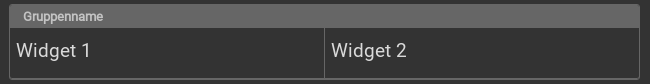
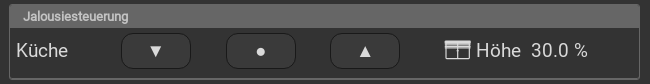

.. _group:

Das Group Widget
================

.. api-doc:: Group

Beschreibung
------------

Mit dem Group-Widget können mehrere Widgets mit einem Rahmen gruppiert werden. Dies dient einerseits der Übersichtlichkeit, 
andererseits kann damit die automatische Anordnung der widgets (zB beim Drehen des Anzeigegerätes vom Hoch- 
ins Querformat) beeinflusst werden. 

Mit dem nowidget Attribut werden die Widget-Rahmen innerhalb der Gruppe unterdrückt. Damit können einzelne Widgets zu einem 
Bedienelement gruppiert werden zB. mehrere Trigger- und ein Info-Widget zu einem speziellen Info-Trigger.

Einstellungen
-------------

Das Verhalten und Aussehen des Group-Widgets kann durch die Verwendung von Attributen und Elementen beeinflusst werden.
Die folgenden Tabellen zeigen die erlaubten Attribute und Elemente. In den Screenshots sieht man, wie
beides über den :ref:`Editor <editor>` bearbeitet werden kann.

Nur die mit ..... unterstrichenen Attribute/Elemente müssen zwingend angegeben werden, alle anderen sind optional und können
daher weg gelassen werden.

Erlaubte Attribute im Group-Element
^^^^^^^^^^^^^^^^^^^^^^^^^^^^^^^^^^^

.. parameter-information:: group

Erlaubte Kind-Elemente und deren Attribute
^^^^^^^^^^^^^^^^^^^^^^^^^^^^^^^^^^^^^^^^^^
 
Mit dem Kind-Element layout kann für jede Gruppe die Größe festgelegt werden.
Des weiteren können im Group-Widget alle vorhandenen Widgets verwendet werden. 

XML Syntax minimal
------------------

Alternativ kann man für das Group Widget auch von Hand einen Eintrag in
der :doc:`visu_config.xml <../../xml-format>` hinzufügen.

.. CAUTION::
    In der Config selbst dürfen NUR UTF-8 Zeichen verwendet
    werden. Dazu muss ein auf UTF-8 eingestellter Editor verwendet werden!

Hier der minimale Beispielcode der das Group Widget aus dem folgenden Screenshot erzeugt:

.. widget-example::

    <settings>
        <screenshot name="group_simple">
            <caption>Beispiel Group Widget</caption>
        </screenshot>
    </settings>
    <group name="Gruppenname">    
        <text align="left">
            <layout colspan="3"/>
            <label>Widget 1</label>
        </text>
        <text align="left">
            <layout colspan="3"/>
            <label>Widget 2</label>
        </text>
    </group>  

Beispiele
---------

Gruppe mit Switch- und Info-Widget
^^^^^^^^^^^^^^^^^^^^^^^^^^^^^^^^^^

.. widget-example::

    <settings>
        <screenshot name="group_info">
            <caption>Beispiel Group- mit Info-Widget</caption>
            <data address="3/1/1">1</data>
            <data address="5/1/90">23.4</data>
        </screenshot>
    </settings>
    <meta>
        <mappings>
            <mapping name="OnOff">
                <entry value="0">O</entry>
                <entry value="1">I</entry>
            </mapping>
        </mappings>
        <stylings>
            <styling name="RedGreen">
                <entry value="0">red</entry>
                <entry value="1">green</entry>
            </styling>
        </stylings>
    </meta>
    <group name="Esszimmer">
        <layout colspan="6"/>
        <switch mapping="OnOff" styling="RedGreen">
            <layout colspan="3"/>
            <label><icon name="light_ceiling_light"/>Licht</label>
            <address transform="DPT:1.001" mode="readwrite">3/1/1</address>
        </switch>
        <info format="%.1f °C">
            <layout colspan="3"/>
            <label><icon name="temp_temperature"/>Temp.</label>
            <address transform="DPT:9.001" mode="read">5/1/90</address>
        </info>
    </group>

Zwei Gruppen inkl. Anwendung von nowidget
^^^^^^^^^^^^^^^^^^^^^^^^^^^^^^^^^^^^^^^^^

.. widget-example::

    <settings>
        <screenshot name="group_nowidget">
            <caption>Beispiel Group Widget mit nowidget="true"</caption>
            <data address="4/1/43">30</data>
        </screenshot>
    </settings>
    <meta>
        <mappings>
            <mapping name="AnAusSymbol">
                <entry value="0">○</entry>
                <entry value="1">●</entry>
            </mapping>
            <mapping name="AufAbSymbol">
                <entry value="0">▲</entry>
                <entry value="1">▼</entry>
            </mapping>
        </mappings>
    </meta>
    <group name="Jalousiesteuerung">
        <group nowidget="true">
            <layout colspan="12"/>
            <text align="left">
                <layout colspan="2"/>
                <label>Küche</label>
            </text>
            <trigger value="1" mapping="AufAbSymbol">
                <layout colspan="2"/>
                <address transform="DPT:1.008" mode="write">3/0/0</address>
            </trigger>
            <trigger value="1" mapping="AnAusSymbol">
                <layout colspan="2"/>
                <address transform="DPT:1.001" mode="write">3/0/1</address>
            </trigger>
            <trigger value="0" mapping="AufAbSymbol">
                <layout colspan="2"/>
                <address transform="DPT:1.008" mode="write">3/0/0</address>
            </trigger>
            <info format="%.1f %%">
                <layout colspan="4"/>
                <label><icon name="fts_shutter_30"/>Höhe</label>
                <address transform="DPT:5.001" mode="read">4/1/43</address>
            </info>
        </group>
    </group>
