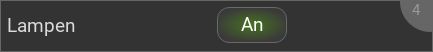

.. _infoaction:

Das InfoAction Widget
=====================

.. api-doc:: InfoAction

Beschreibung
------------

Das InfoAction Widget kombiniert ein darstellendes :ref:`Info <info>`/:ref:`Text <text>` Widget mit
einem bedienbaren Widget (z.B. :ref:`Switch <switch>` oder :ref:`Trigger <trigger>`).

Anwendungsfall: Wenn man eine Gruppe von Lichtern hat, kann man mit diesem Widget diese Gruppe schalten
und gleichzeitig die Anzahl der eingeschalteten Lampen anzeigen.

Einstellungen
-------------

Für eine grundsätzliche Erklärung des Aufbaus der Konfiguration und der Definition der im folgenden benutzten
Begriffe (Elemente, Attribute) sollte zunächst dieser Abschnitt gelesen werden: :ref:`visu-config-details`.

Das Verhalten und Aussehen des InfoAction-Widgets kann durch die Verwendung von Attributen und Elementen beeinflusst werden.
Die folgenden Tabellen zeigen die erlaubten Attribute und Elemente. In den Screenshots sieht man, wie
beides über den :ref:`Editor <editor>` bearbeitet werden kann.

Nur die mit ..... unterstrichenen Attribute/Elemente müssen zwingend angegeben werden, alle anderen sind optional und können
daher weg gelassen werden.

Erlaubte Attribute im InfoAction-Element
^^^^^^^^^^^^^^^^^^^^^^^^^^^^^^^^^^^^^^^^

Keine.

Erlaubte Kind-Elemente und deren Attribute
^^^^^^^^^^^^^^^^^^^^^^^^^^^^^^^^^^^^^^^^^^

.. elements-information:: infoaction

+---------------------------+---------------------------------------------------------------------------+
| Struktur                  | Erlaubte Kind-Elemente                                                    |
+===========================+===========================================================================+
| infoaction                | :ref:`Info <info>` oder :ref:`Text <text>`                                |
|  * widgetinfo             |                                                                           |
+---------------------------+---------------------------------------------------------------------------+
| infoaction                | :ref:`Switch <switch>`, :ref:`Toggle <toggle>`, :ref:`Trigger <trigger>`, |
|  * widgetaction           | :ref:`Pushbutton <pushbutton>`, :ref:`URL-Trigger <urltrigger>`,          |
|                           | :ref:`Multitrigger <multitrigger>`, :ref:`Image <image>`,                 |
|                           | :ref:`Imagetrigger <imagetrigger>`, :ref:`Pagejump <pagejump>`,           |
|                           | oder :ref:`Info <info>`                                                   |
+---------------------------+---------------------------------------------------------------------------+

.. widget-example::
    :editor: elements
    :scale: 75
    :align: center

    <caption>Elemente im Editor</caption>
    <infoaction>
        <layout colspan="4"/>
        <label>Lights</label>
       	<widgetinfo>
          <info>
           <address transform="DPT:9.001">0/0/0</address>
          </info>
        </widgetinfo>
        <widgetaction>
         <switch mapping="OnOff" styling="GreyGreen">
          <layout colspan="3" />
          <address transform="DPT:1.001" mode="readwrite">0/0/1</address>
         </switch>
        </widgetaction>
       </infoaction>

XML Syntax
----------

Alternativ kann man für das InfoAction Widget auch von Hand einen Eintrag in
der :doc:`visu_config.xml <../../xml-format>` hinzufügen.

.. CAUTION::
    In der Config selbst dürfen NUR UTF-8 Zeichen verwendet
    werden. Dazu muss ein auf UTF-8 eingestellter Editor verwendet werden!

Dieses Beispiel zeigt die Anzahl der eingeschalteten Lampen zusammen mit einem
Button, mit dem diese geschaltet werden können.

.. widget-example::

    <settings>
     <caption>InfoAction Beispiel</caption>
     <screenshot name="infoaction_lights">
       <data address="0/0/0">4</data>
       <data address="0/0/1">1</data>
     </screenshot>
   </settings>
   <meta>
    <mappings>
      <mapping name="OnOff">
        <entry value="0">Aus</entry>
        <entry value="1">An</entry>
      </mapping>
    </mappings>
    <stylings>
      <styling name="GreyGreen">
        <entry value="0">grey</entry>
        <entry value="1">green</entry>
      </styling>
    </stylings>
   </meta>
   <infoaction>
    <layout colspan="4"/>
    <label>Lampen</label>
    <widgetinfo>
      <info>
       <address transform="DPT:9.001">0/0/0</address>
      </info>
    </widgetinfo>
    <widgetaction>
     <switch mapping="OnOff" styling="GreyGreen">
      <layout colspan="3" />
      <address transform="DPT:1.001" mode="readwrite">0/0/1</address>
     </switch>
    </widgetaction>
   </infoaction>
