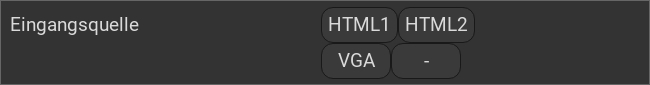

.. replaces:: CometVisu/multitrigger
    CometVisu/multitrigger_(Deutsch)
    CometVisu/Widget/multitrigger/de
    CometVisu/0.8.x/widgets/multitrigger/de/
    CometVisu/0.8.0/multitrigger/de

.. _multitrigger:

Das MultiTrigger Widget
=======================

.. api-doc:: MultiTrigger

Beschreibung
------------

Der Multitrigger fügt der Visu beliebig Schaltflächen hinzu, mit denen z.B. Szenenaufrufe realisiert werden können.

.. hint::
    Ab Version 0.12.0 sind beliebig viele Schaltflächen möglich, in älteren Versionen waren nicht mehr als 4 möglich.

Einstellungen
-------------

Für eine grundsätzliche Erklärung des Aufbaus der Konfiguration und der Definition der im folgenden benutzten
Begriffe (Elemente, Attribute) sollte zunächst dieser Abschnitt gelesen werden: :ref:`visu-config-details`.

Das Verhalten und Aussehen des MultiTrigger-Widgets kann durch die Verwendung von Attributen und Elementen beeinflusst werden.
Die folgenden Tabellen zeigen die erlaubten Attribute und Elemente. In den Screenshots sieht man, wie
beides über den :ref:`Editor <editor>` bearbeitet werden kann.

Nur die mit ..... unterstrichenen Attribute/Elemente müssen zwingend angegeben werden, alle anderen sind optional und können
daher weg gelassen werden.

Erlaubte Attribute im MultiTrigger-Element
^^^^^^^^^^^^^^^^^^^^^^^^^^^^^^^^^^^^^^^^^^

.. parameter-information:: multitrigger

.. widget-example::
    :editor: attributes
    :scale: 75
    :align: center

    <caption>Elemente im Editor</caption>
    <multitrigger>
      <layout colspan="6"/>
      <label>Eingangsquelle</label>
      <address transform="DPT:5.001" mode="readwrite">9/6/1</address>
      <buttons>
        <button label="HTML1">0</button>
        <button label="HTML2">1</button>
        <button label="VGA">2</button>
        <button label="-"></button>
      </buttons>
    </multitrigger>

Erlaubte Kind-Elemente und deren Attribute
^^^^^^^^^^^^^^^^^^^^^^^^^^^^^^^^^^^^^^^^^^

.. elements-information:: multitrigger

.. widget-example::
    :editor: elements
    :scale: 75
    :align: center

    <caption>Elemente im Editor</caption>
    <multitrigger>
      <layout colspan="6"/>
      <label>Eingangsquelle</label>
      <address transform="DPT:5.001" mode="readwrite">9/6/1</address>
      <buttons>
        <button label="HTML1">0</button>
        <button label="HTML2">1</button>
        <button label="VGA">2</button>
        <button label="-"></button>
      </buttons>
    </multitrigger>

XML Syntax
----------

Alternativ kann man für das MultiTrigger Widget auch von Hand einen Eintrag in
der :doc:`visu_config.xml <../../xml-format>` hinzufügen.

.. CAUTION::
    In der Config selbst dürfen NUR UTF-8 Zeichen verwendet
    werden. Dazu muss ein auf UTF-8 eingestellter Editor verwendet werden!

Hier der minimale Beispielcode der das MultiTrigger Widget aus dem folgenden Screenshot erzeugt:

.. widget-example::

        <settings>
            <screenshot name="multitrigger_simple">
                <caption>MultiTrigger, einfaches Beispiel</caption>
            </screenshot>
        </settings>
        <multitrigger>
            <layout colspan="6"/>
            <label>Eingangsquelle</label>
            <address transform="DPT:5.001" mode="readwrite">9/6/1</address>
            <buttons>
              <button label="HTML1">0</button>
              <button label="HTML2">1</button>
              <button label="VGA">2</button>
              <button label="-"></button>
            </buttons>
        </multitrigger>

.. rubric:: Fußnoten

.. [#f1] In der vereinfachten Ansicht sind ggf. einige Dinge ausgeblendet. In der Expertenansicht ist alles zu sehen.