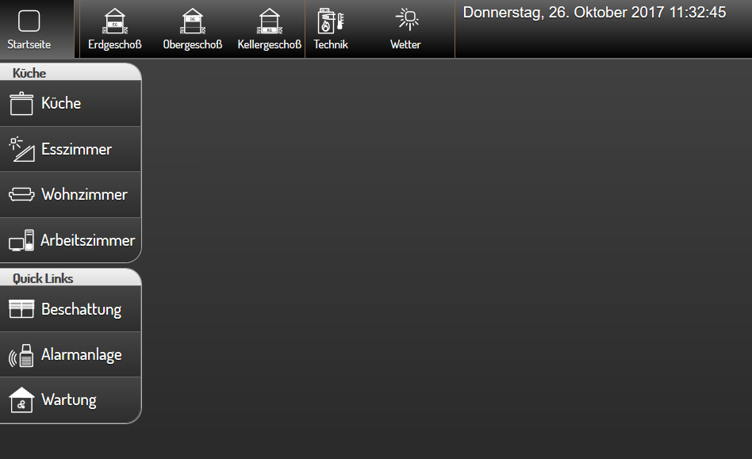

.. _navbar:

Das Navbar Widget
===================

.. api-doc:: NavBar

Beschreibung
------------

Mit dem Navbar-Widget kann man ein permanent sichtbares Navigationsmenü erstellen, 
das auf jeder Seite der Visualisierung getrennt konfiguriert oder auch ausgeblendet werden kann.  

Am häufigsten werden im Navbar PageJump-Widgets zur Navigation platziert. Besonders praktisch ist auch die 
Anzeige der Uhrzeit- bzw. des  Datums mit dem strftime-Plugin. 

Je Seite können bis zu 4 Navbars konfiguriert werden, meistens werden aber nur 1-2 Navbars verwendet. 
Die Sichtbarkeit der Navbars kann über die Attribute des Page-Elementes zB. ``showtopnavigation="true"`` gesteuert
werden.

Einstellungen
-------------

Für eine grundsätzliche Erklärung des Aufbaus der Konfiguration und der Definition der im folgenden benutzten
Begriffe (Elemente, Attribute) sollte zunächst dieser Abschnitt gelesen werden: :ref:`visu-config-details`.

Das Verhalten und Aussehen des Navbar-Widgets kann durch die Verwendung von Attributen und Elementen beeinflusst werden.
Die folgenden Tabellen zeigen die erlaubten Attribute und Elemente. 

Nur die mit ..... unterstrichenen Attribute/Elemente müssen zwingend angegeben werden, alle anderen sind optional und können
daher weg gelassen werden.

Über das ``scope``-Attribut kann die Vererbung der Navbars auf die nächsten Unterseiten gesteuert werden. Mit ``scope="0"``
erfolgt keine Vererbung, d.h. die Navbar muss für jede Seite individuell definiert werden.

Mit ``scope="1"`` wird die Navbar auf das nächste Page-Element vererbt, d.h. eine weitere Navbar-Definition auf 
der Unterseite wird zusätzlich zur Navbar der übergeordneten Page angezeigt, mit ``scope="2"`` wird um 2 Ebenen 
vererbt, usw.

Über das ``dynamic`` kann eingestellt werden, ob die Navbar angezeigt werden soll
und unter welchen Bedingungen diese dynamisch ein- und ausgeblendet wird.
Das Ein- und Ausblenden ist nur für die linke Navbar implementiert und benötigt
ein touch-fähiges Gerät. Zum Einblenden muss vom linken Bildschirmrand in die
Mitte horizontal gewischt werden, zum Ausblenden muss nach links gewischt werden.

+-------------+------------------------------------------+------------------------------------------+
| ``dynamic`` | Mobiles Gerät                            | Großer Bildschirm                        |
+=============+==========================================+==========================================+
| *leer*      | Wie auf der übergeordneten Seite, sonst: | Wie auf der übergeordneten Seite, sonst: |
|             | Navbar ist ein- und ausblendbar.         | Navbar ist immer eingeblendet.           |
|             | Nach Start ist diese ausgeblendet.       |                                          |
+-------------+------------------------------------------+------------------------------------------+
| true        | Navbar ist ein- und ausblendbar.         | Navbar ist ein- und ausblendbar.         |
|             | Nach Start ist diese ausgeblendet.       | Nach Start ist diese eingeblendet.       |
+-------------+------------------------------------------+------------------------------------------+
| false       | Navbar ist immer eingeblendet.           | Navbar ist immer eingeblendet.           |
+-------------+------------------------------------------+------------------------------------------+

Erlaubte Attribute im Navbar-Element
^^^^^^^^^^^^^^^^^^^^^^^^^^^^^^^^^^^^^^

.. parameter-information:: navbar

Erlaubte Kind-Elemente und deren Attribute
^^^^^^^^^^^^^^^^^^^^^^^^^^^^^^^^^^^^^^^^^^

In einer Navbar können grundsätzlich alle verfügbaren Widget-Elemente eingesetzt werden. Am häufigsten werden  
jedoch PageJump-Widgets platziert, die zusätzlich durch Gruppen-, Line und Text-Widgets optisch gestaltet werden 
können. Besonders praktisch ist auch die Anzeige der Uhrzeit- bzw. des  Datums mit dem strftime-Plugin. 

XML Syntax
----------

Alternativ kann man für das Navbar Widget auch von Hand einen Eintrag in
der :doc:`visu_config.xml <../../xml-format>` hinzufügen.

.. CAUTION::
    In der Config selbst dürfen NUR UTF-8 Zeichen verwendet
    werden. Dazu muss ein auf UTF-8 eingestellter Editor verwendet werden!

Ein komplexes Beispiel für einen Navbar mit PageJump- und InfoAction-Widgets findet sich in der Dokumentation
des :ref:`PageJump-Widgets <pagejump>`.

Nachstehend ein weiteres Beispiel für ein Navigationsmenü mit zwei Navbar-Widgets. Im top-Navbar wird neben mehreren
PageJump-Widgets das strftime-Plugin zur Anzeige von Datum und Uhrzeit angewendet.  

.. code-block:: xml

    <meta>
        <plugins>      
            <plugin name="strftime"/>    
        </plugins>
    </meta>
    <page name="Uebersicht" showtopnavigation="false" showfooter="false" shownavbar-top="true" shownavbar-left="true">
        <navbar position="top">
            <pagejump target="Uebersicht">
                <layout colspan="1"/>
                <label><icon name="control_home"/>Startseite</label>
            </pagejump>
            <line>
                <layout colspan="0.07"/>
            </line>
            <line>
                <layout colspan="0"/>
            </line>
            <pagejump target="Erdgeschoß">
                <layout colspan="1"/>
                <label><icon name="control_building_s_eg"/>Erdgeschoß</label>
            </pagejump>
            <pagejump target="Obergeschoß">
                <layout colspan="1"/>
                <label><icon name="control_building_s_og"/>Obergeschoß</label>
            </pagejump>
            <pagejump target="Kellergeschoß">
                <layout colspan="1"/>
                <label><icon name="control_building_s_kg"/>Kellergeschoß</label>
            </pagejump>
            <line>
                <layout colspan="0"/>
            </line>
            <pagejump target="Technik">
                <layout colspan="1"/>
                <label><icon name="sani_boiler_temp"/>Technik</label>
            </pagejump>
            <pagejump target="Wetter">
                <layout colspan="1"/>
                <label><icon name="weather_sun"/>Wetter</label>
            </pagejump>
            <line>
                <layout colspan="0"/>
            </line> 
            <strftime lang="de" format="%A, %d. %B %Y %H:%M:%S">
                <layout colspan="0"/>
            </strftime>
        </navbar>
        <navbar position="left" dynamic="true" width="180px">
            <group name="Küche">
                <pagejump target="Kueche" name="Küche">
                    <label><icon name="scene_cooking"/></label>
                </pagejump>
                <pagejump target="Esszimmer" name="Esszimmer">
                    <label><icon name="sani_solar"/></label>
                </pagejump>
                <pagejump target="Wohnzimmer" name="Wohnzimmer">
                    <label><icon name="scene_living"/></label>
                </pagejump>
                <pagejump target="Arbeitszimmer" name="Arbeitszimmer">
                    <label><icon name="it_pc"/></label>
                </pagejump>
            </group>
            <group name="Quick Links">
                <pagejump target="Beschattung" name="Beschattung">
                    <label><icon name="fts_shutter"/></label>
                </pagejump>
                <pagejump target="Alarmanlage" name="Alarmanlage">
                    <label><icon name="secur_alarm"/></label>
                </pagejump>
                <pagejump target="Wartung" name="Wartung">
                    <label><icon name="control_building_control"/></label>
                </pagejump>
            </group>
        </navbar>
    
  </page>
