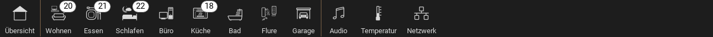

.. _pagejump:

Das PageJump Widget
===================

.. api-doc:: PageJump

Beschreibung
------------

Mit dem PageJump-Widget lassen sich Seiten der Visu verknüpfen. Von der Funktion ist das
vergleichbar mit Hyperlinks. Man kann sie z.B. nutzen um über die :ref:`Navbar <navbar>`
ein permanent sichtbares Navigationsmenü zu erstellen.

Zusätzlich kann ein PageJump-Widget in einem Page-Element platziert werden.

Einstellungen
-------------

Für eine grundsätzliche Erklärung des Aufbaus der Konfiguration und der Definition der im folgenden benutzten
Begriffe (Elemente, Attribute) sollte zunächst dieser Abschnitt gelesen werden: :ref:`visu-config-details`.

Das Verhalten und Aussehen des PageJump-Widgets kann durch die Verwendung von Attributen und Elementen beeinflusst werden.
Die folgenden Tabellen zeigen die erlaubten Attribute und Elemente. In den Screenshots sieht man, wie
beides über den :ref:`Editor <editor>` bearbeitet werden kann.

Nur die mit ..... unterstrichenen Attribute/Elemente müssen zwingend angegeben werden, alle anderen sind optional und können
daher weg gelassen werden.

Erlaubte Attribute im PageJump-Element
^^^^^^^^^^^^^^^^^^^^^^^^^^^^^^^^^^^^^^

.. parameter-information:: pagejump

.. widget-example::
    :editor: attributes
    :scale: 75
    :align: center

    <caption>Attribute im Editor (vereinfachte Ansicht) [#f1]_</caption>
    <pagejump target="Seitenname">
        <layout colspan="4" />
    </pagejump>

Erlaubte Kind-Elemente und deren Attribute
^^^^^^^^^^^^^^^^^^^^^^^^^^^^^^^^^^^^^^^^^^

.. elements-information:: pagejump

.. widget-example::
    :editor: elements
    :scale: 75
    :align: center

    <caption>Elemente im Editor</caption>
    <pagejump target="Seitenname">
        <layout colspan="4" />
    </pagejump>

XML Syntax
----------

Alternativ kann man für das PageJump Widget auch von Hand einen Eintrag in
der :doc:`visu_config.xml <../../xml-format>` hinzufügen.

.. CAUTION::
    In der Config selbst dürfen NUR UTF-8 Zeichen verwendet
    werden. Dazu muss ein auf UTF-8 eingestellter Editor verwendet werden!

Hier ein komplexes Beispiel für ein Navigationsmenü in einer Navbar:

.. widget-example::

    <settings selector="#navbarTop .navbar">
        <screenshot name="pagejump_komplex">
            <caption>Navbar mit PageJump-Widgets</caption>
            <data address="1/0/0" transform="DPT:9">20.5</data>
            <data address="1/0/1" transform="DPT:9">21.5</data>
            <data address="1/0/2" transform="DPT:9">22</data>
            <data address="1/0/3" transform="DPT:9">18</data>
        </screenshot>
    </settings>
    <navbar position="top" dynamic="true">
        <pagejump target="Übersicht">
            <layout colspan="0" />
            <label>
                <icon name="control_building_empty" />
                Übersicht
            </label>
        </pagejump>
        <line>
            <layout colspan="0" />
        </line>
        <pagejump target="Wohnzimmer">
            <layout colspan="0" />
            <label>
                <icon name="scene_livingroom" />
                Wohnen
            </label>
            <widgetinfo>
                <info format="%d">
                    <layout colspan="0" />
                    <address transform="DPT:9.001" mode="read" variant="">1/0/0</address>
                </info>
            </widgetinfo>
        </pagejump>
        <pagejump target="Esszimmer">
            <layout colspan="0" />
            <label>
                <icon name="scene_dinner" />
                Essen
            </label>
            <widgetinfo>
                <info format="%d">
            <layout colspan="0" />
            <address transform="DPT:9.001" mode="read" variant="">1/0/1</address>
                </info>
            </widgetinfo>
        </pagejump>
        <pagejump target="Schlafzimmer">
            <layout colspan="0" />
            <label>
                <icon name="scene_sleeping" />
                Schlafen
            </label>
            <widgetinfo>
                <info format="%d">
                    <layout colspan="0" />
                    <address transform="DPT:9.001" mode="read" variant="">1/0/2</address>
                </info>
            </widgetinfo>
        </pagejump>
        <pagejump target="Büro">
            <layout colspan="0" />
            <label>
                <icon name="it_pc" />
                Büro
            </label>
        </pagejump>
        <pagejump target="Küche">
            <layout colspan="0" />
            <label>
                <icon name="scene_baking_oven" /> Küche
            </label>
            <widgetinfo>
                <info format="%d">
                    <layout colspan="0" />
                    <address transform="DPT:9.001" mode="read" variant="">1/0/3</address>
                </info>
            </widgetinfo>
        </pagejump>
        <pagejump target="Bad">
            <layout colspan="0" />
            <label>
                <icon name="scene_bath" />
                Bad
            </label>
        </pagejump>
        <pagejump target="Flure">
            <layout colspan="0" />
            <label>
                <icon name="scene_hall" />
                Flure
            </label>
        </pagejump>
        <pagejump target="Garage">
            <layout colspan="0" />
            <label>
                <icon name="fts_garage" />
                Garage
            </label>
        </pagejump>
        <line>
            <layout colspan="0" />
        </line>
        <pagejump target="Multiroom">
            <layout colspan="0" />
            <label>
                <icon name="audio_sound" />
                Audio
            </label>
        </pagejump>
        <pagejump target="Temperaturen">
            <layout colspan="0" />
            <label>
                <icon name="temp_temperature" />
                Temperatur
            </label>
        </pagejump>
        <pagejump target="Netzwerk">
            <layout colspan="0" />
            <label>
                <icon name="it_network" />
                Netzwerk
            </label>
        </pagejump>
    </navbar>

.. rubric:: Fußnoten

.. [#f1] In der vereinfachten Ansicht sind ggf. einige Dinge ausgeblendet. In der Expertenansicht ist alles zu sehen.
