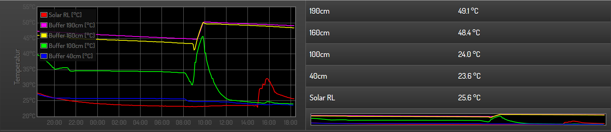
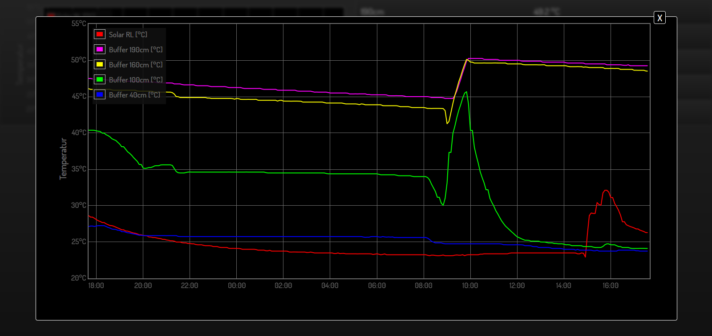
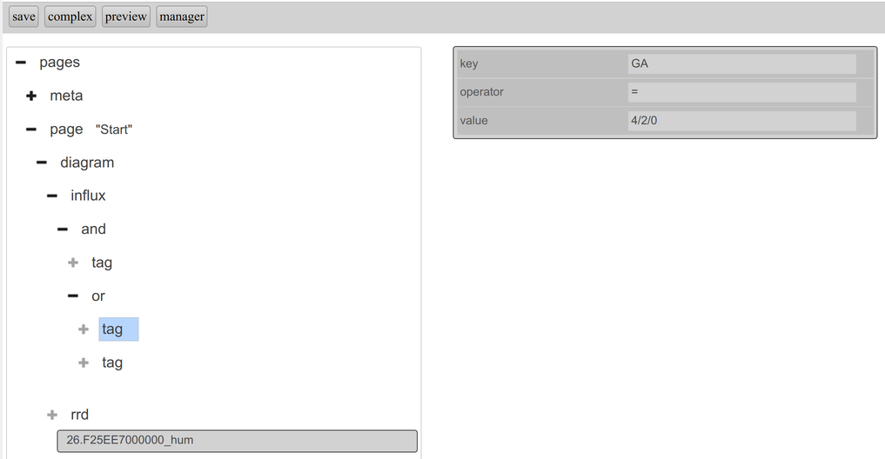

.. replaces:: CometVisu/Widget/diagram_inline/de
    CometVisu/Widget/diagram_popup/de

.. _diagram:

Das Diagram Plugin
==================

.. api-doc:: cv.plugins.diagram.AbstractDiagram

.. TODO::

    openHAB Ergänzungen

Beschreibung
------------

Das Diagram-Plugin bietet die Möglichkeit den zeitlichen Verlauf von Messwerten etc. zu visualisieren. Die Datenquelle 
muss im rrd-Format vorliegen. Genaueres dazu im Abschnitt :ref:`RRD-Einführung & Beispiele <rrd_introduction>`.

Das Diagramm wird standardmäßig im Inline-Modus als Widget dargestellt. Zusätzlich kann die Option Popup 
aktiviert werden, so dass das Diagramm nach dem Anklicken im Vollbildmodus erscheint. Je nach Widgetgröße kann
für die Inline Ansicht festgelegt werden ob Legende bzw. Achsenbeschriftungen angezeigt werden sollen.

    
   Diagramm als Widget (Inline-Diagramm) mit 5 Datenreihen und rechts unten als kleine Voransicht

    
   Diagramm Popup das nach dem Anklicken des Diagramms angezeigt wird.

Wenn ein Anzeigewert als Aufruf für das Popup dienen soll, muss das ``diagram_info``-Plugin verwendet werden.
Genauere Informationen dazu unter :ref:`diagram_info`.

Detaillierte Einstellungen
--------------------------

Das Diagram-Plugin ist eines der Widgets mit den umfangreichsten Konfigurationsmöglichkeiten. Viele der Attribute-
bzw. Elemente sind aber optional für verschiedene Sonderanwendungen, so dass bereits mit wenigen Einstellungen
sehr ansehnliche Diagramme in der CometVisu dargestellt werden können.

Erlaubte Attribute im Diagramm-Element
^^^^^^^^^^^^^^^^^^^^^^^^^^^^^^^^^^^^^^

.. parameter-information:: diagram

Erlaubte Kind-Elemente und deren Attribute
^^^^^^^^^^^^^^^^^^^^^^^^^^^^^^^^^^^^^^^^^^

.. elements-information:: diagram

.. _diagram_influx:

``authentication`` Attribut
"""""""""""""""""""""""""""

Im ``<influx>`` Element kann über das ``authentication`` Attribut auf einen entsprechenden Eintrag aus der
:ref:`versteckten Konfiguration <hidden-config>` verwiesen werden (als Default wird als Name `influx` angenommen).

Die in der versteckte Konfiguration verwendeten Schlüssel/Wert-Paare sind:

+-----------+-----------------------------------------------------------------------------+----------------------------+
|Schlüssel  |Wert                                                                         |Beispiel                    |
+===========+=============================================================================+============================+
|uri        |Die URI für den Zugriff auf die InfluxDB (optional)                          |http://localhost:8086/query |
+-----------+-----------------------------------------------------------------------------+----------------------------+
|user       |Der Benutzername für die InfluxDB                                            |InfluxDBTestUser            |
+-----------+-----------------------------------------------------------------------------+----------------------------+
|pass       |Das Passwort für die InfluxDB                                                |``Xsdwfw324SEs``            |
+-----------+-----------------------------------------------------------------------------+----------------------------+
|selfsigned |Erlaube selbst signierte HTTPS Verbindung zum Server, wenn Wert ``true`` ist |``false``                   |
+-----------+-----------------------------------------------------------------------------+----------------------------+

``consolidationFunction`` Attribut
""""""""""""""""""""""""""""""""""

Wenn für einen Zeitraum nur ein Wert angezeigt werden soll, so wird dieser über
eine ``consolidationFunction`` gebildet. Möglich ist:

=================================  =======================================================================
``COUNT``                          Anzahl der Werte
``DERIVATIVE`` [1]_                Änderung pro Sekunde
``DERIVATIVE_COUNT`` [1]_          Änderung pro Sekunde der Messwertanzahlen im jeweiligen Zeitbereich
``DERIVATIVE_MEAN`` [1]_           Änderung pro Sekunde der Mittelwerte des jeweiligen Zeitbereichs
``DERIVATIVE_MEDIAN`` [1]_         Änderung pro Sekunde der Mediane des jeweiligen Zeitbereichs
``DERIVATIVE_MODE`` [1]_           Änderung pro Sekunde der häufigsten Werte des jeweiligen Zeitbereichs
``DERIVATIVE_SUM`` [1]_            Änderung pro Sekunde der Summen des jeweiligen Zeitbereichs
``DERIVATIVE_FIRST`` [1]_          Änderung pro Sekunde der ersten Messwerte im jeweiligen Zeitbereich
``DERIVATIVE_LAST`` [1]_           Änderung pro Sekunde der letzten Messwerte im jeweiligen Zeitbereich
``DERIVATIVE_MIN`` [1]_            Änderung pro Sekunde der kleinsten Messwerte im jeweiligen Zeitbereich
``DERIVATIVE_MAX`` [1]_            Änderung pro Sekunde der größten Messwerte im jeweiligen Zeitbereich
``DERIVATIVE_PERCENTILE_1`` [1]_   Änderung pro Sekunde des 1% Percentils des jeweiligen Zeitbereichs
``DERIVATIVE_PERCENTILE_5`` [1]_   Änderung pro Sekunde des 5% Percentils des jeweiligen Zeitbereichs
``DERIVATIVE_PERCENTILE_10`` [1]_  Änderung pro Sekunde des 10% Percentils des jeweiligen Zeitbereichs
``DERIVATIVE_PERCENTILE_20`` [1]_  Änderung pro Sekunde des 20% Percentils des jeweiligen Zeitbereichs
``DERIVATIVE_PERCENTILE_25`` [1]_  Änderung pro Sekunde des 25% Percentils des jeweiligen Zeitbereichs
``DERIVATIVE_PERCENTILE_75`` [1]_  Änderung pro Sekunde des 75% Percentils des jeweiligen Zeitbereichs
``DERIVATIVE_PERCENTILE_80`` [1]_  Änderung pro Sekunde des 80% Percentils des jeweiligen Zeitbereichs
``DERIVATIVE_PERCENTILE_90`` [1]_  Änderung pro Sekunde des 90% Percentils des jeweiligen Zeitbereichs
``DERIVATIVE_PERCENTILE_95`` [1]_  Änderung pro Sekunde des 95% Percentils des jeweiligen Zeitbereichs
``DERIVATIVE_PERCENTILE_99`` [1]_  Änderung pro Sekunde des 99% Percentils des jeweiligen Zeitbereichs
``DIFFERENCE`` [1]_                Differenz
``DIFFERENCE_COUNT`` [1]_          Differenz der Messwertanzahlen im jeweiligen Zeitbereichs
``DIFFERENCE_MEAN`` [1]_           Differenz der Mittelwerte des jeweiligen Zeitbereichs
``DIFFERENCE_MEDIAN`` [1]_         Differenz der Mediane des jeweiligen Zeitbereichs
``DIFFERENCE_MODE`` [1]_           Differenz der häufigsten Werte des jeweiligen Zeitbereichs
``DIFFERENCE_SUM`` [1]_            Differenz der Summen des jeweiligen Zeitbereichs
``DIFFERENCE_FIRST`` [1]_          Differenz der ersten Messwerte im jeweiligen Zeitbereich
``DIFFERENCE_LAST`` [1]_           Differenz der letzten Messwerte im jeweiligen Zeitbereich
``DIFFERENCE_MIN`` [1]_            Differenz der kleinsten Messwerte im jeweiligen Zeitbereich
``DIFFERENCE_MAX`` [1]_            Differenz der größten Messwerte im jeweiligen Zeitbereich
``DIFFERENCE_PERCENTILE_1`` [1]_   Differenz des 1% Percentils des jeweiligen Zeitbereichs
``DIFFERENCE_PERCENTILE_5`` [1]_   Differenz des 5% Percentils des jeweiligen Zeitbereichs
``DIFFERENCE_PERCENTILE_10`` [1]_  Differenz des 10% Percentils des jeweiligen Zeitbereichs
``DIFFERENCE_PERCENTILE_20`` [1]_  Differenz des 20% Percentils des jeweiligen Zeitbereichs
``DIFFERENCE_PERCENTILE_25`` [1]_  Differenz des 25% Percentils des jeweiligen Zeitbereichs
``DIFFERENCE_PERCENTILE_75`` [1]_  Differenz des 75% Percentils des jeweiligen Zeitbereichs
``DIFFERENCE_PERCENTILE_80`` [1]_  Differenz des 80% Percentils des jeweiligen Zeitbereichs
``DIFFERENCE_PERCENTILE_90`` [1]_  Differenz des 90% Percentils des jeweiligen Zeitbereichs
``DIFFERENCE_PERCENTILE_95`` [1]_  Differenz des 95% Percentils des jeweiligen Zeitbereichs
``DIFFERENCE_PERCENTILE_99`` [1]_  Differenz des 99% Percentils des jeweiligen Zeitbereichs
``ELAPSED``                        Zeit seit dem letzen Messwert (ignoriert ``resolution`` Attribut)
``INTEGRAL``                       Integral der Werte
``MAX``                            Maximum
``MEAN``                           Mittelwert
``MEDIAN``                         Median
``MIN``                            Minimum
``MODE``                           Der häufigste Wert
``SPREAD``                         Differenz zwischen Maximum und Minimum
``STDDEV``                         Standardabweichung
``SUM``                            Summe
=================================  =======================================================================

.. [1] Hinweis: In zukünftigen Versionen der CometVisu kann sich die Syntax für
       diese Transformations ändern. Bei einem Update bitte im Handbuch auf
       Änderungen diesbezüglich achten.

``fillMissing`` Attribut
""""""""""""""""""""""""

Über ``fillMissing`` lassen sich Lücken in den Daten schließen. Möglich ist:

============  ===========================
``linear``    Lineare Interpolation
``none``      Keine Auffüllung
``null``      Kein Wert
``previous``  Übername des letzten Wertes
============  ===========================

Elemente innerhalb ``<influx>``
"""""""""""""""""""""""""""""""

Im ``<influx>`` Element können über ``<add>``, ``<or>`` und ``<tag>`` Elemente
die anzuzeigenden Daten gefiltert werden. Über ``<add>`` und ``<or>`` werden
die (auch verschachtelten) Kind-Elemente UND bzw. ODER verknüpft. Im ``<tag>``
wird nach dem in der InfluxDB abgelegten Tags gefiltert in dem der Schlüssel
``key`` mit dem Wert ``value`` über den Operator ``operator`` verglichen wird.
Mögliche Operatoren sind:

====== ==================================
``=``  Gleich
``!=`` Ungleich
``<``  Kleiner
``<=`` Kleiner gleich
``>``  Größer
``>=`` Größer gleich
``=~`` Match des regulären Ausdrucks
``!~`` Kein Match des regulären Ausdrucks
====== ==================================

.. code-block:: xml

    <diagram width="600" height="300" series="fullday" period="8">
      <influx field="Val" fillMissing="linear" style="lines" fill="true" measurement="timeseries_db/KNX_LINE1" authentication="influx">
        <and>
          <tag key="PA" operator="=" value="1.2.3"/>
          <or>
            <tag key="GA" operator="=" value="4/2/0"/>
            <tag key="GA" operator="=" value="4/2/1"/>
          </or>
        </and>
      </influx>
      <rrd datasourceIndex="0" consolidationFunction="AVERAGE" fill="true">26.F25EE7000000_hum</rrd>
    </diagram>

   Beispiel Influx-Datenquelle mit Filtern

XML Syntax minimal
------------------

Alternativ kann man für das Diagram-Widget auch von Hand einen Eintrag in
der :ref:`visu_config.xml <xml-format>` hinzufügen.

.. CAUTION::
    In der Config selbst dürfen NUR UTF-8 Zeichen verwendet
    werden. Dazu muss ein auf UTF-8 eingestellter Editor verwendet werden!

Nachstehend ein einfaches Beispiel für das Diagram als Widget mit Popup-Funktion inkl. Beispielcode. 

.. figure:: _static/Diagram_simple_inline3.png

.. code-block:: xml

    <diagram  period="24" refresh="300" series="hour" gridcolor="#707070" popup="true" previewlabels="true" legend="both" legendposition="nw">
        <layout colspan="6" rowspan="6"/>
        <axis unit="°C" label="Temperatur"/>
        <rrd color="#FF0000" label="Solar RL [°C]">28.9B3172020000_temp</rrd>
        <rrd color="#FF00FF" label="Buffer 190cm [°C]">28.56A61B030000_temp</rrd>
        <rrd color="#FFFF00" label="Buffer 160cm [°C]">28.DCA672020000_temp</rrd>
        <rrd color="#00FF00" label="Buffer 100cm [°C]">28.EEA21B030000_temp</rrd>
        <rrd color="#0000FF" label="Buffer 40cm [°C]">28.E7E17D020000_temp</rrd>
    </diagram>

