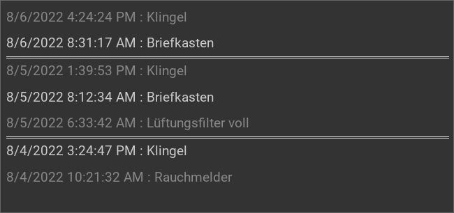

.. _rsslog:

Das RSSLog Plugin
=================

.. api-doc:: cv.plugins.Rsslog

Beschreibung
------------

Das RSSLog-Plugin für der Visuseite interaktive Log-Meldungen, basierend auf
RSS-Technologie, hinzu.

Einstellungen
-------------

Für eine grundsätzliche Erklärung des Aufbaus der Konfiguration und der Definition der im folgenden benutzten
Begriffe (Elemente, Attribute) sollte zunächst dieser Abschnitt gelesen werden: :ref:`visu-config-details`.

Das Verhalten und Aussehen des strftime-Plugins kann durch die Verwendung von Attributen und Elementen beeinflusst werden.
Die folgenden Tabellen zeigen die erlaubten Attribute und Elemente. In den Screenshots sieht man, wie
beides über den :ref:`Editor <editor>` bearbeitet werden kann.

Nur die mit ..... unterstrichenen Attribute/Elemente müssen zwingend angegeben werden, alle anderen sind optional und können
daher weg gelassen werden.

Erlaubte Attribute im rsslog-Element
^^^^^^^^^^^^^^^^^^^^^^^^^^^^^^^^^^^^

.. parameter-information:: rsslog

.. widget-example::
    :editor: attributes
    :scale: 75
    :align: center

    <caption>Attribute im Editor (vereinfachte Ansicht) [#f1]_</caption>
    <meta>
        <plugins>
            <plugin name="rsslog" />
        </plugins>
    </meta>
    <rsslog src="plugins/rsslog/rsslog.php" refresh="300" limit="6" mode="last">
      <layout rowspan="6" colspan="6"/>
      <address transform="DPT:1.001" mode="readwrite">12/7/1</address>
    </rsslog>

Erlaubte Kind-Elemente und deren Attribute
^^^^^^^^^^^^^^^^^^^^^^^^^^^^^^^^^^^^^^^^^^

.. elements-information:: rsslog

.. widget-example::
    :editor: elements
    :scale: 75
    :align: center

    <caption>Elemente im Editor</caption>
    <meta>
        <plugins>
            <plugin name="rsslog" />
        </plugins>
    </meta>
    <rsslog src="plugins/rsslog/rsslog.php" refresh="300" limit="6" mode="last">
        <layout rowspan="6" colspan="6"/>
        <address transform="DPT:1.001" mode="readwrite">12/7/1</address>
    </rsslog>

XML Syntax
----------

Alternativ kann man für das rsslog Plugin auch von Hand einen Eintrag in
der :ref:`visu_config.xml <xml-format>` hinzufügen.

.. CAUTION::
    In der Config selbst dürfen NUR UTF-8 Zeichen verwendet
    werden. Dazu muss ein auf UTF-8 eingestellter Editor verwendet werden!

Hier der minimale Beispielcode der das rsslog Plugin aus dem folgenden Screenshot erzeugt:

.. widget-example::

    <settings sleep="1300">
        <screenshot name="rsslog_simple">
            <caption>RSSLog, einfaches Beispiel</caption>
        </screenshot>
    </settings>
    <meta>
        <plugins>
            <plugin name="rsslog" />
        </plugins>
    </meta>
    <rsslog src="plugins/rsslog/rsslog.php" refresh="300" limit="6" mode="last">
        <layout rowspan="6" colspan="6"/>
        <address transform="DPT:1.001" mode="readwrite">12/7/1</address>
    </rsslog>

Externe Interation mit den Daten
--------------------------------

Das RSSLog Plugin der CometVisu ist nur die Anzeige der Daten aus der Datenbank,
die Befüllung muss durch eine Logik-Engine von außen passieren. Empfohlen ist
hierfür nicht direkt auf die Datenbank zuzugreifen, sondern das gleich HTTP-API
zu nutzen, die auch das RRSLog Plugin nutzt.

Alle Aufrufe sind normale HTTP GET Requests, die eine Logik-Engine leicht
erzeugen kann.

API Dokumentation
^^^^^^^^^^^^^^^^^

Neuer Eintrag
.............

.. list-table::
    :widths: 20 80
    :header-rows: 1

    *   - Schlüssel
        - Wert
    *   - ``c``
        - Inhalt
    *   - ``t[]``
        - Tag zum Filtern.

          Es dürfen auch mehrere Tags gleichzeitig gesetzt werden, diese
          müssen dann durch ein Komma getrennt werden (z.B. ``t[]=tag1,tag2``)
    *   - ``h``
        - Optional: Ein Header bzw. Titel für den Eintrag
    *   - ``state``
        - Optional: Status des Eintrags (``0`` oder ``1``).
    *   - ``mapping``
        - Optional: Mapping für die Anzeige

Beispiel: ``rsslog.php?c=Fisch&t[]=blau,gelb``

Log als RSS-Feed ausgeben
.........................

.. list-table::
    :widths: 20 80
    :header-rows: 1

    *   - Schlüssel
        - Wert
    *   - ``f``
        - Optional: Filter, nur Einträge deren Tag auf den Filter passen
          werden ausgegeben
    *   - ``state``
        - Optional: Nur Einträge mit diesem Zustand werden ausgegeben
    *   - ``limit``
        - Optional: Zahl der auszugebenden Einträge

Beispiel: ``rsslog.php?f=gelb&state=0&limit=5``

Log auf einer HTML-Seite anzeigen
.................................

.. list-table::
    :widths: 20 80
    :header-rows: 1

    *   - Schlüssel
        - Wert
    *   - ``dump``
        - (Ohne Wert)

Beispiel: ``rsslog.php?dump``

Alte Einträge löschen
.....................

.. list-table::
    :widths: 20 80
    :header-rows: 1

    *   - Schlüssel
        - Wert
    *   - ``r``
        - UNIX-Zeitstempel (Sekunden seit dem 1.1.1970) des ältesten Eintrags
          der noch zu behalten ist
    *   - ``f``
        - Optional: Filter - nur Zeilen bei denen der Filter zutrifft werden
          gelöscht

Beispiel: ``rsslog.php?r=213&f=gelb``

Einen Eintrag löschen
.....................

.. list-table::
    :widths: 20 80
    :header-rows: 1

    *   - Schlüssel
        - Wert
    *   - ``d``
        - ID des Eintrags

Beispiel: ``rsslog.php?d=123``

Inhalt im JSON Format ausgeben
..............................

.. list-table::
    :widths: 20 80
    :header-rows: 1

    *   - Schlüssel
        - Wert
    *   - ``j``
        - (Ohne Wert)

Beispiel: ``rsslog.php?j``

Status aktualisieren
....................

.. list-table::
    :widths: 20 80
    :header-rows: 1

    *   - Schlüssel
        - Wert
    *   - ``u``
        - ID des Eintrags
    *   - ``state``
        - Der neue Wert für den Status

Beispiel: ``rsslog.php?u=123&state=1``

Info-Seite anzeigen
...................

.. list-table::
    :widths: 20 80
    :header-rows: 1

    *   - Schlüssel
        - Wert
    *   - ``info``
        - (Ohne Wert)

Beispiel: ``rsslog.php?info``

Beispiel: API Zugriff mit Node-Red
^^^^^^^^^^^^^^^^^^^^^^^^^^^^^^^^^^

Beispiel: API Zugriff aus der Linux Shell
^^^^^^^^^^^^^^^^^^^^^^^^^^^^^^^^^^^^^^^^^

In einer Shell lässt sich über die bekannten Tools ``wget`` oder ``curl`` auch
ein HTTP GET Request absetzen.

Mit diesem Befehl lässt sich beispielsweise ein neuer Eintrag anlegen:

.. code-block:: bash

    wget http://localhost/

.. rubric:: Fußnoten

.. [#f1] In der vereinfachten Ansicht sind ggf. einige Dinge ausgeblendet. In der Expertenansicht ist alles zu sehen.
