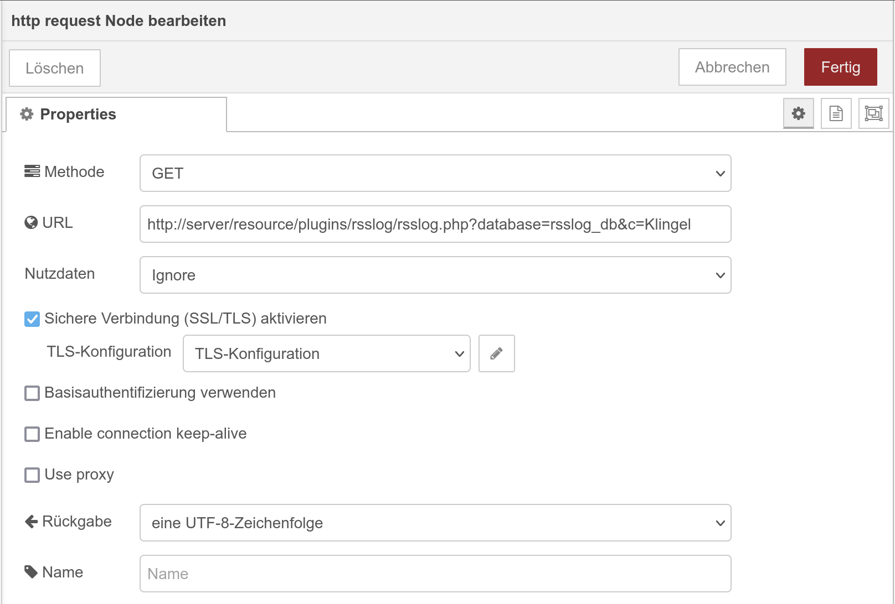

.. _rsslog:

Das RSSLog Plugin
=================

.. api-doc:: cv.plugins.RssLog

.. spelling::

    Always
    database
    delay
    display
    Feed
    first
    future
    Inhibit
    itemack
    limit
    modify
    mysql
    rollover
    rsslog
    sqlite

Beschreibung
------------

Das RSSLog-Plugin fügt der Visu-Seite interaktive Log-Meldungen hinzu, die auf
der RSS-Feed Technologie basieren.

Diese Log-Meldungen können sowohl für ein statisches Ereignisprotokoll, z.B. wann
geklingelt wurde oder wann es welche Anlagenfehler gab, als auch für ein interaktives
Protokoll verwendet werden. Bei diesem können Einträge bestätigt werden, was
beispielsweise für eine ToDo-Liste relevant ist.

Durch einen Klick auf die Log-Liste öffnet sich ein Pop-Up-Fenster. In diesem
können noch mehr Einträge sichtbar sein und es ist - bei der interaktiven
Variante - möglich die einzelnen Zeilen zu bestätigen.

Einstellungen
-------------

Für eine grundsätzliche Erklärung des Aufbaus der Konfiguration und der Definition der im folgenden benutzten
Begriffe (Elemente, Attribute) sollte zunächst dieser Abschnitt gelesen werden: :ref:`visu-config-details`.

Das Verhalten und Aussehen des RSSLog-Plugins kann durch die Verwendung von Attributen und Elementen beeinflusst werden.
Die folgenden Tabellen zeigen die erlaubten Attribute und Elemente. In den Screenshots sieht man, wie
beides über den :ref:`Editor <editor>` bearbeitet werden kann.

Nur die mit ..... unterstrichenen Attribute/Elemente müssen zwingend angegeben werden, alle anderen sind optional und können
daher weg gelassen werden.

Erlaubte Attribute im rsslog-Element
^^^^^^^^^^^^^^^^^^^^^^^^^^^^^^^^^^^^

.. parameter-information:: rsslog

.. widget-example::
    :editor: attributes
    :scale: 75
    :align: center

    <settings>
      <fixtures>
        <fixture source-file="doc/manual/de/config/widgets/plugins/rsslog/_static/fixtures/rsslog_simple.json" target-path="resource/plugins/rsslog/rsslog.php?limit=6&amp;j=1" mime-type="application/json"/>
      </fixtures>
    </settings>
    <caption>Attribute im Editor (vereinfachte Ansicht) [#f1]_</caption>
    <meta>
      <plugins>
        <plugin name="rsslog" />
      </plugins>
    </meta>
    <rsslog src="plugins/rsslog/rsslog.php" refresh="300" limit="6" mode="last">
      <layout rowspan="6" colspan="6"/>
      <address transform="DPT:1.001" mode="readwrite">12/7/1</address>
    </rsslog>

Erlaubte Kind-Elemente und deren Attribute
^^^^^^^^^^^^^^^^^^^^^^^^^^^^^^^^^^^^^^^^^^

.. elements-information:: rsslog

.. widget-example::
    :editor: elements
    :scale: 75
    :align: center

    <settings>
      <fixtures>
        <fixture source-file="doc/manual/de/config/widgets/plugins/rsslog/_static/fixtures/rsslog_simple.json" target-path="resource/plugins/rsslog/rsslog.php?limit=6&amp;j=1" mime-type="application/json"/>
      </fixtures>
    </settings>
    <caption>Elemente im Editor</caption>
    <meta>
        <plugins>
            <plugin name="rsslog" />
        </plugins>
    </meta>
    <rsslog src="plugins/rsslog/rsslog.php" refresh="300" limit="6" mode="last">
        <layout rowspan="6" colspan="6"/>
        <address transform="DPT:1.001" mode="readwrite">12/7/1</address>
    </rsslog>

.. note::

    Grundsätzlich gibt es technisch keine Möglichkeit einen RSS-Feed durch
    eine Aktion vom Server auf dem Client zu aktualisieren, d.h. der Client
    kann nicht wissen, dass es einen neuen Eintrag gibt. Das RSSLog-Plugin
    wird nach der im Attribut ``refresh`` definierten Zeit die Daten neu laden,
    aber zwischenzeitlich eingetragene Daten sind bis dahin nicht sehen.

    Wenn jedoch optional ein ``<address>`` Element mit angegeben wird, kann
    das RSSLog-Plugin von sich aus die Daten neu laden sobald
    irgend ein Wert auf diese Adresse geschrieben wird.
    Über das Attribut ``delay`` kann hier noch ein zeitlicher Versatz
    konfiguriert werden, so dass in der Logik-Engine gegebenenfalls vorhandene
    Durchlaufzeiten kompensiert werden können.

XML Syntax
----------

Alternativ kann man für das rsslog Plugin auch von Hand einen Eintrag in
der :ref:`visu_config.xml <xml-format>` hinzufügen.

.. CAUTION::
    In der Config selbst dürfen NUR UTF-8 Zeichen verwendet
    werden. Dazu muss ein auf UTF-8 eingestellter Editor verwendet werden!

Einfaches Beispiel: statische Liste
^^^^^^^^^^^^^^^^^^^^^^^^^^^^^^^^^^^

Die Einträge in diesem Beispiel könnten durch diese URLs erzeugt werden:

.. code::

    http://server/resource/plugins/rsslog/rsslog.php?&c=Klingel
    http://server/resource/plugins/rsslog/rsslog.php?&c=Briefkasten
    http://server/resource/plugins/rsslog/rsslog.php?&c=Lüftungsfilter%20voll
    http://server/resource/plugins/rsslog/rsslog.php?&c=Rauchmelder

.. widget-example::

    <settings>
        <fixtures>
            <fixture source-file="doc/manual/de/config/widgets/plugins/rsslog/_static/fixtures/rsslog_simple.json" target-path="resource/plugins/rsslog/rsslog.php?limit=6&amp;j=1" mime-type="application/json" />
        </fixtures>
        <screenshot name="rsslog_simple">
            <caption>RSSLog, einfaches Beispiel</caption>
        </screenshot>
    </settings>
    <meta>
        <plugins>
            <plugin name="rsslog" />
        </plugins>
    </meta>
    <rsslog src="plugins/rsslog/rsslog.php" refresh="300" limit="6" mode="last">
        <layout rowspan="6" colspan="6"/>
        <address transform="DPT:1.001" mode="readwrite">12/7/1</address>
    </rsslog>

Einfaches Beispiel: statische Liste, mit Mapping
^^^^^^^^^^^^^^^^^^^^^^^^^^^^^^^^^^^^^^^^^^^^^^^^

Die Einträge in diesem Beispiel könnten durch diese URLs erzeugt werden:

.. code::

    http://server/resource/plugins/rsslog/rsslog.php?&c=Klingel&mapping=StateDoorBell
    http://server/resource/plugins/rsslog/rsslog.php?&c=Briefkasten&mapping=StateMail
    http://server/resource/plugins/rsslog/rsslog.php?&c=Lüftungsfilter%20voll&mapping=StateService
    http://server/resource/plugins/rsslog/rsslog.php?&c=Rauchmelder&mapping=StateSmokedetector

.. widget-example::

    <settings>
        <fixtures>
            <fixture source-file="doc/manual/de/config/widgets/plugins/rsslog/_static/fixtures/rsslog_simple_mapping.json" target-path="resource/plugins/rsslog/rsslog.php?limit=7&amp;j=1" mime-type="application/json" />
        </fixtures>
        <screenshot name="rsslog_simple_mapping">
            <caption>RSSLog, einfaches Beispiel mit Mapping</caption>
        </screenshot>
    </settings>
    <meta>
        <plugins>
            <plugin name="rsslog" />
        </plugins>
        <mappings>
            <mapping name="StateMail">
                <entry value="0"><icon name="message_postbox_mail"/> </entry>
            </mapping>
            <mapping name="StateDoorBell">
                <entry value="0"><icon name="message_bell_door"/> </entry>
            </mapping>
            <mapping name="StateService">
                <entry value="0"><icon name="message_service" color="#FFA500"/> </entry>
            </mapping>
            <mapping name="StateSmokedetector">
                <entry value="0"><icon name="secur_smoke_detector" color="#FF0000"/> </entry>
            </mapping>
        </mappings>
    </meta>
    <rsslog src="plugins/rsslog/rsslog.php" refresh="300" limit="7" mode="last">
        <layout rowspan="6" colspan="6"/>
        <address transform="DPT:1.001" mode="readwrite">12/7/1</address>
    </rsslog>

Einfaches Beispiel: interaktive Liste
^^^^^^^^^^^^^^^^^^^^^^^^^^^^^^^^^^^^^

Die Einträge in diesem Beispiel könnten durch diese URLs erzeugt werden:

.. code::

    http://server/resource/plugins/rsslog/rsslog.php?&c=Aquarium%201%20Wasser%20wechseln&t[]=fish&mapping=StateConfirm&state=0
    http://server/resource/plugins/rsslog/rsslog.php?&c=Aquarium%202%20Wasser%20wechseln&t[]=fish&mapping=StateConfirm&state=0
    http://server/resource/plugins/rsslog/rsslog.php?&c=Lüftung%20Filter%20tauschen&t[]=ventilation&mapping=StateConfirm&state=0

.. widget-example::

    <settings>
        <fixtures>
            <fixture source-file="doc/manual/de/config/widgets/plugins/rsslog/_static/fixtures/rsslog_interactive.json" target-path="resource/plugins/rsslog/rsslog.php?limit=6&amp;j=1" mime-type="application/json"/>
        </fixtures>
        <screenshot name="rsslog_interactive">
            <caption>RSSLog, einfaches interaktives Beispiel</caption>
        </screenshot>
    </settings>
    <meta>
        <plugins>
            <plugin name="rsslog" />
        </plugins>
        <mappings>
            <mapping name="StateConfirm">
                <entry value="0"><icon name="info_warning" color="#EE0000"/> </entry>
                <entry value="1"><icon name="info_ack" color="#00AA00"/> </entry>
            </mapping>
        </mappings>
    </meta>
    <rsslog src="plugins/rsslog/rsslog.php" refresh="300" limit="6" mode="last">
        <layout rowspan="6" colspan="6"/>
        <address transform="DPT:1.001" mode="readwrite">12/7/1</address>
    </rsslog>

Komplexes Beispiel mit mehreren Kategorien
^^^^^^^^^^^^^^^^^^^^^^^^^^^^^^^^^^^^^^^^^^

Durch die Verwendung von Tags können Kategorien gebildet werden. In der Anzeige
wird der Tag zu dem HTML ``class`` Attribut hinzugefügt, so dass über CSS eine
Formatierung möglich ist. In diesem Beispiel wurde dies genutzt um die verschiedenen
Mülltonnen-Farben zu erzeugen.

Die Einträge in diesem Beispiel könnten durch diese URLs erzeugt werden:

.. code::

    http://server/resource/plugins/rsslog/rsslog.php?&c=Bio%20Tonne%20herausstellen&t[]=brown&mapping=StateConfirmGarbage&state=0
    http://server/resource/plugins/rsslog/rsslog.php?&c=Gelbe%20Tonne%20herausstellen&t[]=yellow&mapping=StateConfirmGarbage&state=0
    http://server/resource/plugins/rsslog/rsslog.php?&c=Papier%20Tonne%20herausstellen&t[]=blue&mapping=StateConfirmGarbage&state=0
    http://server/resource/plugins/rsslog/rsslog.php?&c=Tanken&t[]=car&mapping=StateConfirmFuel&state=0

Die ältesten beiden Einträge wurden bereits durch den Anwender bestätigt.

.. widget-example::

    <settings>
        <fixtures>
            <fixture source-file="doc/manual/de/config/widgets/plugins/rsslog/_static/fixtures/rsslog_complex.json" target-path="resource/plugins/rsslog/rsslog.php?limit=6&amp;j=1" mime-type="application/json"/>
        </fixtures>
        <screenshot name="rsslog_complex">
            <caption>RSSLog, komplexes Beispiel</caption>
        </screenshot>
    </settings>
    <meta>
        <plugins>
            <plugin name="rsslog" />
        </plugins>
        <mappings>
            <mapping name="StateConfirmGarbage">
                <entry value="0"><icon name="message_garbage_collection"/> </entry>
                <entry value="1"><icon name="info_ack" color="#00AA00"/> </entry>
            </mapping>
            <mapping name="StateConfirmFuel">
                <entry value="0"><icon name="scene_gas_station" color="#FF0000"/> </entry>
                <entry value="1"><icon name="scene_gas_station"/> </entry>
            </mapping>
        </mappings>
    </meta>
    <rsslog src="plugins/rsslog/rsslog.php" refresh="300" limit="6" mode="last">
        <layout rowspan="6" colspan="6"/>
        <address transform="DPT:1.001" mode="readwrite">12/7/1</address>
    </rsslog>

Externe Interaktion mit den Daten
---------------------------------

Das RSSLog-Plugin der CometVisu dient nur der Anzeige der Daten aus der Datenbank,
die Befüllung muss durch eine Logik-Engine von außen passieren. Empfohlen wird
hierfür nicht direkt auf die Datenbank zuzugreifen, sondern die gleiche HTTP-API
zu nutzen, die auch das RSSLog-Plugin nutzt.

Alle Aufrufe sind normale HTTP GET Requests, die eine Logik-Engine leicht
erzeugen kann.

API Dokumentation
^^^^^^^^^^^^^^^^^

Parameter für alle Aufrufe:

.. list-table::
    :widths: 20 80
    :header-rows: 1

    *   - Schlüssel
        - Wert
    *   - ``database``
        - Eintrag in der :ref:`versteckten Konfiguration <hidden-config>` in dem
          Informationen über den Datenbank-Zugriff hinterlegt sind.

Relevante Einträge in der versteckte Konfiguration (Hidden Config) sind:

.. list-table::
    :widths: 20 80
    :header-rows: 1

    *   - Schlüssel
        - Wert
    *   - ``type``
        - Datenbank-Typ: ``sqlite`` oder ``mysql``.
    *   - ``file``
        - Für sqlite: Datei (inkl. Pfad) für die Datenbank.
    *   - ``host``
        - Für mysql: Host-Adresse der Datenbank.
    *   - ``port``
        - Für mysql, optional: Port der Datenbank.
    *   - ``user``
        - Für mysql: Benutzername für die Datenbank.
    *   - ``pass``
        - Für mysql: Passwort für die Datenbank.
    *   - ``db``
        - Für mysql: Name der Datenbank.
    *   - ``logs``
        - Optional: Name für die ``Logs`` Tabelle.
    *   - ``version``
        - Optional: Name für die ``Version`` Tabelle.

Neuer Eintrag
.............

.. list-table::
    :widths: 20 80
    :header-rows: 1

    *   - Schlüssel
        - Wert
    *   - ``c``
        - Inhalt
    *   - ``h``
        - Optional: Ein Header bzw. Titel für den Eintrag. Dieser ist nur für
          den RSS-Feed relevant, nicht aber für das RSSLog-Plugin.
    *   - ``t[]``
        - Optional: Tag zum Filtern.

          Es dürfen auch mehrere Tags gleichzeitig gesetzt werden, diese
          müssen dann durch ein Komma getrennt werden (z.B. ``t[]=tag1,tag2``).

          Die Werte der Tags werden auch dem HTML ``class`` Attribute des
          im ``mapping`` definierten Eintrags hinzugefügt, so dass dieser über
          eigene CSS-Regeln zusätzlich formatiert werden kann.
    *   - ``state``
        - Optional: Status des Eintrags (``0`` oder ``1``).

          Dieser Status kann durch Klick auf den Eintrag interaktiv geändert
          werden.
    *   - ``mapping``
        - Optional: Auswahl des Mapping für die Anzeige. Dies muss im ``<meta>``
          Bereich der Konfiguration definiert worden sein und kann genutzt
          werden um bei dem Eintrag ein Icon mit anzuzeigen. Dieses Mapping
          nutzt auch den Status des Eintrags.

Beispiel: ``rsslog.php?c=Fisch&t[]=blau,gelb``

.. note::

    Neue Einträge werden normaler Weise über eine Logik-Engine durch den Aufruf
    dieser URL erzeugt. Beispiele hierzu sind weiter unten aufgeführt.

    Es lassen sich aber auch leicht über die CometVisu von Nutzer selbst neue
    Einträge hinzufügen. Hierzu muss nur ein :doc:`URL-Trigger <../../urltrigger/index>`
    mit einer URL nach diesem Schema verwendet werden.

Log als RSS-Feed ausgeben
.........................

.. list-table::
    :widths: 20 80
    :header-rows: 1

    *   - Schlüssel
        - Wert
    *   - ``f``
        - Optional: Filter; nur Einträge deren Tag auf den Filter passen
          werden ausgegeben
    *   - ``state``
        - Optional: Nur Einträge mit diesem Zustand werden ausgegeben
    *   - ``limit``
        - Optional: Zahl der auszugebenden Einträge
    *   - ``showmeta``
        - Optional: wenn ``true`` dann wird der Titel um Meta-Informationen
          erweitert

Beispiel: ``rsslog.php?f=gelb&state=0&limit=5``

Log auf einer HTML-Seite anzeigen
.................................

.. list-table::
    :widths: 20 80
    :header-rows: 1

    *   - Schlüssel
        - Wert
    *   - ``dump``
        - (Ohne Wert)

Beispiel: ``rsslog.php?dump``

Alte Einträge löschen
.....................

.. list-table::
    :widths: 20 80
    :header-rows: 1

    *   - Schlüssel
        - Wert
    *   - ``r``
        - UNIX-Zeitstempel (Sekunden seit dem 1.1.1970) des ältesten Eintrags
          der noch zu behalten ist
    *   - ``f``
        - Optional: Filter; nur Zeilen bei denen der Filter zutrifft werden
          gelöscht

Beispiel: ``rsslog.php?r=213&f=gelb``

.. note::

    Damit die Datenbank nicht zu groß wird sollten regelmäßig alte Einträge
    gelöscht werden.

    Hierfür bietet es sich an den Aufruf dieser URL periodisch und automatisch
    durchzuführen, beispielsweise als CRON-Job. Ein Aufruf um alle Einträge
    zu löschen die älter als ein Jahr sind würde sich über diesen
    Terminal-Befehl erledigen lassen:

    .. code::

        wget http://server/resource/plugins/rsslog/rsslog.php?r=`date +%s -d "1 year ago"`

    Manuell lässt sich diese Bereinigung der Datenbank am leichtesten über die
    :ref:`Info-Seite <info-seite>` erreichen.

Einen Eintrag löschen
.....................

.. list-table::
    :widths: 20 80
    :header-rows: 1

    *   - Schlüssel
        - Wert
    *   - ``d``
        - ID des Eintrags

Beispiel: ``rsslog.php?d=123``

Inhalt im JSON Format ausgeben
..............................

.. list-table::
    :widths: 20 80
    :header-rows: 1

    *   - Schlüssel
        - Wert
    *   - ``j``
        - (Ohne Wert)

Beispiel: ``rsslog.php?j``

Status aktualisieren
....................

.. list-table::
    :widths: 20 80
    :header-rows: 1

    *   - Schlüssel
        - Wert
    *   - ``u``
        - ID des Eintrags
    *   - ``state``
        - Der neue Wert für den Status

Beispiel: ``rsslog.php?u=123&state=1``

.. _info-seite:

Info-Seite anzeigen
...................

Die Info-Seite zeigt Informationen über die Konfiguration und die Datenbank
an, beispielsweise die Zahl der gespeicherten Einträge. Außerdem gibt es Links
mit denen ältere Einträge gelöscht werden können.

.. list-table::
    :widths: 20 80
    :header-rows: 1

    *   - Schlüssel
        - Wert
    *   - ``info``
        - (Ohne Wert)

Beispiel: ``rsslog.php?info``

Beispiel: API Zugriff aus der Linux Shell
^^^^^^^^^^^^^^^^^^^^^^^^^^^^^^^^^^^^^^^^^

In einer Shell lässt sich über die bekannten Tools ``wget`` oder ``curl`` auch
ein HTTP GET Request absetzen.

Mit diesem Befehl lässt sich beispielsweise ein neuer Eintrag anlegen, in diesem
Beispiel mit dem Inhalt ``Klingel`` und der in der Hidden-Config konfigurierten
Datenbank ``rsslog_db``:

.. code-block:: bash

    wget http://server/resource/plugins/rsslog/rsslog.php?database=rsslog_db&c=Klingel

Beispiel: API Zugriff mit Node-RED
^^^^^^^^^^^^^^^^^^^^^^^^^^^^^^^^^^

Bei Node-RED kann ``http request`` genutzt werden um einen Eintrag zu erzeugen.

Bei diesem Beispiel soll bei jedem Klingeln ein Eintrag erzeugt werden. Hierzu
wird auf den KNX gehört und wenn dort ``true`` gesendet wurde,
so wird die entsprechende URL aufgerufen:

    Einfacher Node-RED flow.

    Konfiguration des ``http request`` für den einfachen Node-RED flow.

Es ist auch möglich dynamisch den Text für den Eintrag festzulegen:

.. figure:: _static/node-RED_dynamic.png

    Node-RED flow bei dem dynamisch der RSSLog-Text gesetzt werden kann.

.. figure:: _static/node-RED_dynamic_config.png

    Konfiguration des ``http request`` für den dynamischen Node-RED flow.

Beispiel: API Zugriff mit dem Timberwolf Server
^^^^^^^^^^^^^^^^^^^^^^^^^^^^^^^^^^^^^^^^^^^^^^^

Der `Timberwolf Server <https://timberwolf.io/>`_ bietet über das HTTP-API die
Möglichkeit HTTP GET Requests zu erzeugen und damit mit der RSSLog API zu
interagieren.

.. note::

    Die Beschreibung basiert auf der Timberwolf Software Version 3.0.

Statischer API Aufruf
.....................

Am einfachsten lässt sich ein Mechanismus realisieren, bei dem mit jedem
Eintreffen einer über KNX gesendeten Botschaft ein fester API Aufruf
getätigt werden soll.

In diesem Beispiel wird davon ausgegangen, dass mit Klingeln an die GA 4/3/200
der Wert ``Ein`` gesendet wird. Auch wird davon ausgegangen, dass die CometVisu
über den Proxy mit dem Pfad ``/visu/`` zu erreichen ist.

Als erstes muss ein HTTP-API Subsystem erzeugt werden:

.. figure:: _static/TWS_create_subsystem.png

Im Anschluss muss im "Ressourcen Manager" über "Neuen HTTP-API Server hinzufügen"
der relevante Eintrag angelegt werden:

.. figure:: _static/TWS_add_server.png

Für den Server muss nun noch mit "Ressource hinzufügen" die Verbindung zur
RSSLog API hergestellt werden ("HTTP Weiterleitungen folgen" muss aktiv sein):

Die Verbindung zwischen dem KNX Subsystem und dem HTTP-API Aufruf erfolgt nun
über "Objekt zu HTTP Abfrage hinzufügen", wobei die Einstellung für den
"Auslöser" angepasst werden muss:

.. figure:: _static/TWS_add_objekt.png

Abgeschlossen wird dies nun über das "Hinzufügen" bei "Verknüpfungen (Quellen)":

Nach der Einrichtung wird die Übersicht aussehen wie:

.. figure:: _static/TWS_static_final.png

Dynamischer API Aufruf
......................

Etwas komplexer wird das Beispiel, wenn die Klingel beim Klingeln "Ein" sendet,
sonst aber regelmäßig ein "Aus", so dass hier über eine Logik diese Werte
ausgefiltert werden müssen. In diesem Beispiel soll außerdem der Text für den
Eintrag nicht mehr fest in der URL kodiert werden, sondern aus der Logik
übertragen werden.

Wie für den statischen Eintrag beschrieben muss die HTTP-API konfiguriert werden,
wobei der Text für den Eintrag durch einen Platzhalter wie ``<title>``
ersetzt werden muss:

Bei dem Dialog für die Verbindung muss im "Selektor" der Platzhalter
angegeben werden und das "Format" auf "Text" geändert werden:

.. figure:: _static/TWS_add_dynamic_objekt.png

Unter "Objekte & Logik" muss nun im "Logik Manager" mit "Logik hinzufügen" ein
"Multiplexer(string)" hinzugefügt werden. Der "Eingang 1" wird auf
"Funktion: Parameter" geändert mit dem Wert ``Klingel``.
Der "Selektor" muss auf "Funktion: Parameter" mit Wert ``0`` gesetzt werden.
Über das ``+`` muss noch ein "Inhibit" Eintrag erzeugt werden. Dieser muss mit
dem KNX Objekt der Klingel verbunden werden und der Eingang selbst invertiert
werden (Klick auf den gepunkteten Kreis, so dass dieser ausgefüllt dargestellt
wird).
Der Inhibit-Eingang, so wie der Ausgang müssen noch auf "A" für "Always" gesetzt
werden und der Ausgang mit dem Objekt der HTTP-API verbunden werden:

.. figure:: _static/TWS_logik.png

.. note::

    Der Text für den Eintrag wird direkt in die URL eingebaut, d.h. der Text
    muss die Eigenheiten einer URL berücksichtigen und daher "escaped" sein.
    So müssen beispielsweise die Leerzeichen durch ``%20`` ersetzt werden.

.. rubric:: Fußnoten

.. [#f1] In der vereinfachten Ansicht sind ggf. einige Dinge ausgeblendet. In der Expertenansicht ist alles zu sehen.
