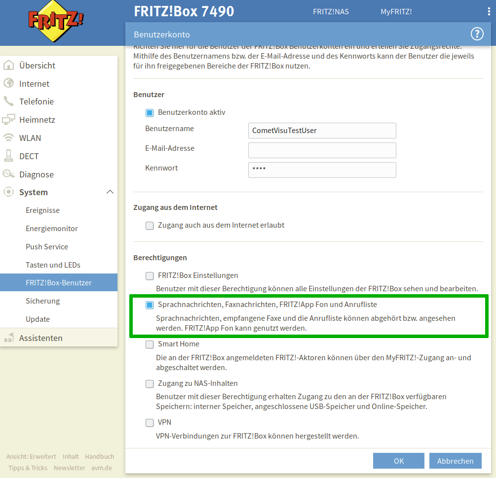

.. _tr064:

Das tr064 Plugin
=================

.. api-doc:: cv.plugins.tr064.CallList

Beschreibung
------------

Das Plugin ist ein Interface zu Routern die das TR-064 Protokoll implementieren, wie der weit verbreiteten Fritz!Box.
Mit dem ``calllist`` Widget aus diesem Plugin lässt sich eine Anrufliste darstellen. Diese Liste enthält sowohl die
Namen der Anrufer (wenn im Router hinterlegt), also auch die Aufzeichnungen des Anrufbeantworters.

.. widget-example::
    :hide-source: true

        <settings>
          <fixtures>
            <fixture source-file="source/test/fixtures/tr064_proxy.xml" target-path="resource/plugins/tr064/proxy.php"/>
            <fixture source-file="source/test/fixtures/tr064_soap.json" target-path="resource/plugins/tr064/soap.php"/>
          </fixtures>
          <screenshot name="calllist">
          </screenshot>
        </settings>
        <meta>
          <plugins><plugin name="tr064"/></plugins>
        </meta>
        <calllist device="tr064device">
          <layout colspan="6" />
        </calllist>

Einstellungen
-------------

Für eine grundsätzliche Erklärung des Aufbaus der Konfiguration und der Definition der im folgenden benutzten
Begriffe (Elemente, Attribute) sollte zunächst dieser Abschnitt gelesen werden: :ref:`visu-config-details`.

Das Verhalten und Aussehen des calllist-Widgets aus dem tr064-Plugin kann durch die Verwendung von Attributen und Elementen beeinflusst werden.
Die folgenden Tabellen zeigen die erlaubten Attribute und Elemente. In den Screenshots sieht man, wie
beides über den :ref:`Editor <editor>` bearbeitet werden kann.

Nur die mit ..... unterstrichenen Attribute/Elemente müssen zwingend angegeben werden, alle anderen sind optional und können
daher weg gelassen werden.

Erlaubte Attribute im calllist-Element
^^^^^^^^^^^^^^^^^^^^^^^^^^^^^^^^^^^^^^

.. parameter-information:: calllist

.. widget-example::
    :editor: attributes
    :scale: 75
    :align: center

    <caption>Attribute im Editor (vereinfachte Ansicht) [#f1]_</caption>
    <meta>
        <plugins>
            <plugin name="tr064" />
        </plugins>
    </meta>
    <calllist device="fritzbox">
        <layout colspan="4" />
    </calllist>

Erlaubte Kind-Elemente und deren Attribute
^^^^^^^^^^^^^^^^^^^^^^^^^^^^^^^^^^^^^^^^^^

.. elements-information:: calllist

.. widget-example::
    :editor: elements
    :scale: 75
    :align: center

    <caption>Elemente im Editor</caption>
    <meta>
        <plugins>
            <plugin name="tr064" />
        </plugins>
    </meta>
    <calllist device="fritzbox">
        <layout colspan="4" />
        <label>TR-064 Calllist</label>
        <address transform="DPT:1.001" mode="read">1/1/0</address>
    </calllist>

XML Syntax
----------

Alternativ kann man für das tr064-Plugin auch von Hand einen Eintrag in
der :ref:`visu_config.xml <xml-format>` hinzufügen.

.. CAUTION::
    In der Config selbst dürfen NUR UTF-8 Zeichen verwendet
    werden. Dazu muss ein auf UTF-8 eingestellter Editor verwendet werden!

Hier der minimale Beispielcode der das calllist Widget aus dem tr064 Plugin aus dem folgenden Screenshot erzeugt:

.. widget-example::

    <settings>
        <fixtures>
          <fixture source-file="source/test/fixtures/tr064_proxy.xml" target-path="/resource/plugins/tr064/proxy.php"/>
          <fixture source-file="source/test/fixtures/tr064_soap.json" target-path="/resource/plugins/tr064/soap.php"/>
        </fixtures>
        <screenshot name="calllist_simple">
            <caption>calllist, einfaches Beispiel</caption>
        </screenshot>
    </settings>
    <meta>
        <plugins>
            <plugin name="tr064" />
        </plugins>
    </meta>
    <calllist device="fritzbox">
        <label>calllist</label>
    </calllist>

    
Voraussetzungen / Einrichtung auf dem Server
--------------------------------------------

Um dieses Plugin nutzen zu können muss auf dem Server PHP eingerichtet sein und
die Unterstützung für SoapClient installiert sein.

Unter Debian basierten Systemen muss daher das Paket ``php-soap`` installiert 
sein.

Einrichtung der Fritz!Box
-------------------------

Um Zugriff auf die Anrufliste der Fritz!Box zu bekommen, muss dort ein Benutzer angelegt werden (oder ein bereits
angelegter Benutzer verwendet werden). Dies geht über die Benutzer-Verwaltung:

.. figure:: _static/fritzbox_overview.png

Der Benutzer selbst benötigt noch die Rechte um auf die Anrufliste zugreifen zu dürfen:

Damit das Plugin auf diesen Benutzer zugreifen kann, müssen dessen Login-Daten hinterlegt werden. Dies geht über die
:ref:`"Versteckten Konfigurationen" <hidden-config>`.

Der dort verwendete Name muss im calllist Widget im Attribut ``device`` angegeben werden.

Die in der versteckte Konfiguration verwendeten Schlüssel/Wert-Paare sind:

+-----------+-----------------------------------------------------+-------------------------------+
|Schlüssel  |Wert                                                 |Beispiel                       |
+===========+=====================================================+===============================+
|uri        |Die URI für den Zugriff auf die TR-064 Schnittstelle |``https://192.168.0.1:49443/`` |
+-----------+-----------------------------------------------------+-------------------------------+
|user       |Der Benutzername für den TR-064 Zugang               |``CometVisuTestUser``          |
+-----------+-----------------------------------------------------+-------------------------------+
|pass       |Das Passwort für den TR-64 Zugang                    |``pa3bvNM4j9z4``               |
+-----------+-----------------------------------------------------+-------------------------------+
|selfsigned |Erlaube selbstsignierte Zertifikate wenn ``true``    |``false``                      |
+-----------+-----------------------------------------------------+-------------------------------+

.. hint::

    Wenn eine SSL gesicherte Verbindung zum Router aufgebaut werden soll (d.h. die URI mit
    ``https`` beginnt), so ist meist ``selfsigned`` auf ``true`` zu setzen, da ein Router
    im Heimnetz üblicher Weise mit einem selbst signierten Zertifikat arbeitet.

.. rubric:: Fußnoten

.. [#f1] In der vereinfachten Ansicht sind ggf. einige Dinge ausgeblendet. In der Expertenansicht ist alles zu sehen.
