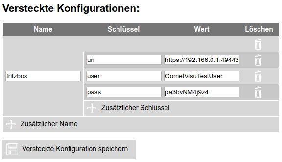

.. _tr064:

Das tr064 Plugin
=================

.. api-doc:: tr064

.. TODO::

    Automatische Screenshot-Generierung (aus Dummy-Daten)

Beschreibung
------------

Das Plugin ist ein Interface zu Routern die das TR-064 Protokoll implementieren, wie der weit verbreiteten Fritz!Box.
Mit dem ``calllist`` Widget aus diesem Plugin lässt sich eine Anrufliste darstellen. Diese Liste enthält sowohl die
Namen der Anrufer (wenn im Router hinterlegt), also auch die Aufzeichnungen des Anrufbeantworters.

.. widget-example::
    :hide-source: true

        <settings>
          <screenshot name="calllist">
          </screenshot>
        </settings>
        <meta>
          <plugins><plugin name="tr064"/></plugins>
        </meta>
        <calllist device="tr064device">
          <layout colspan="6" rowspan="6" />
        </calllist>

Einstellungen
-------------

Für eine grundsätzliche Erklärung des Aufbaus der Konfiguration und der Definition der im folgenden benutzten
Begriffe (Elemente, Attribute) sollte zunächst dieser Abschnitt gelesen werden: :ref:`visu-config-details`.

Das Verhalten und Aussehen des calllist-Widgets aus dem tr064-Plugin kann durch die Verwendung von Attributen und Elementen beeinflusst werden.
Die folgenden Tabellen zeigen die erlaubten Attribute und Elemente. In den Screenshots sieht man, wie
beides über den :ref:`Editor <editor>` bearbeitet werden kann.

Nur die mit ..... unterstrichenen Attribute/Elemente müssen zwingend angegeben werden, alle anderen sind optional und können
daher weg gelassen werden.

Erlaubte Attribute im calllist-Element
^^^^^^^^^^^^^^^^^^^^^^^^^^^^^^^^^^^^^^

.. parameter-information:: calllist

.. widget-example::
    :editor: attributes
    :scale: 75
    :align: center

    <caption>Attribute im Editor (vereinfachte Ansicht) [#f1]_</caption>
    <meta>
        <plugins>
            <plugin name="tr064" />
        </plugins>
    </meta>
    <calllist device="fritzbox">
        <layout colspan="4" />
    </calllist>

Erlaubte Kind-Elemente und deren Attribute
^^^^^^^^^^^^^^^^^^^^^^^^^^^^^^^^^^^^^^^^^^

.. elements-information:: calllist

.. widget-example::
    :editor: elements
    :scale: 75
    :align: center

    <caption>Elemente im Editor</caption>
    <meta>
        <plugins>
            <plugin name="tr064" />
        </plugins>
    </meta>
    <calllist device="fritzbox">
        <layout colspan="4" />
        <label>TR-064 Calllist</label>
        <address transform="DPT:1.001" mode="read">1/1/0</address>
    </calllist>

XML Syntax
----------

Alternativ kann man für das tr064-Plugin auch von Hand einen Eintrag in
der :doc:`visu_config.xml <../../../xml-format>` hinzufügen.

.. CAUTION::
    In der Config selbst dürfen NUR UTF-8 Zeichen verwendet
    werden. Dazu muss ein auf UTF-8 eingestellter Editor verwendet werden!

Hier der minimale Beispielcode der das calllist Widget aus dem tr064 Plugin aus dem folgenden Screenshot erzeugt:

.. code-block:: xml

    <?xml version="1.0" encoding="UTF-8"?>
    <meta>
        <plugins>
            <plugin name="tr064" />
        </plugins>
    </meta>
    <page name="TR-064" type="text">
        <calllist device="fritzbox">
            <label>calllist</label>
        </calllist>
    </page>
    
.. widget-example::

    <settings>
        <screenshot name="calllist_simple">
            <caption>calllist, einfaches Beispiel</caption>
        </screenshot>
    </settings>
    <meta>
        <plugins>
            <plugin name="tr064" />
        </plugins>
    </meta>
    <calllist device="fritzbox">
        <label>calllist</label>
    </calllist>

    
Voraussetzungen / Einrichtung auf dem Server
--------------------------------------------

Um dieses Plugin nutzen zu können muss auf dem Server PHP eingerichtet sein und
die Unterstützung für SoapClient installiert sein.

Unter Debian basierten Systemen muss daher das Paket ``php-soap`` installiert 
sein.

Einrichtung der Fritz!Box
-------------------------

Um Zugriff auf die Anrufliste der Fritz!Box zu bekommen, muss dort ein Benutzer angelegt werden (oder ein bereits
angelegter Benutzer verwendet werden). Dies geht über die Benutzer-Verwaltung:

.. figure:: _static/fritzbox_overview.png

Der Benutzer selbst benötigt noch die Rechte um auf die Anrufliste zugreifen zu dürfen:

.. figure:: _static/fritzbox_user.png

Damit das Plugin auf diesen Benutzer zugreifen kann, müssen dessen Login-Daten hinterlegt werden. Dies geht im Manager
im Bereich der "Versteckten Konfigurationen"[#f2]_:

Der dort verwendete Name muss im calllist Widget im Attribut ``device`` angegeben werden.

Alternativ zum Manager lässt sich auch direkt die Datei ``config/hidden.php`` editieren und eine Konfigurationszeile
hinzufügen:

.. code-block:: php

    <?php
    // File for configurations that shouldn't be shared with the user
    $hidden = array(
      'fritzbox' => array('uri' => 'https://192.168.0.1:49443/', 'user' => 'CometVisuTestUser', 'pass' => 'pa3bvNM4j9z4')
    );
    ?>

.. rubric:: Fußnoten

.. [#f1] In der vereinfachten Ansicht sind ggf. einige Dinge ausgeblendet. In der Expertenansicht ist alles zu sehen.

.. [#f2] Die "Versteckte Konfiguration" sind Konfigurationsdaten die nicht an den Client übertragen werden und auf dem
   Server bleiben. Daher werden diese vor dem Anwender "versteckt", sind aber auf dem Server selbst im Klartext lesbar.
   Auch im Manager sind diese Informationen im Klartext lesbar.

   Dies erzeugt für sich noch keine sichere Umgebung. Jedoch lässt sich hierdurch eine Sichere Umgebung aufbauen, in
   dem der Webserver so konfiguriert sein muss, dass der Anwender keinen Zugriff auf den Manager erhält.