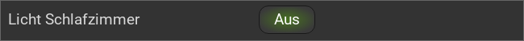

.. _toggle:

Das Toggle Widget
=================

.. api-doc:: Toggle

Beschreibung
------------

Das Toggle Widget fügt der Visu eine Schaltfläche hinzu, mit der EIN/AUS Funktionen realisiert werden können.

Einstellungen
-------------

Für eine grundsätzliche Erklärung des Aufbaus der Konfiguration und der Definition der im folgenden benutzten
Begriffe (Elemente, Attribute) sollte zunächst dieser Abschnitt gelesen werden: :ref:`visu-config-details`.

Das Verhalten und Aussehen des Toggle-Widgets kann durch die Verwendung von Attributen und Elementen beeinflusst werden.
Die folgenden Tabellen zeigen die erlaubten Attribute und Elemente. In den Screenshots sieht man, wie
beides über den :ref:`Editor <editor>` bearbeitet werden kann.

Nur die mit ..... unterstrichenen Attribute/Elemente müssen zwingend angegeben werden, alle anderen sind optional und können
daher weg gelassen werden.

Erlaubte Attribute im Toggle-Element
^^^^^^^^^^^^^^^^^^^^^^^^^^^^^^^^^^^^

.. parameter-information:: toggle

.. widget-example::
    :editor: attributes
    :scale: 75
    :align: center

    <caption>Attribute im Editor (vereinfachte Ansicht) [#f1]_</caption>
    <toggle mapping="OnOff" styling="RedGreen">
      <label>Licht Schlafzimmer</label>
      <address transform="DPT:1.001" mode="readwrite" variant="">12/1/5</address>
    </toggle>

Erlaubte Kind-Elemente und deren Attribute
^^^^^^^^^^^^^^^^^^^^^^^^^^^^^^^^^^^^^^^^^^

.. elements-information:: toggle

.. widget-example::
    :editor: elements
    :scale: 75
    :align: center

    <caption>Elemente im Editor</caption>
    <toggle mapping="OnOff" styling="RedGreen">
      <label>Licht Schlafzimmer</label>
      <address transform="DPT:1.001" mode="readwrite" variant="">12/1/5</address>
    </toggle>

XML Syntax
----------

Alternativ kann man für das Toggle Widget auch von Hand einen Eintrag in
der :doc:`visu_config.xml <../../xml-format>` hinzufügen.

.. CAUTION::
    In der Config selbst dürfen NUR UTF-8 Zeichen verwendet
    werden. Dazu muss ein auf UTF-8 eingestellter Editor verwendet werden!

Hier der minimale Beispielcode der das Toggle Widget aus dem folgenden Screenshot erzeugt:

.. widget-example::

    <settings>
        <screenshot name="toggle_simple">
            <caption>Toggle, einfaches Beispiel</caption>
            <data address="1/4/0">0</data>
        </screenshot>
    </settings>
    <meta>
        <mappings>
            <mapping name="OnOff">
                <entry value="0">Aus</entry>
                <entry value="1">An</entry>
            </mapping>
        </mappings>
        <stylings>
            <styling name="RedGreen">
                <entry value="1">red</entry>
                <entry value="0">green</entry>
            </styling>
        </stylings>
    </meta>
    <toggle mapping="OnOff" styling="RedGreen">
      <label>Licht Schlafzimmer</label>
      <address transform="DPT:1.001" mode="readwrite" variant="">12/1/5</address>
    </toggle>

.. rubric:: Fußnoten

.. [#f1] In der vereinfachten Ansicht sind ggf. einige Dinge ausgeblendet. In der Expertenansicht ist alles zu sehen.