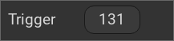

.. replaces:: CometVisu/0.8.0/trigger/de
    CometVisu/0.8.x/widgets/trigger/de/
    CometVisu/Widget/trigger/de
    CometVisu/trigger
    CometVisu/trigger_(Deutsch)

.. _trigger:

Das Trigger Widget
==================

.. api-doc:: Trigger

Beschreibung
------------

Der Trigger fügt der Visu eine Schaltfläche hinzu, die einen Wert für einen normalen (kurzen) Tastendruck und darüber hinaus,
einen zweiten Wert für einen langen Tastendruck senden kann (wenn konfiguriert).

Einstellungen
-------------

Für eine grundsätzliche Erklärung des Aufbaus der Konfiguration und der Definition der im folgenden benutzten
Begriffe (Elemente, Attribute) sollte zunächst dieser Abschnitt gelesen werden: :ref:`visu-config-details`.

Das Verhalten und Aussehen des Trigger-Widgets kann durch die Verwendung von Attributen und Elementen beeinflusst werden.
Die folgenden Tabellen zeigen die erlaubten Attribute und Elemente. In den Screenshots sieht man, wie
beides über den :ref:`Editor <editor>` bearbeitet werden kann.

Nur die mit ..... unterstrichenen Attribute/Elemente müssen zwingend angegeben werden, alle anderen sind optional und können
daher weg gelassen werden.

Erlaubte Attribute im Trigger-Element
^^^^^^^^^^^^^^^^^^^^^^^^^^^^^^^^^^^^^^^^^^^^^^^^^^^^^^^^^^^^^^^^^

.. parameter-information:: trigger

.. widget-example::
    :editor: attributes
    :scale: 75
    :align: center

    <caption>Attribute im Editor (vereinfachte Ansicht) [#f1]_</caption>
    <trigger value="131" shortvalue="4" shorttime="300" styling="Red_Green" mapping="On_Off" align="center" bind_click_to_widget="true">
        <layout colspan="2"/>
        <label>Trigger</label>
        <address transform="DPT:5.001" mode="write" variant="short">1/1/13</address>
        <address transform="DPT:5.001" mode="write" variant="button">1/1/13</address>
    </trigger>

Erlaubte Kind-Elemente und deren Attribute
^^^^^^^^^^^^^^^^^^^^^^^^^^^^^^^^^^^^^^^^^^

.. elements-information:: trigger

.. widget-example::
    :editor: elements
    :scale: 75
    :align: center

    <caption>Elemente im Editor</caption>
    <trigger value="131" shortvalue="4" shorttime="300" styling="Red_Green" mapping="On_Off" align="center" bind_click_to_widget="true">
        <layout colspan="2"/>
        <label>Trigger</label>
        <address transform="DPT:5.001" mode="write" variant="short">1/1/13</address>
        <address transform="DPT:5.001" mode="write" variant="button">1/1/13</address>
    </trigger>

XML Syntax
----------

Alternativ kann man für das Trigger Widget auch von Hand einen Eintrag in
der :doc:`visu_config.xml <../../xml-format>` hinzufügen.

.. CAUTION::
    In der Config selbst dürfen NUR UTF-8 Zeichen verwendet
    werden. Dazu muss ein auf UTF-8 eingestellter Editor verwendet werden!

Hier einige Beispielcodes für Trigger-Widgets:

.. widget-example::

    <settings>
        <screenshot name="trigger1">
            <caption>Beispiel 1 - Szene "4" aufrufen und abspeichern</caption>
            <data address="1/4/0">0</data>
        </screenshot>
    </settings>
    <trigger value="131" shortvalue="4" shorttime="300" styling="Red_Green" mapping="On_Off" align="center" bind_click_to_widget="true">
        <layout colspan="2"/>
        <label>Trigger</label>
        <address transform="DPT:5.001" mode="write" variant="short">1/1/13</address>
        <address transform="DPT:5.001" mode="write" variant="button">1/1/13</address>
    </trigger>

.. widget-example::

    <settings>
        <screenshot name="trigger2">
            <caption>Beispiel 2 - kurz=0; lang=1</caption>
            <data address="1/4/0">0</data>
        </screenshot>
    </settings>
    <trigger value="1" shorttime="300" shortvalue="0">
        <label>Trigger auf 300ms</label>
        <address transform="DPT:1.001" variant="button" mode="readwrite">12/7/1</address>
        <address transform="DPT:1.001" variant="short" mode="readwrite">12/7/10</address>
    </trigger>

.. rubric:: Fußnoten

.. [#f1] In der vereinfachten Ansicht sind ggf. einige Dinge ausgeblendet. In der Expertenansicht ist alles zu sehen.