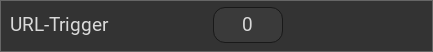

.. _urltrigger:

Das UrlTrigger Widget
=====================

.. api-doc:: UrlTrigger

Beschreibung
------------

Das UrlTrigger Widget fügt der Visualisierung eine Schaltfläche hinzu, die im Hintergrund eine
URL öffnet. Hierbei handelt es sich um eine reine Abfrage, d.H die abgefragten Daten werden nicht genutzt.

Einstellungen
-------------

Für eine grundsätzliche Erklärung des Aufbaus der Konfiguration und der Definition der im folgenden benutzten
Begriffe (Elemente, Attribute) sollte zunächst dieser Abschnitt gelesen werden: :ref:`visu-config-details`.

Das Verhalten und Aussehen des UrlTrigger-Widgets kann durch die Verwendung von Attributen und Elementen beeinflusst werden.
Die folgenden Tabellen zeigen die erlaubten Attribute und Elemente. In den Screenshots sieht man, wie
beides über den :ref:`Editor <editor>` bearbeitet werden kann.

Nur die mit ..... unterstrichenen Attribute/Elemente müssen zwingend angegeben werden, alle anderen sind optional und können
daher weg gelassen werden.

Erlaubte Attribute im UrlTrigger-Element
^^^^^^^^^^^^^^^^^^^^^^^^^^^^^^^^^^^^^^^^

.. parameter-information:: urltrigger

.. widget-example::
    :editor: attributes
    :scale: 75
    :align: center

        <caption>Attribute im Editor (vereinfachte Ansicht) [#f1]_</caption>
        <urltrigger url="/open/data/index.php">
            <layout colspan="4"/>
            <label>URL-Trigger</label>
        </urltrigger>

Erlaubte Kind-Elemente und deren Attribute
^^^^^^^^^^^^^^^^^^^^^^^^^^^^^^^^^^^^^^^^^^

.. elements-information:: urltrigger

.. widget-example::
    :editor: elements
    :scale: 75
    :align: center

        <caption>Elemente im Editor</caption>
        <urltrigger url="/open/data/index.php">
            <layout colspan="4"/>
            <label>URL-Trigger</label>
        </urltrigger>

XML Syntax
----------

Alternativ kann man für das UrlTrigger Widget auch von Hand einen Eintrag in
der :doc:`visu_config.xml <../../xml-format>` hinzufügen.

.. CAUTION::
    In der Config selbst dürfen NUR UTF-8 Zeichen verwendet
    werden. Dazu muss ein auf UTF-8 eingestellter Editor verwendet werden!

Hier der minimale Beispielcode der das UrlTrigger Widget aus dem folgenden Screenshot erzeugt:

.. widget-example::

    <settings>
        <screenshot name="urltrigger_simple">
            <caption>UrlTrigger, einfaches Beispiel</caption>
        </screenshot>
    </settings>
    <urltrigger url="/open/data/index.php">
        <layout colspan="4"/>
        <label>URL-Trigger</label>
    </urltrigger>

.. rubric:: Fußnoten

.. [#f1] In der vereinfachten Ansicht sind ggf. einige Dinge ausgeblendet. In der Expertenansicht ist alles zu sehen.