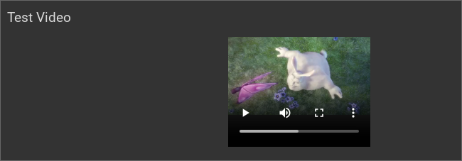

.. replaces:: CometVisu/0.8.0/video/de
    CometVisu/0.8.x/widgets/video/de/
    CometVisu/Widget/video/de
    CometVisu/video
    CometVisu/video_(Deutsch)

.. _video:

Das Video Widget
================

.. api-doc:: Video

Beschreibung
------------

Das Video Widget nutzt intern den neuen HTML5 Tag ``<video>``.
Diese Funktion, die im Browser des Clients ausgeführt wird, wird noch nicht von
allen Browsern gleich gut verarbeitet. Zur Zeit werden nur die beiden Videoformate
OGG und MP4 (H.264) unterstützt. Um eine Übersicht über die Kompatibilität zwischen Browser
und Videoformat zu bekommen, nutzen Sie bitte die untenstehende Tabelle:

+-------------------------------+-------+-------------+
|                               | OGG   | MP4 (H.264) |
+===============================+=======+=============+
| Firefox >= 21.x (Win, Linux)  | X     | X           |
+-------------------------------+-------+-------------+
| Firefox >= 6.x (Mac)          | X     | O           |
+-------------------------------+-------+-------------+
| Opera 11                      | X     | O           |
+-------------------------------+-------+-------------+
| Safari 5                      | O     | X           |
+-------------------------------+-------+-------------+
| Internet Explorer 9           | O     | X           |
+-------------------------------+-------+-------------+
| Chrome ab Version 7           | X     | X           |
+-------------------------------+-------+-------------+
| IPhone                        | O     | X           |
+-------------------------------+-------+-------------+
| Android ab 4.1 (Jelly Bean)   | X     | X           |
+-------------------------------+-------+-------------+

**Legende:** X = unterstützt, O = nicht unterstützt

Einstellungen
-------------

Für eine grundsätzliche Erklärung des Aufbaus der Konfiguration und der Definition der im folgenden benutzten
Begriffe (Elemente, Attribute) sollte zunächst dieser Abschnitt gelesen werden: :ref:`visu-config-details`.

Das Verhalten und Aussehen des Video-Widgets kann durch die Verwendung von Attributen und Elementen beeinflusst werden.
Die folgenden Tabellen zeigen die erlaubten Attribute und Elemente. In den Screenshots sieht man, wie
beides über den :ref:`Editor <editor>` bearbeitet werden kann.

Nur die mit ..... unterstrichenen Attribute/Elemente müssen zwingend angegeben werden, alle anderen sind optional und können
daher weg gelassen werden.

Erlaubte Attribute im Video-Element
^^^^^^^^^^^^^^^^^^^^^^^^^^^^^^^^^^^^^^^^^^^^^^^

.. parameter-information:: video

.. widget-example::
    :editor: attributes
    :scale: 75
    :align: center

    <caption>Attribute im Editor (vereinfachte Ansicht) [#f1]_</caption>
    <video src="http://www.w3schools.com/html/mov_bbb.mp4" width="200px" height="200px" autoplay="no">
        <label>Test Video</label>
    </video>

Erlaubte Kind-Elemente und deren Attribute
^^^^^^^^^^^^^^^^^^^^^^^^^^^^^^^^^^^^^^^^^^

.. elements-information:: video

.. widget-example::
    :editor: elements
    :scale: 75
    :align: center

    <caption>Elemente im Editor</caption>
    <video src="http://www.w3schools.com/html/mov_bbb.mp4" width="200px" height="200px" autoplay="no">
        <label>Test Video</label>
    </video>

XML Syntax
----------

Alternativ kann man für das Video Widget auch von Hand einen Eintrag in
der :doc:`visu_config.xml <../../xml-format>` hinzufügen.

.. CAUTION::
    In der Config selbst dürfen NUR UTF-8 Zeichen verwendet
    werden. Dazu muss ein auf UTF-8 eingestellter Editor verwendet werden!

Hier der minimale Beispielcode der das Video Widget aus dem folgenden Screenshot erzeugt:

.. widget-example::

    <settings>
        <screenshot name="video_simple">
            <caption>Video, einfaches Beispiel</caption>
        </screenshot>
    </settings>
    <video src="http://www.w3schools.com/html/mov_bbb.mp4" width="200px" height="200px" autoplay="no">
        <label>Test Video</label>
    </video>

.. rubric:: Fußnoten

.. [#f1] In der vereinfachten Ansicht sind ggf. einige Dinge ausgeblendet. In der Expertenansicht ist alles zu sehen.
