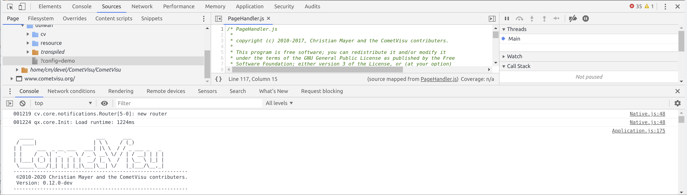

.. _development_setup:

******************************
Setup der Entwicklungsumgebung
******************************

Der Einstieg in die CometVisu Entwicklung ist einfach, jedoch sollte die
Entwicklungsumgebung passen damit man optimal unterstützt wird. In diesem
Kapitel werden verschiedene Setups vorgestellt, so dass je nach eigenem Fokus
ein optimales Setup dabei sein sollte.

Grundsätzlich ist bei der Einrichtung der Entwicklungsumgebung auf verschiedene
Randbedingungen zu achten. Welches Betriebssystem läuft auf dem
Entwicklung-Computer? Wo läuft der Server? Ein dedizierter Computer? Ein
Docker-Container?

Tester
------

Tester sind meist fortgeschrittene Anwender aber oft keine Entwickler. Der
Fokus liegt darauf ohne Aufwand bei bestehendem Code unter Anleitung
eines Entwickler kleine Modifikationen durchführen zu können und wertvolle
Rückmeldungen geben zu können.

Annahmen:
=========

:Entwicklungscomputer: Windows, MacOS oder Linux
:CometVisu Server: Dedizierter Server, ggf. mit CometVisu in einem Docker-Container

Setup:
======

Im einfachsten Fall reicht es im Web-Browser über Strg+Umschalt+I die
Entwicklungskonsole zu öffnen:

    Entwicklungskonsole im Chrome Browser

Hier sind vor Allem die Reiter "Elements" (HTML-/DOM-Struktur der CometVisu),
"Sources" (der Source-Code) und "Network" im Rahmen der Analyse wichtig.

Der Reiter "Elements" bietet auch Zugriff auf die verwendeten CSS Regeln und
ist daher ein optimaler Einstiegspunkt um eigene Designanspassungen an der
CometVisu vor zu nehmen.

Unter "Sources" kann live der Source-Code geändert werden. Diese Änderungen
gehen jedoch über einen Reload der Seite verloren. Hierzu bietet es sich
an eine bereits fertig kompilierte Entwicklungsversion zu installieren. Dies
kann normaler Weise parallel zu einem produktiv verwendeten Release erfolgen.

.. warning:: Entwicklungversionen sollten nicht produktiv genutzt werden!

Die jeweils aktuellste Entwicklungsversion wird täglich als so genanntes
`nightly` automatisch erzeugt und wird unter
https://bintray.com/cometvisu/CometVisu/CometVisu
bereit gestellt.

Außerdem werden die Docker-Container ``testing`` bzw. ``testing-arm`` mit jedem
Code-Update erzeugt. Für Vergleiche mit älteren Versionen (z.B. um eine
Regression einkreisen zu können) gibt es mit ``testing-<Datum>`` auch hier
Nightlies.

Sowohl der kompilierte Code also auch die Docker-Container lassen sich wie
ein fertiges Release installieren.

Durch Zugriff auf die installierten Dateien können nun auch Änderungen am
Code vorgenommen werden, die ab einem neuen Laden der Seite enthalten sind
und bleiben.

Gelegenheitsentwickler
----------------------

Möchte ohne großen Installations-Aufwand kleine Anpassungen am Code vornehmen,
beispielsweise ein :ref:`Plugin <custom_plugins>` erstellen.

Fortgeschrittener Entwickler
----------------------------

Möchte tiefer in den Code einsteigen, ein zum Entwickeln geeigneter Text-Editor
oder gar eine Entwicklungsumgebung ist bereits vorhanden und nun geht es darum
in alle Aspekte der CometVisu und ihrer Erzeugung eingreifen zu können.

Hard Core Entwickler
--------------------

Ist bereit das Entwicklungssystem so aufzubauen, dass alle Änderungen am Code
später mit maximaler Effizienz durchgeführt werden können.
