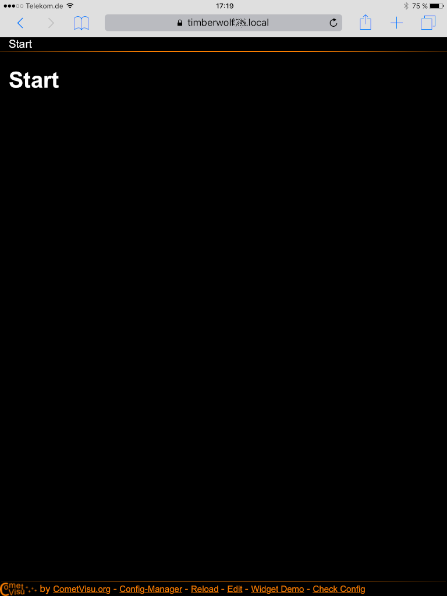
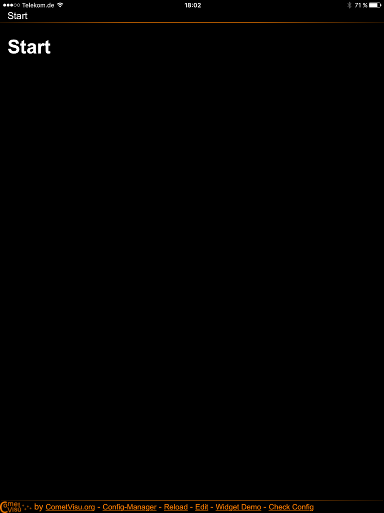

*********************
Die CometVisu als App
*********************

Hintergrund
===========

Um die CometVisu komfortabel mit mobilen Geräten nutzen zu können, kann diese
vergleichbar mit Apps aus dem App-Store auf dem Gerät hinzugefügt werden.

Android
=======

Um auf einem Android basiertem System die CometVisu dem Startbildschirm hinzufügen
zu können, sind ein paar einfache Schritte nötig:

CometVisu öffnen
----------------

Im ersten Schritt muss die CometVisu normal im Browser geöffnet werden:

.. figure:: _static/app_android_browser.png

    Die CometVisu im Browser (Chrome)

Browser-Menü
------------

Wenn die gewünschte Konfiguration und Seite angezeigt wird, wird über das Browser-Menü (⋮)
der Eintrag "Zum Startbildschirm zufügen" ausgewählt:

.. figure:: _static/app_android_browser_menu.png

    Das Browser-Menü

App-Name
--------

Im nun erscheinenden Dialogfenster kann der Name für die App festgelegt werden unter dem
die CometVisu auf dem Startbildschirm aufgeführt werden soll:

.. figure:: _static/app_android_dialog1.png

    Dialog um den App-Namen festzulegen

Bestätigung
-----------

Über "OK" wird der Vorgang final bestätigt:

.. figure:: _static/app_android_dialog2.png

    Dialog zur Bestätigung

Startbildschirm
---------------

Waren die Schritte erfolgreich, so erscheint nun auf dem Startbildschirm die App
für den Zugriff auf die CometVisu:

.. figure:: _static/app_android_homescreen.png

    Der Startbildschirm mit der CometVisu App

App
---

Ruft man über dieses Icon nun die App auf, so kommt man unmittelbar zu der gewählten
Konfiguration und Seite. Auch wird nun der volle Bildschirm genutzt, da die
Adresszeile des Browsers nicht mehr angezeigt wird:

.. figure:: _static/app_android_final.png

    Die CometVisu, wenn diese als App aufgerufen wurde - ohne Adresszeile

Apple iOS Geräte
================

Um auf einem iOS basiertem System wie dem iPhone oder dem iPad die CometVisu dem
Startbildschirm hinzufügen zu können, sind ein paar einfache Schritte nötig:

CometVisu öffnen
----------------

Im ersten Schritt muss die CometVisu normal im Browser geöffnet werden:

    Die CometVisu im Browser (Safari)

Browser-Menü
------------

Wenn die gewünschte Konfiguration und Seite angezeigt wird, wird über das Browser-Menü
der Eintrag "Zum Home-Bildschirm" ausgewählt:

.. figure:: _static/app_ios_browser_menu.png

    Das Browser-Menü

App-Name
--------

Im nun erscheinenden Dialogfenster kann der Name für die App festgelegt werden unter dem
die CometVisu auf dem Home-Bildschirm aufgeführt werden soll:

.. figure:: _static/app_ios_dialog.png

    Dialog um den App-Namen festzulegen

Home-Bildschirm
---------------

Waren die Schritte erfolgreich, so erscheint nun auf dem Home-Bildschirm die App
für den Zugriff auf die CometVisu:

.. figure:: _static/app_ios_homescreen.png

    Der Startbildschirm mit der CometVisu App

App
---

Ruft man über dieses Icon nun die App auf, so kommt man unmittelbar zu der gewählten
Konfiguration und Seite. Auch wird nun der volle Bildschirm genutzt, da die
Adresszeile des Browsers nicht mehr angezeigt wird:

    Die CometVisu, wenn diese als App aufgerufen wurde - ohne Adresszeile

