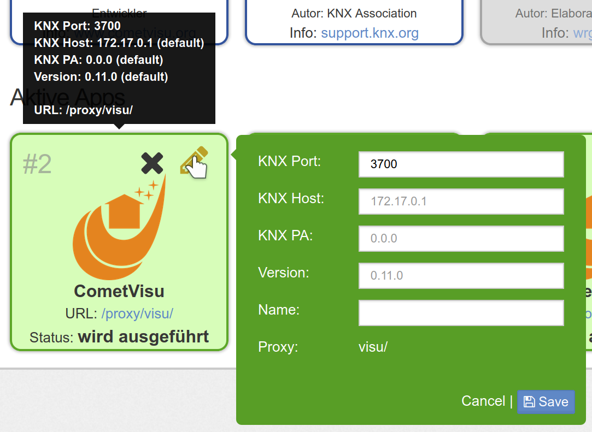
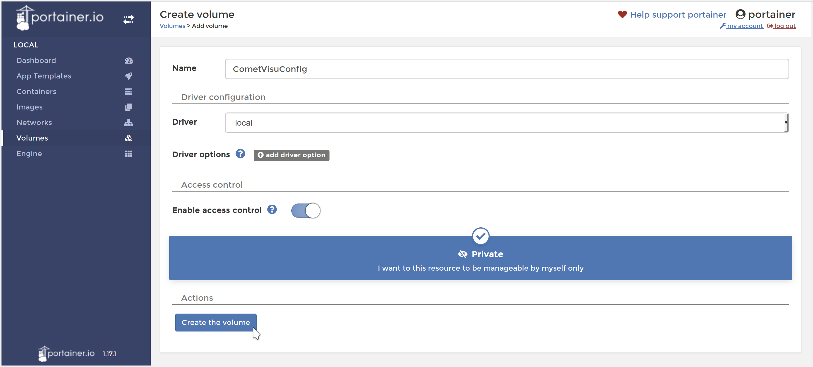
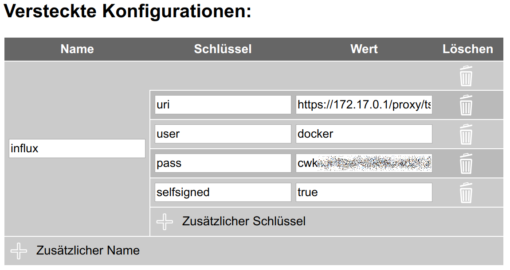

.. _timberwolf:

Installation auf dem Timberwolf über die App
============================================

Die einfachste Möglichkeit die CometVisu auf dem  `Timberwolf <https://wiregate.de/>`__-Server zu
installieren ist über die dort angebotene App.

   Auswahl der CometVisu App auf der Timberwolf-Oberfläche

Nach der Installation über das grüne "+" wird die CometVisu unter "Aktive Apps" aufgeführt. Hinter "URL" ist
bereits der Link eingeblendet über den die CometVisu aufgerufen werden kann.

Update
------

   Installierte CometVisu App

Über das Stift-Symbol kann die App konfiguriert werden. Am wichtigsten ist die Zeile "Version". Die dort eingestelle
Versions-Nummer wird installiert, bzw. über Speichern wird auf diese Versionsnummer gewechselt.

Installation auf dem Timberwolf mittels Portainer
=================================================

Die fortgeschrittene Methode die CometVisu auf dem Timberwolf-Server zu installieren (wird nur in Ausnahmefällen
benötigt, empfohlen ist die Installation über die App) ist über die Docker Administrationsoberfläche
`Portainer <https://portainer.io/>`__. Auch für andere Systeme mit Docker und Portainer ist diese Anleitung im
wesentlichen geeignet.

Installation
------------

Mit dieser Anleitung wird die CometVisu auf dem Timberwolf Server über HTTPS
unter der Adresse ``https://<mein timberwolf>/proxy/visu/`` aufrufbar sein.

Grundsätzlich eignen sich diese Schritte auch als Referenz für die Installation
über Portainer auf anderen Systemen, jedoch müssen die Schritte im Detail
angepasst werden, da dort üblicherweise keine Proxy zur Verfügung steht, der
die CometVisu über HTTPS zugreifbar macht.

Volumes anlegen
^^^^^^^^^^^^^^^

Volume für Konfigurationsdateien
""""""""""""""""""""""""""""""""

Zuerst ist ein Volume anzulegen um dort die Konfigurationsdateien abzulegen
und diese über Neustarts und Aktualisierungen des Containers hinweg
beizubehalten.

Die notwendigen Schritte sind: *Volumes* → *Add Volume* → Name: ``CometVisuConfig`` → *Create the Volume*

   Volume im Portainer anlegen

Dieses Volume kann von außen mit den Config-Dateien befüllt werden - oder
am besten über den :ref:`Manager <manager>`.

Volume für RRD
""""""""""""""

Dieser Schritt ist optional und nur notwendig, wenn das :ref:`Diagram Plugin <diagram>`
mit RRD Dateien genutzt werden sollen. Bei der reinen Verwendung der InfluxDB
kann dieser Schritt übersprungen werden.

Die Schritte für das Anlegen des *Volume für Konfigurationsdateien* ist zu
wiederholen, jedoch wird hier sinnvoller Weise der Name ``CometVisuRRD``
gewählt.

Das Befüllen dieses Containers muss extern erfolgen, z.B. durch einen anderen
Container, der diesen RRD-Container gleichzeitig mit einbindet.

**Wichtig:** Das interne Format der RRD Dateien ist Architektur spezifisch.
So können die RRD-Dateien vom WireGate (32 Bit Architektur) nicht direkt auf
dem Timberwolf (64 Bit Architektur) verwendet werden [1]_.

Anlegen des Containers
^^^^^^^^^^^^^^^^^^^^^^

Unter *Containers* → *Add Container*

- Name: ``CometVisu``
- Image configuration: Name: ``cometvisu/cometvisu:latest`` für die "großen" Server
  (TSW2xxx) oder ``cometvisu/cometvisu:latest-arm`` für die Hutschienen-Server.
- Port mapping: host ``18080``, container ``80``
- Advanced container settings:

  - Volumes: Volume mapping

    - ``container``: ``/var/www/html/config`` ⭢ ``volume``: ``CometVisuConfig`` *(bis einschließlich Version 0.10.2)*
    - ``container``: ``/var/www/html/resource/config`` ⭢ ``volume``: ``CometVisuConfig`` *(ab Version 0.11)*
    - ``container``: ``/var/www/rrd`` ⭢ ``volume``: ``RRD`` *(Optional, wenn RRD genutzt werden soll)*

  - Env: Environment variables

    - ``name``: ``CGI_URL_PATH`` mit ``value``: ``/proxy/visu/cgi-bin/``
    - Je nach lokaler Umgebung sind gegebenenfalls weitere Anpassungen
      notwendig, die im Abschnitt des
      :ref:`Docker Containers <dockerenvironment>` angegeben wurden.

      So kann es notwendig sein für ``KNX_PA`` einen anderen Wert als das
      Default ``1.1.238`` zu setzen, wenn diese physikalische Addresse bereits
      belegt ist oder eine andere Linie als ``1.1`` verwendet werden soll.

      Es ist auch wichtig, dass der Port der KNX Schnittstelle korrekt ist. Im
      Timberwolf ist unter *Einstellungen* → *KNX* → *Schnittstellen* der
      verwendete Port ersichtlich:

      .. figure:: _static/timberwolf_knx_port.png
          :scale: 50 %

      Sollte der Port von ``3700`` abweichen, so ist die Umgebungsvariable
      ``KNX_INTERFACE`` entsprechend anzupassen, in diesem Beispiel auf den
      Wert ``iptn:172.17.0.1:3674``.

  - Restart policy: ``Unless stopped``

.. figure:: _static/portainer_container_add.png
   :scale: 50 %

   Container im Portainer anlegen

.. figure:: _static/portainer_container_volumes_add.png
   :scale: 50 %

   Container *Volumes* im Portainer konfigurieren

.. figure:: _static/portainer_container_env_add.png
   :scale: 50 %

   Container *Env* im Portainer konfigurieren

.. figure:: _static/portainer_container_restart_add.png
   :scale: 50 %

   Container *Restart policy* im Portainer konfigurieren

Dann über *Deploy the container* diesen erzeugen.

.. _tws_proxy:

Proxy einrichten
^^^^^^^^^^^^^^^^

In der Timberwolf Oberfläche: *Einstellungen* → *Remotezugriff* → *Reverse Proxy*

- URL: ``visu/``, Target ``http://127.0.0.1:18080/``

Über *Add* bestätigen.

.. figure:: _static/timberwolf_proxy_add.png
   :scale: 50 %

   Timberwolf Proxy-Eintrag hinzufügen

Die CometVisu ist nun über ``https://<mein timberwolf>/proxy/visu/`` aufrufbar.

InfluxDB Zugriff
^^^^^^^^^^^^^^^^

.. HINT::
  The InfluxDB access as well as the hidden config was introduced with
  version 0.11.0 and isn't available in earlier versions.

Für den Zugriff auf die Zeitreihen der InfluxDB müssen die Credentials in der
:ref:`Versteckten Konfiguration <hidden-config>` über den
:ref:`Manager <manager>` eingetragen werden. Hierzu muss auf dem Timberwolf
Server unter *Portainer* bei *"Wie Sie aus dem Docker Container auf die
Zeitreihen-Datenbank zugreifen können"* auf das ``i`` geklickt werden um
den Benutzernamen und das Passwort für die lokale Installation in Erfahrung
zu bringen.

.. figure:: _static/timberwolf_influx.png
   :scale: 50 %

   Timberwolf InfluxDB Credentials

In der :ref:`Versteckten Konfiguration <hidden-config>` des :ref:`Managers <manager>`
ist nun ein Eintrag mit diesen Eigenschaften anzulegen:

- Name: ``influx``
- Schlüssel und Wert:

  - ``uri``: ``https://172.17.0.1/proxy/ts/query`` (Sollte entgegen dieser
    Anleitung das Netzwerk des Containers angepasst worden sein, so muss
    gegebenenfalls hier die IP-Addresse entsprechend angepasst werden)
  - ``user``: Benutzername aus den Credentials
  - ``pass``: Passwort aus den Credentials
  - ``selfsigned``: ``true``

   Timberwolf InfluxDB Credentials im Manager

Aktualisieren
-------------

Container ersetzen
^^^^^^^^^^^^^^^^^^

Unter *Containers* → ``CometVisu`` wird über den Button *Duplicate/Edit* das
Menü aufgerufen um den Container zu aktualisieren.

Hier ist sicher zu stellen, dass *Always pull the image* aktiv ist.

Unter *Advanced container settings* → *Labels* sollten die Labels gelöscht
werden, um später leichter erkennen zu können welche CometVisu Container
Version installiert ist.

Wenn von der Version 0.10.2 auf eine Version aus der 0.11er Reihe gewechselt
werden soll, so ist noch unter *Volumes* der Config-Pfad von
``/var/www/html/config`` auf ``/var/www/html/resource/config`` anzupassen.

Mit *Actions* → *Deploy the Container* wird der Container nun durch die
neueste Version ersetzt.

.. figure:: _static/portainer_container_replace.png
   :scale: 50 %

   Container im Portainer durch eine neue Version ersetzen

Anschließend muss die Sicherheitsabfrage bestätigt werden.

   Bestätigung um den Container im Portainer durch eine neue Version zu ersetzen

Aufräumen
^^^^^^^^^

Wenn ein Container durch einen neuen ersetzt wird, so bleibt der alte als
*Unused* im System zurück und belegt weiterhin Platz. Dieser lässt sich unter
*Images* löschen.

Durch markieren des zu löschenden Images (zu erkennen am Label *Unused* und
dem entsprechenden Tag) kann über *Remove* das Image entfernt werden.

.. figure:: _static/portainer_image_remove.png
   :scale: 50 %

   Portainer Dialog um ein Image zu löschen

Entwicklungsversion
-------------------

Grundsätzlich sind für die jeweils aktuelle Entwicklungsversion die gleichen
Schritte wie für das Release durchzuführen. Auch wenn theoretisch das gleiche
Konfigutations-Volume wie für die Produktiv-Version verwendet werden kann, so
sollte ein getrenntes Volume (z.B. ``CometVisuTestConfig``) angelegt werden, da
sich durch zukünftige Updates das Format der Config-Dateien inkompatibel ändern
kann.

Wie unter :ref:`Docker <docker>` beschrieben hat die neueste
Entwicklunglungsversion den Tag ``testing``. Somit ist unter *Anlegen des
Containers* als ``name`` ``cometvisu/cometvisu:testing`` bzw.
``cometvisu/cometvisu:testing-arm`` zu verwenden.

Um für Fehlerberichte u.ä. eine einheitliche Umgebung zu haben, ist die
Empfehlung die Testing Version mit diesen Parametern zu installieren:

- Container:

  - Name: ``CometVisuTest``
  - Image configuration: Name: ``cometvisu/cometvisu:testing`` bzw. ``cometvisu/cometvisu:testing-arm``
  - Port mapping: host ``28080``, container ``80``
  - Advanced container settings:

    - Volumes: Volume mapping

      - ``container``: ``/var/www/html/resource/config`` ⭢ ``volume``: ``CometVisuTestConfig``
      - ``container``: ``/var/www/rrd`` ⭢ ``volume``: ``RRD`` *(Optional)*

    - Env: Environment variables ``name``: ``CGI_URL_PATH`` mit ``value``: ``/proxy/visutest/cgi-bin/``

- Proxy:

  - URL: ``visutest``, Target ``http://127.0.0.1:28080/``

----

.. [1] Um den Inhalt einer RRD Datei ``RRD_Name`` von einer Architektur auf eine
  andere zu übertragen muss auf dem Quell-System (also z.B. dem WireGate) der
  Befehl

  .. code-block:: bash

     rrdtool dump /var/www/rrd/RRD_Name.rrd > RRD_Name.xml

  ausgeführt werden. Auf dem Ziel-System (also z.B. einem Container auf dem
  Timberwolf) wird dann mit dem Befehl

  .. code-block:: bash

     rrdtool restore -f RRD_Name.xml RRD_Name.rrd

  die neue RRD-Datei angelegt.

  Wenn auf dem Quell-System mit einer Lokalisierung gearbeitet wird, die
  Zahlen mit einem Komma als Dezimaltrennzeichen verwendet (so wie im
  Deutschen üblich), so kann es sein, dass der RRD-Export mit Komma statt
  Punkt erfolgt und somit der Import fehl schlägt. Hier wäre dann der Export
  mit generischem ``LANG=C`` durchzuführen.

  Um eine größere Menge an RRD-Dateien zu konvertieren kann dies über eine
  Schleife vereinfacht werden:

  .. code-block:: bash

     LANG=C; for f in *.rrd; do rrdtool dump ${f} > ${f}.xml; done

  bzw.

  .. code-block:: bash

     for f in *.xml; do rrdtool restore ${f} ${f}.rrd; done
