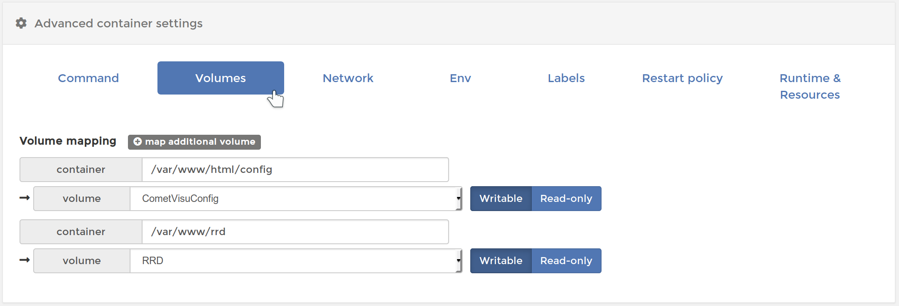
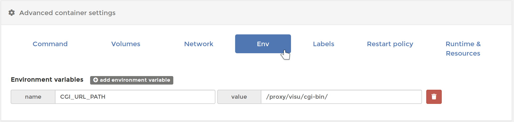

.. _timberwolf:

Installation auf dem Timberwolf mittels Portainer
=================================================

Um die CometVisu auf dem `Timberwolf <https://wiregate.de/>`_-Server zu
installieren wird die dort verwendete Administrationsoberfläche
`Portainer <https://portainer.io/>`_ verwendet.

Installation
------------

Mit dieser Anleitung wird die CometVisu auf dem Timberwolf Server über HTTPS
unter der Adresse ``https://<mein timberwolf>/proxy/visu/`` aufrufbar sein.

Grundsätzlich eignen sich diese Schritte auch als Referenz für die Installation
über Portainer auf anderen Systemen, jedoch müssen die Schritte im Detail
angepasst werden, da dort üblicherweise keine Proxy zur Verfügung steht, der
die CometVisu über HTTPS zugreifbar macht.

Volumes anlegen
~~~~~~~~~~~~~~~

Volume für Konfigurationsdateien
................................

Zuerst ist ein Volume anzulegen um dort die Konfigurationsdateien abzulegen
und diese über Neustarts und Aktualisierungen des Containers hinweg
beizubehalten.

Die notwendigen Schritte sind: *Volumes* → *Add Volume* → Name: ``CometVisuConfig`` → *Create the Volume*

.. figure:: _static/portainer_volume_add.png
   :scale: 50 %

   Volume im Portainer anlegen

Dieses Volume kann von außen mit den Config-Dateien befüllt werden - oder
am besten über den :ref:`Manager <manager>`.

Volume für RRD
..............

Dieser Schritt ist optional und nur notwendig, wenn das :ref:`Diagram Plugin <diagram>`
mit RRD Dateien genutzt werden sollen. Bei der reinen Verwendung der InfluxDB
kann dieser Schritt übersprungen werden.

Die Schritte für das Anlegen des *Volume für Konfigurationsdateien* ist zu
wiederholen, jedoch wird hier sinnvoller Weise der Name ``CometVisuRRD``
gewählt.

Das Befüllen dieses Containers muss extern erfolgen, z.B. durch einen anderen
Container, der diesen RRD-Container gleichzeitig mit einbindet.

**Wichtig:** Das interne Format der RRD Dateien ist Architektur spezifisch.
So können die RRD-Dateien vom WireGate (32 Bit Architektur) nicht direkt auf
dem Timberwolf (64 Bit Architektur) verwendet werden [1]_.

Anlegen des Containers
~~~~~~~~~~~~~~~~~~~~~~

Unter *Containers* → *Add Container*

- Name: ``CometVisu``
- Image configuration: Name: ``cometvisu/cometvisu:latest``
- Port mapping: host ``18080``, container ``80``
- Advanced container settings:

  - Volumes: Volume mapping

    - ``container``: ``/var/www/html/config`` ⭢ ``volume``: ``CometVisuConfig``
    - ``container``: ``/var/www/rrd`` ⭢ ``volume``: ``RRD`` *(Optional)*

  - Env: Environment variables ``name``: ``CGI_URL_PATH`` mit ``value``: ``/proxy/visu/cgi-bin/``

.. figure:: _static/portainer_container_add.png

   Container im Portainer anlegen

   Container *Volumes* im Portainer konfigurieren

   Container *Env* im Portainer konfigurieren

.. figure:: _static/portainer_container_restart_add.png

   Container *Restart policy* im Portainer konfigurieren

Dann über *Deploy the container* diesen erzeugen.

Proxy einrichten
~~~~~~~~~~~~~~~~

In der Timberwolf Oberfläche: *Einstellungen* → *Remotezugriff* → *Reverse Proxy*

- URL: ``visu``, Target ``http://127.0.0.1:18080/``

Über *Add* bestätigen.

.. figure:: _static/timberwolf_proxy_add.png

   Timberwolf Proxy-Eintrag hinzufügen

Die CometVisu ist nun über ``https://<mein timberwolf>/proxy/visu/`` aufrufbar.

Aktualisieren
-------------

Container ersetzen
~~~~~~~~~~~~~~~~~~

Unter *Containers* → ``CometVisu`` wird über den Button *Duplicate/Edit* das
Menü aufgerufen um den Container zu aktualisieren.

Hier ist sicher zu stellen, dass *Always pull the image* aktiv ist.

Unter *Advanced container settings* → *Labels* sollten die Labels gelöscht
werden, um später leichter erkennen zu können welche CometVisu Container
Version installiert ist.

Mit *Actions* → *Deploy the Container* wird der Container nun durch die
neueste Version ersetzt.

.. figure:: _static/portainer_container_replace.png

   Container im Portainer durch eine neue Version ersetzen

Anschließend muss die Sicherheitsabfrage bestätigt werden.

.. figure:: _static/portainer_container_replace_confirm.png

   Bestätigung um den Container im Portainer durch eine neue Version zu ersetzen

Aufräumen
~~~~~~~~~

Wenn ein Container durch einen neuen ersetzt wird, so bleibt der alte als
*Unused* im System zurück und belegt weiterhin Platz. Dieser lässt sich unter
*Images* löschen.

Durch markieren des zu löschenden Images (zu erkennen am Label *Unused* und
dem entsprechenden Tag) kann über *Remove* das Image entfernt werden.

.. figure:: _static/portainer_image_remove.png

   Portainer Dialog um ein Image zu löschen

Entwicklungsversion
-------------------

Grundsätzlich sind für die jeweils aktuelle Entwicklungsversion die gleichen
Schritte wie für das Release durchzuführen. Auch wenn theoretisch das gleiche
Konfigutations-Volume wie für die Produktiv-Version verwendet werden kann, so
sollte ein getrenntes Volume (z.B. ``CometVisuTestConfig``) angelegt werden, da
sich durch zukünftige Updates das Format der Config-Dateien inkompatibel ändern
kann.

Wie unter :ref:`Docker <docker>` beschrieben hat die neueste
Entwicklunglungsversion den Tag ``testing``. Somit ist unter *Anlegen des
Containers* als ``name`` ``cometvisu/cometvisu:testing`` zu verwenden.

Um für Fehlerberichte u.ä. eine einheitliche Umgebung zu haben, ist die
Empfehlung die Testing Version mit diesen Parametern zu installieren:

- Container:

  - Name: ``CometVisuTest``
  - Image configuration: Name: ``cometvisu/cometvisu:testing``
  - Port mapping: host ``28080``, container ``80``
  - Advanced container settings:

    - Volumes: Volume mapping

      - ``container``: ``/var/www/html/config`` ⭢ ``volume``: ``CometVisuTestConfig``
      - ``container``: ``/var/www/rrd`` ⭢ ``volume``: ``RRD`` *(Optional)*

    - Env: Environment variables ``name``: ``CGI_URL_PATH`` mit ``value``: ``/proxy/visu/cgi-bin/``

- Proxy:

  - URL: ``visutest``, Target ``http://127.0.0.1:28080/``

.. [1] Um den Inhalt einer RRD Datei ``RRD_Name`` von einer Architektur auf eine
  andere zu übertragen muss auf dem Quell-System (also z.B. dem WireGate) der
  Befehl

  .. code-block:: bash

     rrdtool dump /var/www/rrd/RRD_Name.rrd > RRD_Name.xml

  ausgeführt werden. Auf dem Ziel-System (also z.B. einem Container auf dem
  Timberwolf) wird dann mit dem Befehl

  .. code-block:: bash

     rrdtool restore -f RRD_Name.xml RRD_Name.rrd

  die neue RRD-Datei angelegt.

  Um eine größere Menge an RRD-Dateien zu konvertieren kann dies über eine
  Schleife vereinfacht werden:

  .. code-block:: bash

     for f in *.rrd; do rrdtool dump ${f} > ${f}.xml; done

  bzw.

  .. code-block:: bash

     for f in *.xml; do rrdtool restore ${f} ${f}.rrd; done
