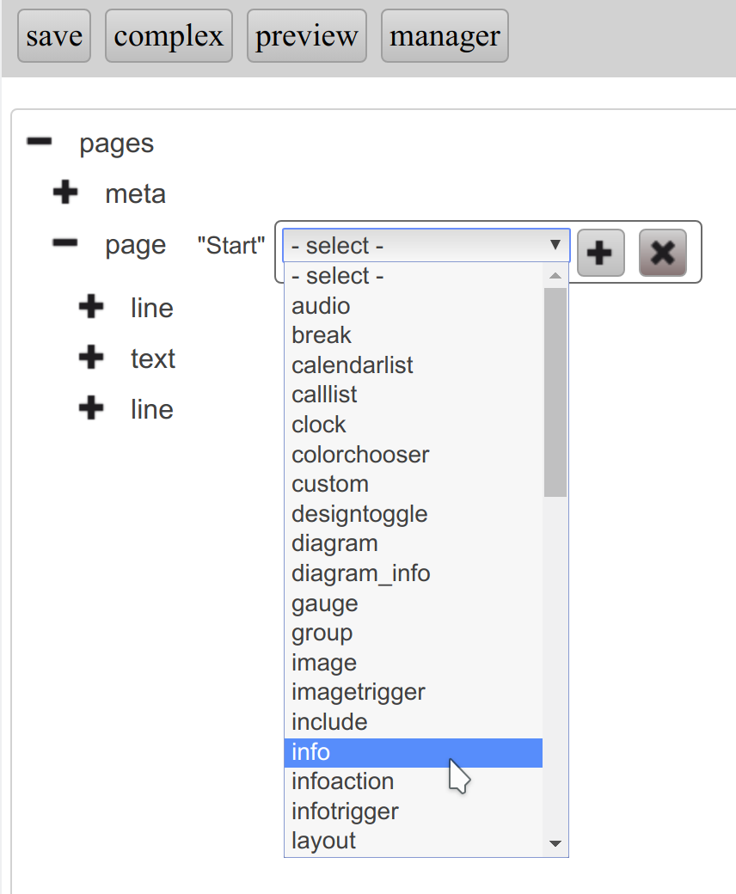
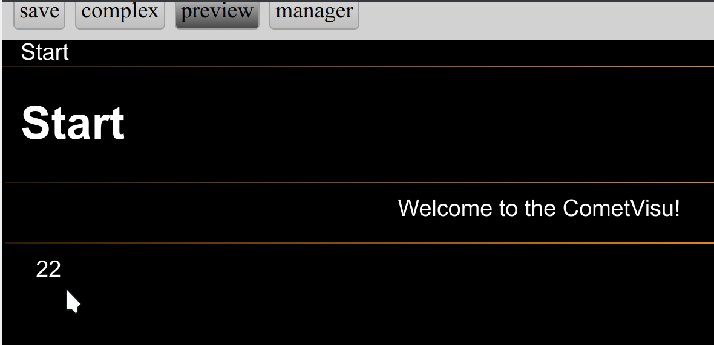
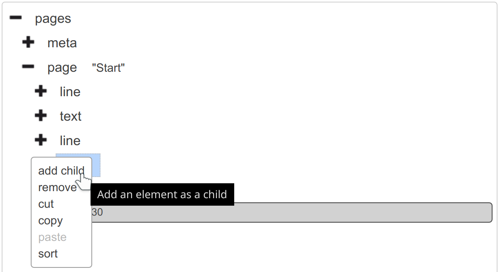
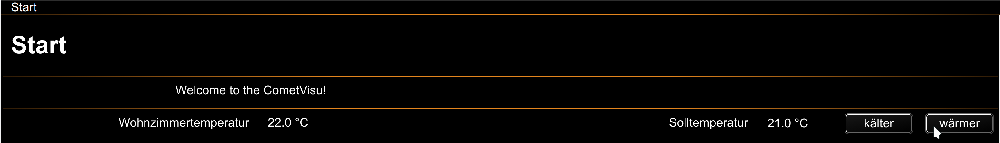

Tutorial: Erste Schritte - eine Visu in einer halben Minute
===========================================================

In diesem Tutorial wird gezeigt wie innerhalb einer halben Minute bereits die
erste (natürlich rudimentäre) Visu erstellt werden kann.

Video
-----

.. raw:: html

    

      <iframe src="https://www.youtube-nocookie.com/embed/ONFb_gxTaPk" style="position:absolute;width:100%;height:100%" frameborder="0" allow="accelerometer; autoplay; encrypted-media; gyroscope; picture-in-picture" allowfullscreen></iframe>
    

Einzelschritte
--------------

Die im Video gezeigten Schritte werden hier noch einmal Stück für Stück
aufgeführt.
Es soll eine Beispiel-Visu für einen Heizungsregler im Wohnzimmer erstellt
werden, für den gilt:

========= ====== =========
Wert      GA     Datentyp
========= ====== =========
Ist       4/0/30 DPT:9.001
Soll      3/3/30 DPT:9.001
========= ====== =========

.. IMPORTANT::

  Es ist ziemlich unwahrscheinlich, dass die eigene Installation
  die gleichen Adressen für diese Werte verwendet. Daher bitte prüfen und die
  Werte beim Nachstellen dieses Tutorials entsprechend anpassen!

Erste Visu - in unter einer halben Minute
~~~~~~~~~~~~~~~~~~~~~~~~~~~~~~~~~~~~~~~~~

Im :ref:`Manager <manager>` wird von der Default-Konfig "Editieren" ausgewählt:

.. figure:: _static/first_steps01.png
   :scale: 50 %

Über einen Links-Klick auf das "+" vor ``pages`` werden die Kinder-Elemente
eingeblendet:

.. figure:: _static/first_steps02.png
   :scale: 50 %

Über einen Rechts-Klick auf ``page "Start"``...

.. figure:: _static/first_steps03.png
   :scale: 50 %

... wird dort das Kontext-Menü angezeigt:

.. figure:: _static/first_steps04.png
   :scale: 50 %

Dort wird über Links-Klick auf ``add child`` das Menü zum Einfügen eines
Kind-Elementes aufgerufen.

In diesem Menü wird das :ref:`info-Widget <info>` ausgewählt...

... und über "+" wird das Info-Widget als Kind-Element der Seite
(:ref:`page <page>`) "Start" hinzugefügt:

.. figure:: _static/first_steps06.png
   :scale: 50 %

Über Links-Klick auf das "+" vor ``info``...

.. figure:: _static/first_steps07.png
   :scale: 50 %

... wird das Vor-Erzeugte ``address``-Element angezeigt:

.. figure:: _static/first_steps08.png
   :scale: 50 %

Dort wird die Adresse (GA) für die Ist-Temperatur (4/0/30) eingetragen...

.. figure:: _static/first_steps09.png
   :scale: 50 %

... und mit Return bestätigt:

.. figure:: _static/first_steps10.png
   :scale: 50 %

Wird nun mit links auf ``address`` geklickt...

.. figure:: _static/first_steps11.png
   :scale: 50 %

... so erscheint rechts neben dem
Elementen-Baum das Menü mit den Attributen für das ``address``-Element:

.. figure:: _static/first_steps12.png
   :scale: 50 %

Unter ``transform`` wird nun der Datentyp ``DPT:9.001`` eingetragen:

.. figure:: _static/first_steps13.png
   :scale: 50 %

Über "preview" wird eine Vorschau des aktuellen Zustands der Konfig angezeigt:

.. figure:: _static/first_steps14.png
   :scale: 50 %

Wie im Video gezeigt ist nun nach gerade einmal 23 Sekunden die erste
(allerdings noch sehr rudimentäre) Visu entstanden.

Wenn die eigene Installation
zu den oben angegebenen Beispiel-Adressen passen sollte, so wir bei dem
Nachstellen dieses Tutorials auch eine Temperatur erscheinen:

Über einen weiteren Klick auf "preview" kommt man wieder zurück zum Editor:

.. figure:: _static/first_steps16.png
   :scale: 50 %

Verfeinerung
~~~~~~~~~~~~

Um von einer blanken, nichtssagenden Zahl zu einer nutzbaren Visualisierung
zu kommen, sollte diese noch etwas erweitert werden. Im ersten Schritt wird
der Ausgabe-Wert so modifiziert, dass eine Nachkommastelle und die Einheit °C
angezeigt wird.

Über Links-Klick auf ``info``...

.. figure:: _static/first_steps17.png
   :scale: 50 %

... wird in das Attribut :ref:`format <format>`...

.. figure:: _static/first_steps18.png
   :scale: 50 %

... der Wert ``%.1f °C`` eingetragen:

.. figure:: _static/first_steps19.png
   :scale: 50 %

Für eine Beschreibung wird nun noch ein ``label`` hinzugefügt.

Rechts-Klick auf ``info`` und Links-Klick auf ``add child``...

... lässt ein ``label``-Element hinzufügen:

.. figure:: _static/first_steps21.png
   :scale: 50 %

Im Elemente-Baum unter dem ``label`` wird noch ein ``#text`` Element benötigt:

.. figure:: _static/first_steps22.png
   :scale: 50 %

Dieses wird mit dem Label für das Info-Widget befüllt, in diesem Tutorial
folglich mit "Wohnzimmertemperatur":

.. figure:: _static/first_steps23.png
   :scale: 50 %

Dem ``page "Start"`` wird nun für die Modifikation der Solltemperatur ein
:ref:`infotrigger-Widget <infotrigger>` hinzugefügt:

.. figure:: _static/first_steps24.png
   :scale: 50 %

Dies bekommt die ``address`` mit dem Wert aus diesem Tutorial, der ``3/3/30``:

.. figure:: _static/first_steps25.png
   :scale: 50 %

Dazu gehört das ``transform``-Attribut ``DPT:9.001``:

.. figure:: _static/first_steps26.png
   :scale: 50 %

Die Attribute des ``infotrigger`` selbst werden befüllt mit:

============= ============ ==========================================
Attribut      Wert         Bedeutung
============= ============ ==========================================
``upvalue``   ``0.5``      Temperaturänderung für Auf bzw. "wärmer"
``downvalue`` ``-0.5``     Temperaturänderung für Ab bzw. "kälter"
``uplabel``   ``wärmer``   Button-Beschriftung für Auf
``downlabel`` ``kälter``   Button-Beschriftung für Ab
``change``    ``absolute`` Direkte ("absolute") Änderung des Wertes
``format``    ``%.1f °C``  Eine Nachkommastelle mit angehängtem " °C"
============= ============ ==========================================

.. figure:: _static/first_steps27.png
   :scale: 50 %

Nun nur noch die Beschriftung bzw. das Label für das Widget:

.. figure:: _static/first_steps28.png
   :scale: 50 %

Über ``save``...

.. figure:: _static/first_steps29.png
   :scale: 50 %

... wird die Konfiguration gespeichert:

.. figure:: _static/first_steps30.png
   :scale: 50 %

Zurück zum ``manager``...

.. figure:: _static/first_steps31.png
   :scale: 50 %

... mit der Warnung, dass dadurch die letzten Änderungen verloren gehen. Dies
ist jedoch hier nicht relevant, da die Änderungen ja gerade eben noch von uns
gespeichert wurden:

.. figure:: _static/first_steps32.png
   :scale: 50 %

Im Manager wird über "Öffnen"...

.. figure:: _static/first_steps33.png
   :scale: 50 %

... nun die fertige Visualisierung im Browser geöffnet:

