.. _rpi tutorial cometvisu in docker:

**********************************************
Raspberry Pi: CometVisu in Docker installieren
**********************************************

Auch wenn die CometVisu direkt auf einem Server installiert werden kann, so
ist die Installation über das
`offizielle CometVisu Docker Image <https://hub.docker.com/r/cometvisu/cometvisu>`_
die empfohlene Methode, da hier alle Abhängigkeiten ohne weiteren Aufwand erfüllt
sind und sich die Software leicht warten lässt (wie beispielsweise wenn ein
Wechsel auf eine neue Version ansteht).

.. note::

    Dieses Tutorial ist Teil einer Reihe von Tutorials das die Installation
    auf einem Raspberry Pi beschreibt. Jedoch ist der Inhalt so allgemeingültig,
    dass hier auch jede andere Plattform verwendet werden kann.

    Im Handbuch gibt es einen eigenen Eintrag für die :ref:`CometVisu
    Installation auf dem Timberwolf-Server <timberwolf portainer>`. Die dort
    beschrieben Schritte sind vergleichbar zu der Beschreibung in diesem
    Tutorial, gehen aber auf die Spezifika der Timberwolf-Umgebung ein.

Grundsätzlich kann die Installation über die Kommandozeile erfolgen, was auch
im :ref:`zweiten Teil <cv installation in terminal>` besprochen wird. Wer jedoch
bereits dem :doc:`vorhergehenden Teil des Tutorials <rpi_docker>` gefolgt ist,
kann die Installation komfortabel mit Portainer durchführen.

.. note::

    Wie für ein Tutorial üblich wird hier nur eine typische Installation
    beschrieben. Alle weiteren Information und Optionen sind in der
    :ref:`Anleitung für die Docker-Installation <docker>` beschrieben.

Installation mit Portainer
==========================

Für die Installation sind zwei Schritte notwendig: zu erst muss ein `Volume`
erzeugt werden, in dem alle `persistenten` Daten gespeichert werden, d.h. alle
Daten die Informationen für die konkrete Installation enthalte wie beispielsweise
die Konfig-Dateien. Im zweiten Schritt wird dann der `Container` aus dem
offiziellen `Image` erstellt.

Ein `Volume` erzeugen
---------------------

Frisch nach der Installation des Portainer erscheint im Browser diese Oberfläche,
bei der der `Endpoint` ``local`` ausgewählt wird:

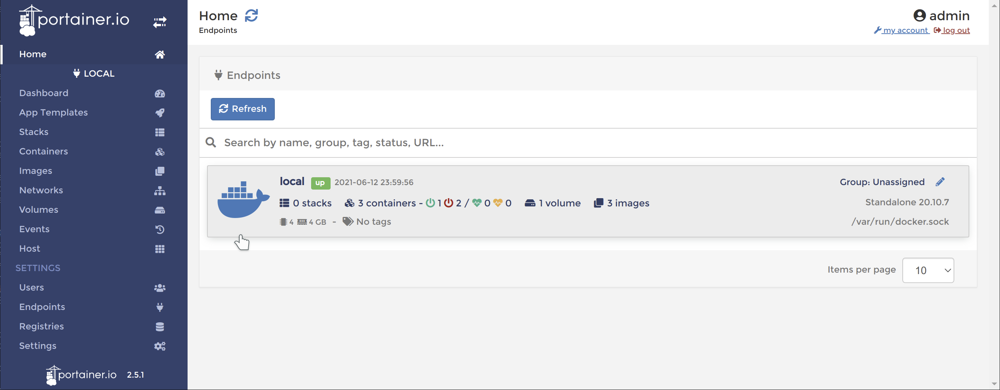

Im Endpoint ``local`` wird über die Auswahl `Volumes`...

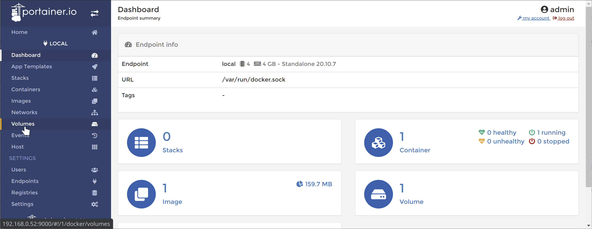

... das Menü `Add volume` aufgerufen:

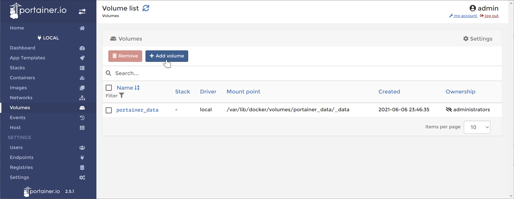

Nun muss unter `Name` ein Name für das Volume angegeben werden, in unserem
Fall ``CometVisuConfig``. Die anderen Optionen können auf der normalen
Einstellung verbleiben. Anschließend wird über `Create the volume` das
Volume erzeugt:

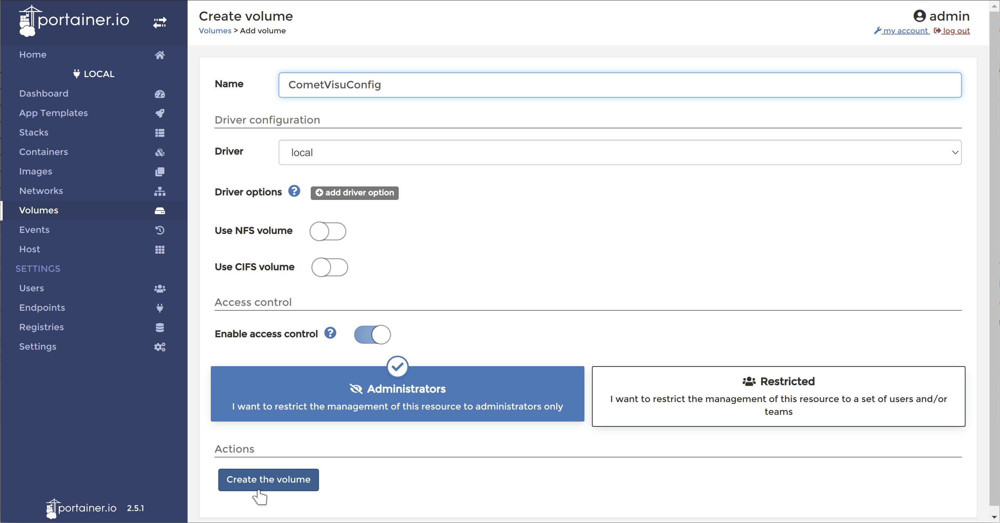

Einen neuen Container hinzufügen
--------------------------------

Nach dem Erzeugen des Volumes wird über die Auswahl `Containers`...

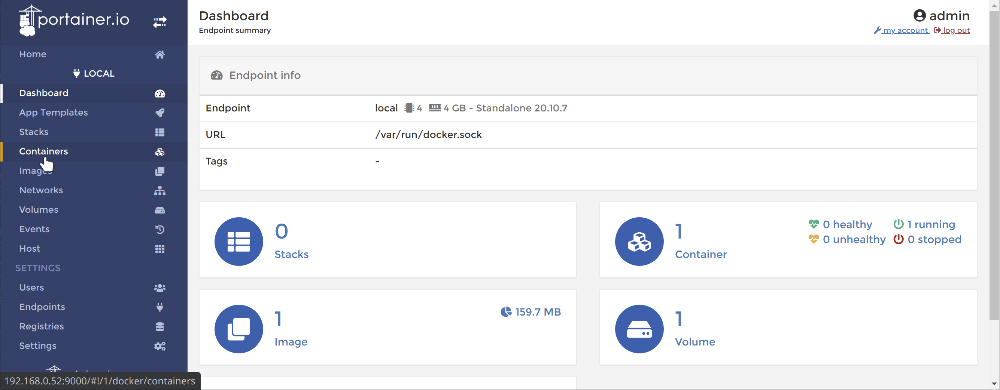

... das Menü `Add container` aufgerufen:

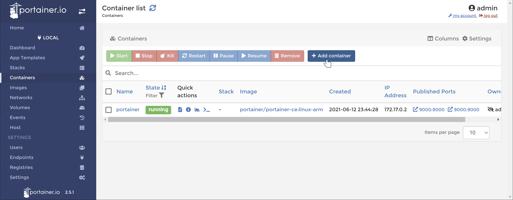

Unter `Advanced container settings` muss der Contianer nun noch konfiguriert
werden.

Hinzufügen des CometVisu Containers
-----------------------------------

Im Formular ist ein passender `Name`, hier ``CometVisu``, für den neuen
Container zu wählen und das Image auszuwählen. Das Image
``cometvisu/cometvisu:latest-arm`` wird hier direkt
vom offiziellen `Docker Hub <https://hub.docker.com/r/cometvisu/cometvisu>`_
geladen.

.. note::

    Wenn die CometVisu auf einem Docker-System installiert werden soll, das
    auf normaler PC Technologie basiert (also mit der x86 bzw. x64 Architektur),
    dann wäre das Image ``cometvisu/cometvisu:latest`` zu verwenden.

Außerdem ist über `publish a new network port` der Port ``80`` sowohl bei
`host` als auch bei `container` einzutragen.

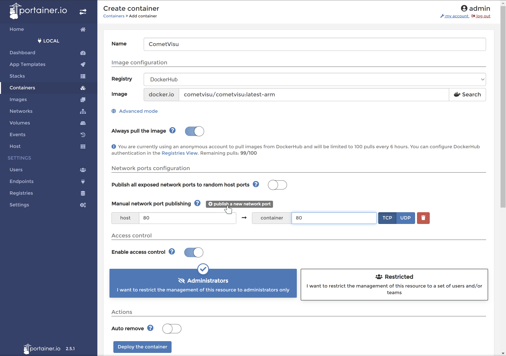

Unten auf der Seite ist nun bei den `Advanced container settings` der
Container noch zu konfigurieren.

Als erstes ist das weiter oben angelegte Volume unter dem Pfad
``/var/www/html/resource/config`` einzubinden:

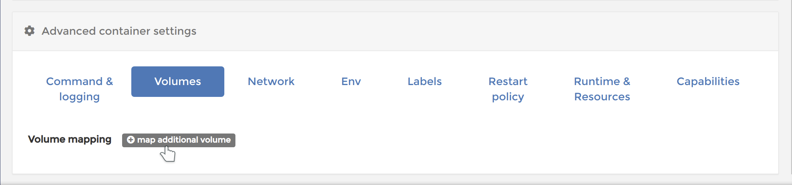

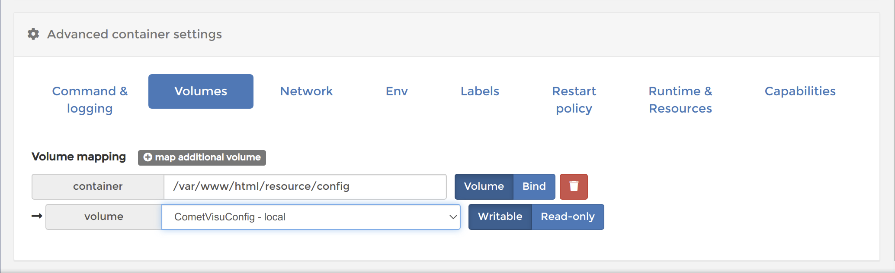

Unter `Env` ist die konkrete Konfiguration des Containers vorzunehmen. So wird
hier eingetragen wie auf die Bus-Schnittstelle zugegriffen werden muss. Die
Parameter sind im Handbuch unter :ref:`Docker Containers <dockerenvironment>`
beschrieben.

In diesem Tutorial wird eine KNX Verbindung zu einem IP-Tunnel unter der
Adresse ``192.168.0.35`` und dem Port ``3700`` aufgebaut.

.. important::

    An dieser Stelle müssen die für die eigene Installation gültigen
    Werte eingetragen werden!

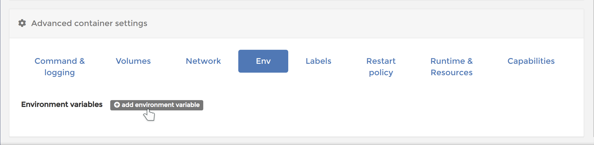

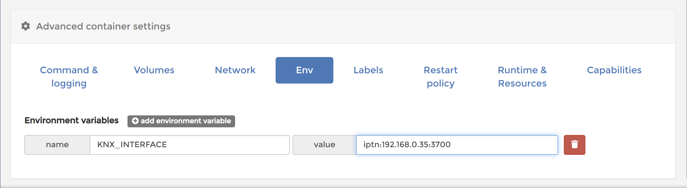

Zum Schluss muss noch die `Restart policy` eingetragen werden, also wann der
Container automatisch gestartet werden soll. Da der CometVisu-Server
durchgängig laufen soll ist ``Unless stopped`` die richtige Regel:

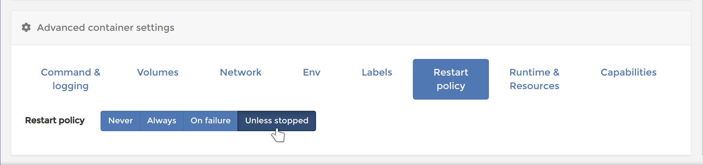

Über `Deploy the container` wird die Installation des Containers abgeschlossen:

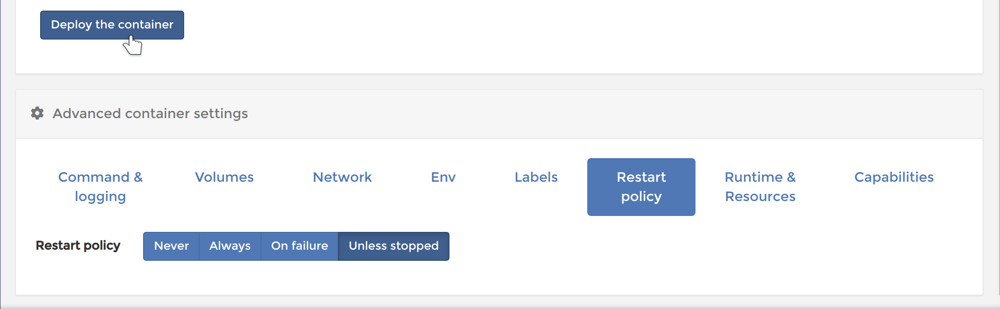

Über die IP-Adresse des Raspberry Pi lässt sich nun die CometVisu normal
im Browser öffnen:

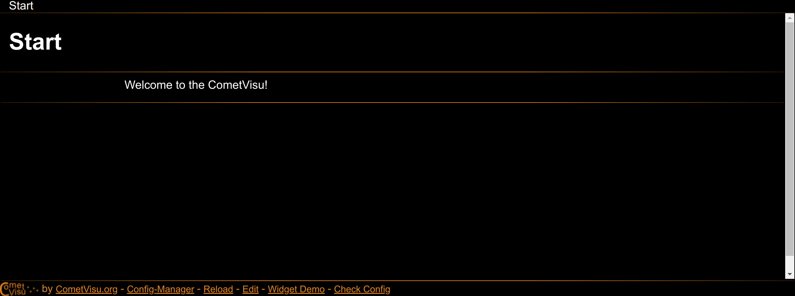

Alle weiteren Schritte für die Erstellung der CometVisu Konfig-Datei, das
Managen der Mediendateien, ... sind unabhängig vom Raspberry Pi und werden
daher nicht mehr in diesem Teil der Tutorial-Serie beschrieben.

.. _cv installation in terminal:

Installation über die Kommandozeile
===================================

Alle Schritte die mit Portainer durchgeführt wurden lassen sich auch leicht
mit wenigen Befehlen im Terminal durchführen.

Für die Installation sind zwei Schritte notwendig: zu erst muss ein `Volume`
erzeugt werden, in dem alle `persistenten` Daten gespeichert werden, d.h. alle
Daten die Informationen für die konkrete Installation enthalte wie beispielsweise
die Konfig-Dateien. Im zweiten Schritt wird dann der `Container` aus dem
offiziellen `Image` erstellt.

Ein `Volume` erzeugen
---------------------

Das Volume wird einfach erzeugt mit: ::

    docker volume create CometVisuConfig

Hinzufügen des CometVisu Containers
-----------------------------------

Der `offizielle CometVisu Container <https://hub.docker.com/r/cometvisu/cometvisu>`_
für den Raspberry Pi ist, in der jeweils neuesten Version,
``cometvisu/cometvisu:latest-arm``.

.. note::

    Wenn die CometVisu auf einem Docker-System installiert werden soll, das
    auf normaler PC Technologie basiert (also mit der x86 bzw. x64 Architektur),
    dann wäre das Image ``cometvisu/cometvisu:latest`` zu verwenden.

Installiert wird dieser mit: ::

    docker pull cometvisu/cometvisu:latest-arm

Zum ersten mal wird der CometVisu-Server nun gestartet mit: ::

    docker run --name CometVisu -e KNX_INTERFACE='iptn:192.168.0.35:3700' --restart unless-stopped -d -p 80:80 -v CometVisuConfig:/var/www/html/resource/config cometvisu/cometvisu:latest-arm

Die Bedeutung der einzelnen Bestandteile in diesem Befehl sind:

.. glossary::

    ``--name``
        Der Name unter dem der Container gemanagt wird.

    ``-e``
        Über diesen Parameter wird eine `Environment`-Variable übergeben. Mit
        ``KNX_INTERFACE='iptn:192.168.0.35:3700'`` wird der CometVisu-Server
        auf die KNX Bus-Schnittstelle mit einem IP-Tunnel an die Adresse
        ``192.168.0.35`` und den Port ``3700`` eingerichtet.

    ``--restart``
        Mit ``unless-stopped`` wird der Container auch bei Fehlern wieder
        automatisch gestartet - so lange er nicht per Befehl explizit beendet
        wurde.

    ``-d``
        Hierdurch wird der Container im Hintergrund gestartet.

    ``-p``
        Durch ``80:80`` wird der Port 80 im Container auf den Port 80 des
        Hosts, also des Raspberry Pi, gemappt. Erst hierdurch kann auf den
        Web-Server im Container von außen zugegriffen werden.

    ``-v``
        Mit ``CometVisuConfig:/var/www/html/resource/config`` wird das vorhin
        angelegte Volume ``CometVisuConfig`` auf den Pfad
        ``/var/www/html/resource/config`` im Container gemappt.

    ``cometvisu/cometvisu:latest-arm``
        Als letztes wird das Image angegeben, dass ausgeführt werden soll.

.. important::

    An dieser Stelle müssen die für die eigene Installation gültigen
    Werte eingetragen werden! Dies gilt vor allem für die Environment-Parameter,
    die mit ``-e`` übergeben werden. Im Handbuch steht eine genaue Beschreibung
    der :ref:`verfügbaren Einstellungen des Docker Containers <dockerenvironment>`.

.. note::

    Es kann sein, dass nach dem Start des CometVisu-Servers die Meldung
    `WARNING: The requested image's platform (linux/amd64) does not match the
    detected host platform (linux/arm/v7) and no specific platform was requested`
    erscheint. Diese Warnung kann ignoriert werden, da diese nur mit der
    Art der Erstellung des Image zusammenhängt.

Mit diesen drei Befehlen ist die Installation des CometVisu-Server bereits
abgeschlossen. Über die IP-Adresse des Raspberry Pi lässt sich nun die
CometVisu normal im Browser öffnen:

Alle weiteren Schritte für die Erstellung der CometVisu Konfig-Datei, das
Managen der Mediendateien, ... sind unabhängig vom Raspberry Pi und werden
daher nicht mehr in diesem Teil der Tutorial-Serie beschrieben.