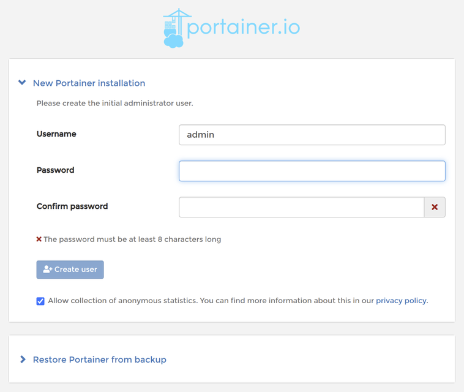
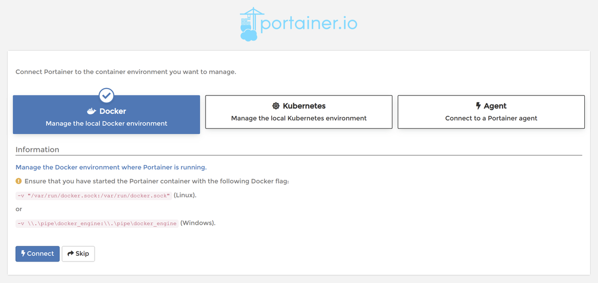

*********************************
Raspberry Pi: Docker installieren
*********************************

Hintergrund
===========

Was ist Docker?
---------------

Docker ist eine leichtgewichtige Umgebung um virtualisierte `Server`, die
hier `Container` genannt werden, laufen lassen zu können. Der Bedarf ist im
Bereich großer Rechenzentren entstanden um so schnell, einfach und sicher
auch sehr große Installationen aufsetzen und warten zu können. So kann mit
Docker leicht und schnell von wenigen auf viele Server skaliert werden,
was beispielsweise für einen Online-Shop sehr wichtig sein kann, damit dieser
problemlos mit steigenden Nutzerzahlen mit skalieren kann.

Wieso Docker auf dem Raspberry Pi?
----------------------------------

Docker ist nicht nur extrem stabil und leichtgewichtig, es hat auch einen
großen Vorteil für eine sehr kleine Installation - wie einen einzelnen
Raspberry Pi der sich um die Heimautomatisierung kümmert:

Dadurch, dass die ganze Server-Software in einem `Image` für den `Container`
zusammen gefasst ist lässt sich dieser mit nur einem Befehl
installieren. Auch reicht nur ein weiterer einfacher Befehl um die Software
zu aktualisieren. Somit sind die ganzen Abhängigkeiten und möglichen
Inkompatibilität einer Server-Software gekapselt und können keine Probleme
verursachen. Auch ist die Installation einer Server-Software als Docker
Container einfacher als wenn diese direkt installiert wird.

Philosophie hinter Docker
-------------------------

Um optimal mit Docker umgehen zu können ist es wichtig die Philosophie hinter
Docker zu verstehen und diese beizubehalten. Man ist manchmal gerne geneigt als
"Abkürzung" diese zu verlassen, jedoch erkauft man sich dadurch Probleme bei der
zukünftigen Wartung.

Bei Docker gilt als Grundsatz, dass immer nur ein "Server" in einem Container
existieren soll (genauer: nur ein Server-Prozess). Wenn mehrere Server
gleichzeitig benötigt werden (wie z.B. ein Datenbank-Server und ein Web-Server),
so werden hierfür zwei getrennte Container gleichzeitig ausgeführt.

Ein Container wird auch immer als "Wegwerf-Produkt" angesehen: wenn dieser
nicht mehr wie gewollt funktioniert (z.B. weil die Version veraltet ist), dann
wird dieser nicht gewartet, sondern gleich ein neuer Container genommen.

Diese - in diesem Fall sehr positive Wegwerf-Mentalität - hat zur Folge, dass
bei einem Docker-Setup auch alle `persistenten Daten`, d.h. alle individuellen
Daten wie Konfigurations-Dateien, getrennt von einem Container aufbewahrt
werden müssen. Hierzu gibt es `Volumes` die vom Host bereitgestellte Dateien und
Verzeichnisse im Container einblenden.

Ein `Image` ist ein bereits fertig gestellter Container. Neben der Möglichkeit
selber eigene Images zu erstellen verwendet man normalerweise fertige Images
die man von `Docker Hub <https://hub.docker.com/>`_ kostenlos beziehen kann.

Installation von Docker
=======================

Die Installation geht sehr einfach. Als erstes ist - wie bei jeder
Software-Installation das System auf den aktuellsten Stand zu bringen (die
ggf. kommende Rückfrage über die zu aktualisierende Software muss mit einem
``J`` bestätigt werden): ::

    sudo apt-get update
    sudo apt-get upgrade

Docker selbst wird installiert mit: ::

    curl -sSL https://get.docker.com | sh

Damit der aktuelle User (normalerweise ``pi``) auch als Nicht-Root User
Container starten kann muss dieser noch der Gruppe ``docker`` hinzugefügt
werden: ::

    sudo usermod -aG docker ${USER}

Anschließend muss der Raspberry Pi neu gestartet werden, damit diese Änderungen
alle aktiv sind: ::

    sudo shutdown -r now

.. note::

    Sollte Docker nach einem Boot nicht automatisch gestartet werden, so kann
    dies mit ``sudo systemctl enable docker`` eingestellt werden.

Installation von Portainer (optional)
=====================================

Docker wird über die Kommandozeile administriert. Jedoch gibt es auch sehr
gute graphische Oberflächen, die gerade Administratoren mit wenig Erfahrung den Umgang
deutlich erleichtern können. In diesem Tutorial verwenden wir dafür
`Portainer <https://www.portainer.io/>`_. Portainer ist selbst ein Docker Image,
dass wir nun als Container laufen lassen.

Die Portainer-Installation ist sehr einfach: ::

    docker pull portainer/portainer-ce:linux-arm

Um Portainer zu starten - und auch nach einem Boot wieder starten zu lassen: ::

    docker run --name portainer --restart always -d -p 9000:9000 -v /var/run/docker.sock:/var/run/docker.sock -v portainer_data:/data portainer/portainer-ce:linux-arm

Nun kann Portainer aufgerufen werden, in dem der Port ``9000`` des Raspberry Pi
im Browser geöffet wird, also z.B. mit der URL:
`http://192.168.0.52:9000/ <http://192.168.0.52:9000/>`_

Im Portainer muss nun als erstes ein Benutzer angelegt werden:

Hierzu ist nur ein Passwort zu vergeben und mit ``Create user`` zu bestätigen.

Als nächstes ist auszuwählen, dass ein ``local Docker environment`` verwaltet
werden soll:

Den Hinweis seitens Portainer haben wir bereits bei der Installation
berücksichtig und können somit mit ``Connect`` die Installation abschließen.

Die nächsten Schritte
=====================

Die Installation von Docker und die optionale Installation von Portainer ist
nun abgeschlossen. Als nächstes können die gewünschten `Container`, wie
beispielsweise für die :doc:`CometVisu <rpi_cometvisu>` oder
:doc:`Node-RED <rpi_nodered>` installiert werden, was in den jeweiligen
Tutorials beschrieben wird.