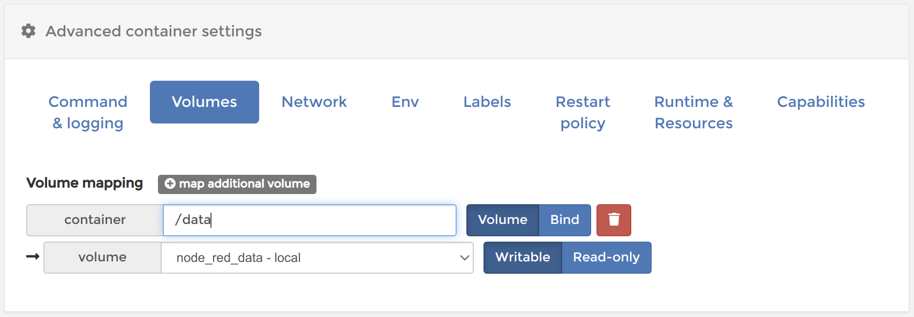

*********************************************
Raspberry Pi: Node-RED in Docker installieren
*********************************************

Ein Heimautomatisierungsserver braucht neben einer Visualisierung auch die
Möglichkeit Logiken auszuführen. Hierfür gibt es verschiedene Möglichkeiten
wie `Node-RED <https://nodered.org/>`_ oder
`OpenHAB <https://www.openhab.org/>`_. In diesem Tutorial wird die Installation
von Node-RED auf dem Raspberry Pi als Docker Container beschrieben.

Grundsätzlich kann die Installation über die Kommandozeile erfolgen, was auch
im :ref:`zweiten Teil <nodered installation in terminal>` besprochen wird. Wer jedoch
bereits dem :doc:`vorhergehenden Teil des Tutorials <rpi_docker>` gefolgt ist,
kann die Installation komfortabel mit Portainer durchführen.

Wenn bereits das Tutorial :doc:`CometVisu in Docker installieren <rpi_cometvisu>`
durchgeführt wurde, so dürften die Schritte in diesem Tutorial bekannt
vorkommen. Daher werden hier die Schritte ohne Screenshots beschrieben. Sollten
folglich Fragen aufkommen wo welcher Punkt zu finden ist, so kann das Tutorial
für die CometVisu Installation als Referenz verwendet werden.

Installation mit Portainer
==========================

Die Installation besteht auch für Node-RED aus zwei Teilen. Zu erst muss ein
`Volume` für die persistenten Daten erzeugt werden bevor der `Container` selbst
aus dem `Image` erzeugt werden kann.

Ein `Volume` erzeugen
---------------------

Als erstes muss ein neues Volume mit dem Namen ``node_red_data`` angelegt werden.

Einen neuen Container hinzufügen
--------------------------------

Nun muss ein neuer Container mit dem Namen ``Node-RED`` angelegt werden. Das
Image ist ``nodered/node-red:latest``. Bei den Netzwerk-Ports muss am
`host` und am `container` jeweils der Port ``1880`` eingetragen werden.

Bei den `Volumes` muss im Container der Pfad ``/data`` auf das vorhin angelegte
Volume ``node_red_data`` gemappt werden.

Über die `Restart Policy` kann nun noch mit ``Unless stopped`` festgelegt
werden, dass der Container auch nach einem Neustart oder bei einem Fehler neu
gestartet werden soll.

.. figure:: _static/portainer_add_nodered_restart.png

Je nach Zeitzone an der der Server laufen soll, muss diese ggf. noch über
das `Environment` eingestellt werden. Für einen Betrieb in Deutschland muss
``TZ`` mit dem Wert ``Europe/Berlin`` eingestellt werden.

Über `Deploy the container` ist die Installation abgeschlossen. Node-RED kann
nun auf dem Raspberry Pi auf dem Port ``1880`` mit dem Browser geöffnet werden.

.. figure:: _static/portainer_nodered.png

.. note::

    Als erstes wird Node-RED eine Warnung mit dem Inhalt `WARNING: please check
    you have started this container with a volume that is mounted to /data
    otherwise any flow changes are lost when you redeploy or upgrade the
    container (e.g. upgrade to a more recent node-red docker image).
    If you are using named volumes you can ignore this warning. Double click
    or see info side panel to learn how to start Node-RED in Docker to save
    your work` anzeigen.

    Da wir das `Named-Volume` ``node_red_data`` auf den Pfad ``/data`` gemappt
    haben, ist diese Warnung für uns nicht relevant.

.. _nodered installation in terminal:

Installation über die Kommandozeile
===================================

Ein `Volume` erzeugen
---------------------

Das Volume wird einfach erzeugt mit: ::

    docker volume create node_red_data

Hinzufügen des CometVisu Containers
-----------------------------------

Node-RED lässt sich über das offizielle Image aus dem `Docker Hub` installieren
mit: ::

    docker run -d --name Node-RED -p 1880:1880 -v node_red_data:/data -e TZ=Europe/Berlin --restart unless-stopped nodered/node-red:latest

Die Bedeutung der einzelnen Bestandteile in diesem Befehl sind:

.. glossary::

    ``-d``
        Hierdurch wird der Container im Hintergrund gestartet.

    ``--name``
        Der Name unter dem der Container gemanagt wird.

    ``-p``
        Durch ``1880:1880`` wird der Port 1880 im Container auf den Port 1880 des
        Hosts, also des Raspberry Pi, gemappt. Erst hierdurch kann auf den
        Web-Server im Container von außen (über den Port 1880) zugegriffen werden.

    ``-v``
        Mit ``node_red_data:/data`` wird das vorhin angelegte Volume
        ``node_red_data`` auf den Pfad ``/data`` im Container gemappt.

    ``-e``
        Über diesen Parameter wird eine `Environment`-Variable übergeben. Mit
        ``TZ=Europe/Berlin`` wird die Zeitzone für Node-RED auf `Berlin`
        festgelegt.

    ``--restart``
        Mit ``unless-stopped`` wird der Container auch bei Fehlern wieder
        automatisch gestartet - so lange er nicht per Befehl explizit beendet
        wurde.

    ``nodered/node-red:latest``
        Als letztes wird das Image angegeben, dass ausgeführt werden soll.

Node-RED kann nun auf dem Raspberry Pi auf dem Port ``1880`` mit dem Browser
geöffnet werden.

.. note::

    Als erstes wird Node-RED eine Warnung mit dem Inhalt `WARNING: please check
    you have started this container with a volume that is mounted to /data
    otherwise any flow changes are lost when you redeploy or upgrade the
    container (e.g. upgrade to a more recent node-red docker image).
    If you are using named volumes you can ignore this warning. Double click
    or see info side panel to learn how to start Node-RED in Docker to save
    your work` anzeigen.

    Da wir das `Named-Volume` ``node_red_data`` auf den Pfad ``/data`` gemappt
    haben, ist diese Warnung für uns nicht relevant.
