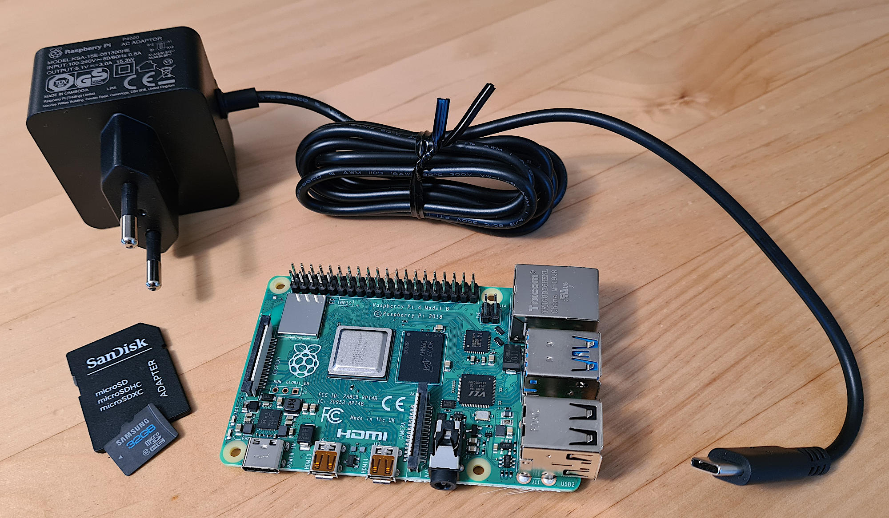
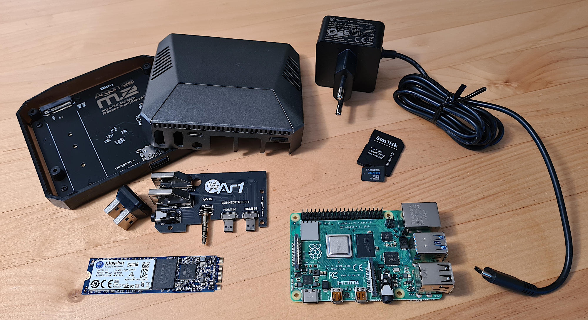

**************************
Raspberry Pi: Vorbereitung
**************************

Im ersten Teil des Tutorials wird der Raspberry Pi (RPi) so vorbereitet, dass
dieser mit minimalem Betriebssystem läuft und von einem Arbeitsrechner über
das Netzwerk erreichbar ist. Wer eine andere Plattform als einen Raspberry Pi
verwenden möchte, wie z.B. einen NUC, kann problemlos den Rechner selbst
vorbereiten und diesen Teil des Tutorials überspringen um bei einem der
späteren Teile einzusteigen.

.. NOTE::

    Dieser erste Tutorial-Teil ist sehr ausführlich gehalten um auch Einsteigern
    ohne jegliche Erfahrung in der Administration von Linux basierten Rechnern
    einen problemlosen Start zu ermöglichen.

    Je nach Vorwissen mag es jedoch notwendig sein selbständig zu den einzelnen
    Themen noch etwas Hintergrundinformationen zu suchen. Dies dazu notwendigen
    Stichworte sind jedoch in diesen Tutorial bereits enthalten.

Warum Raspberry Pi?
===================

Der Raspberry Pi ist ein kleiner, sparsamer Einplatinen-Computer, so dass alles
wichtige für den Betrieb bereits auf der Platine enthalten ist. Ursprünglich
für Bastel- und Ausbildungsprojekte gedacht hat sich der Raspberry Pi in den
letzten Jahren auch im professionellen Umfeld einen Namen gemacht und seinen
Platz gefunden.

Für ein Projekt im Bereich der Gebäudeautomatisierung, wie eben auch im Smart
Home, ist er aufgrund seiner Universalität, Stabilität und des geringen
Stromverbrauchs prädestiniert. Ein weiter Vorteil sind die geringen Kosten
für die Hardware und dessen frei verfügbares Betriebssystem.

Was wird benötigt?
==================

Neben dem Raspberry Pi selbst, in diesem Tutorial wird die 2021 aktuelle
Version **Raspberry Pi 4 Model B** verwendet. Zusätzlich wird nur noch eine
Stromversorgung und ein Speichermedium benötigt.

Weitere Ausstattung wie Netzwerkkabel, HDMI-Kabel, Displays, ... sind jeweils
spezifisch für den Anwendungsfall und werden hier als vorhanden vorausgesetzt.

Minimale Ausstattung
--------------------

* Raspberry Pi 4 Model B, 2 GB
* USB-C Spannungsversorgung
* microSD Karte

Empfohlende Ausstattung
-----------------------

Die größte Schwachstelle bei dauerhaften Betrieb eines Raspberry Pi ist die
Lebensdauer der SD-Karte, da diese nicht auf die dabei auftretende hohe Anzahl
an Schreibzyklen ausgelegt ist. Hier empfiehlt es sich statt der microSD Karte
ein USB Massenspeicher zu verwenden (**keinen** USB-Stick, diese sind sogar meist
mit Flash-Speicher von noch geringerer Qualität ausgestattet). Die
Spannungsversorgung muss ausreichend dimensioniert sein um auf den USB Speicher
versorgen zu können - oder es muss ein entsprechender Speicher mit externer
Versorgung verwendet werden.

Wenn der Raspberry Pi für zukünftige Erweiterungen noch bisschen Luft haben,
so kann auch die Version mit 4 GB RAM verwendet werden.

Für den professionellen, langfristigen Betrieb ist außerdem noch ein Gehäuse
empfohlen, dass auch die CPU kühlen kann.

* Raspberry Pi 4 Model B, 4 GB
* USB-C Spannungsversorgung
* microSD Karte - wird nur temporär benötigt
* USB Speicher mit langer Lebensdauer
* Gehäuse

Ausstattungsbeispiel
--------------------

Dieses Tutorial wurde anhand dieser Ausstattung erstellt:

* Raspberry Pi 4 Model B, 4 GB
* original Raspberry Pi USB-C Spannungsversorgung (3 Ampere)
* microSD Karte - wird nur temporär benötigt
* Kingston M.2 SSD A400 240GB
* Argon ONE M.2 Gehäuse

Anschaffungspreis (2021) waren keine 150 Euro.

.. figure:: _static/rpi_housing.jpg
   :scale: 50 %

Setup der Hardware
==================

Der Zusammenbau der Hardware erfolgt nach den jeweiligen Bedienungsanleitungen.

Setup der Software
==================

Betriebssystem
--------------

Als Betriebssystem wird **Raspberry Pi OS Lite** der `Raspberry Pi Foundation <https://www.raspberrypi.org/>`__
verwendet. Angeboten wird dieses unter: https://www.raspberrypi.org/software/

Dieses Betriebssystem ist nun auf die SD-Karte und, wenn vorhanden, auf den
USB-Speicher zu installieren, z.B. mit dem Raspberry Pi Imager:

.. raw:: html

    

      <iframe src="https://www.youtube-nocookie.com/embed/ntaXWS8Lk34" style="position:absolute;width:100%;height:100%" frameborder="0" allow="accelerometer; autoplay; encrypted-media; gyroscope; picture-in-picture" allowfullscreen></iframe>
    

Netzwerkzugriff - Teil 1
------------------------

Clients
^^^^^^^

Um den Raspberry Pi warten zu können ist es wichtig über das Netzwerk auf diesen
zugreifen zu können. Dies geschieht, wie üblich, über die `Secure Shell (SSH) <https://de.wikipedia.org/wiki/Secure_Shell>`__.
Linux-Anwender können dann normal über das Terminal zugreifen, Windows-Anwender
nutzen hierfür am einfachsten `PuTTY <https://de.wikipedia.org/wiki/PuTTY>`__.
Aber auch für Mac OS, Android, ... sind kostenlose SSH Clients verfügbar.

SSH aktivieren
^^^^^^^^^^^^^^

Um direkt per SSH auf den Raspberry Pi zugreifen zu können muss noch **vor**
dem ersten Start in der ersten Partition der SD-Card (und des USB Speichers)
eine (leere) Datei mit dem Namen ``ssh`` angelegt werden.

Erster Start
^^^^^^^^^^^^

Nun ist der Raspberry Pi bereit für den ersten Start, es müssen nur die Speicher,
das Netzwerk-Kabel und anschließend die Spannungsversorgung verbunden werden.

Wurde auch ein Monitor verbunden, so ist auf diesem die Boot-Sequenz sichtbar.
An deren Ende erscheint die Netzwerk-Adresse, die über DHCP bezogen wurde und
unter der der Raspberry Pi zu erreichen ist. Alternativ kann in der Regel auch
über den DHCP-Server (meist Bestandteil des Internet-Routers) die IP-Adresse
in Erfahrung gebracht werden.

Erster Zugriff
^^^^^^^^^^^^^^

Über den SSH-Client kann nun auf den Raspberry Pi zugegriffen werden. Der initial
angelegte Benutzer für das Login ist ``pi`` mit dem Passwort ``raspberry``.

USB Boot einrichten (optional)
------------------------------

Für das empfohlene Setup für langfristigen Betrieb ohne SD-Karte müssen
nach dem Einloggen auf den `root`-User gewechselt, die Pakete (auf der SD-Karte)
aktualisiert und ggf. die Firmware aktualisiert werden. Im Anschluss wird das
Raspberry Pi Software Configuration Tool gestartet: ::

    sudo -s
    apt update
    apt full-upgrade
    rpi-eeprom-update
    raspi-config

In dem Software Konfigurations-Tool wird nun die Boot-Reihenfolge auf USB Boot
geändert:

#) ``6 Advanced Options``
#) ``A6 Boot Order``
#) ``B2 USB Boot``

.. NOTE::

    Das installierte Raspberry OS kennt, wie jedes andere Linux auch, mehrere
    Benutzer. Als normaler Nutzer ist der Account ``pi`` angelegt worden, dieser
    hat aber - bewusst! - nur eingeschränkte Rechte. Werden für administrative
    Aufgaben erweiterte Rechte benötigt, so müssen diese mit dem Accout ``root``
    durchgeführt werden. Aus Sicherheitsgründen kann man sich normalerweise
    nicht direkt als ``root`` anmelden, sondern geht über einen normalen Account
    (wie ``pi``) und wechselt dann von dort auf den ``root``-Account.

    Für einen einzelnen Befehl geschieht dies, in dem ``sudo`` vor den Befehl
    geschrieben wird. Wenn mehrere Befehlen als ``root`` ausgeführt werden sollen,
    so kann über ``sudo -s`` der Account auf den ``root`` Account gewechselt
    werden. Durch ein ``exit`` wird wieder zurück gewechselt.

Der Raspberry Pi kann nun über ``shutdown -h now`` herunter gefahren werd, die
Spannungsversorgnug getrennt, die SD-Karte entfernt und anschließend über das
Wiedereinstecken der Spannungsversorgung wieder gestartet werden.

Basisadministration
-------------------

Passwort ändern
^^^^^^^^^^^^^^^

Als erster Schritt in der finalen Umgebung sollte das Passwort des Users ``pi``
geändert werden: ::

    passwd

.. NOTE::

    Das Passwort kann gerne lange und kompliziert gewählt werden, da dieses
    später durch den "ssh key exchange" nicht mehr eingegeben werden muss.

    Wenn dennoch ein "unsicheres" Passwort gewünscht wird - wovon dringend
    abgeraten wird - so lässt sich über ``sudo passwd pi`` der Komplexitäts-Schutz
    umgehen.

System aktuell halten
^^^^^^^^^^^^^^^^^^^^^

Seit dem Erstellen des Betriebssystem-Paketes gab es bereits Aktualisierungen
von einzelnen Software-Bestandteilen. Alle Updates werden installiert über: ::

    sudo apt update
    sudo apt full-upgrade

Diese Befehle sollte man später im Rahmen der allgemeinen Systemwartung
regelmäßig wiederholen um alle Bug-Fixes und Sicherheits-Patches zu bekommen.

Komfort (optional)
^^^^^^^^^^^^^^^^^^

Um sich das Leben etwas leichter zu machen können nun ein paar grundlegende
Einstellungen vorgenommen werden.

Editor
""""""

Standardmäßig ist bereits der Editor ``nano`` installiert, eine gerade auch
für Einsteiger gute Wahl. Editieren von (Text-)Dateien geht sehr einfach, in
dem ``nano <Dateiname>`` aufgerufen wird. Änderungen werden dann mit "^O"
gespeichert, d.h. mit :kbd:`Strg` + :kbd:`O`. Der Editor wird mit "^X",
also :kbd:`Strg` + :kbd:`X`, wieder beendet.

Sollte jedoch ein anderer Editor bevorzugt werden, so kann dieser jetzt
installiert werden, z.B. für `vim <https://de.wikipedia.org/wiki/Vim>`__: ::

    sudo apt-get install --no-install-recommends vim

Auch kann dieser nun konfiguriert werden, z.B. wenn bei `vim` die Mausintegration
über das Terminal stören sollte: ::

    echo "set mouse=" | sudo tee -a /etc/vim/vimrc.local
    echo "set ttymouse=" | sudo tee -a /etc/vim/vimrc.local

Dateianzeige
""""""""""""

Für die schnelle und komfortable Anzeige der Dateien im Terminal haben sich
Abkürzungen etabliert, die noch in der Datei ``~/.bashrc`` aktiviert werden
müssen. Hierzu öffnet man diese Datei im Editor (z.B. mit ``nano ~/.bashrc``)
und Passt, relativ am Ende, die Zeilen an auf: ::

    alias ll='ls -alF'
    alias la='ls -A'
    alias l='ls -CF'

Im Terminal kann so nun über ``ll`` mit entsprechend bunter Hervorhebung der
Inhalt des aktuellen Ordners angezeigt werden.

Diese Einstellung ist für jeden Account individuell. D.h. diese müsste sowohl
für den User ``pi`` als auch für ``root`` vorgenommen werden.

Basiseinstellungen
^^^^^^^^^^^^^^^^^^

Über ``sudo raspi-config`` lassen sich nun grundlegende Einstellungen des
Raspberry Pi vornehmen, z.B. nicht benötigte Hardware-Treiber ausschalten
oder, wenn wider Erwarten notwendig, die HDMI Ausgänge konfigurieren.

Netzwerkzugriff - Teil 2
------------------------

Netzwerkaddresse ändern
^^^^^^^^^^^^^^^^^^^^^^^

Bis jetzt hat sich der Raspberry Pi selbst eine Netzwerkadresse besorgt. Damit
dieser aber als Server immer unter der gleichen Adresse zu erreichen ist muss
entweder im DCHP-Server (in der Regel im Internet-Router integriert) für den
Pi eine feste Adresse festgelegt werden - oder man vergibt eine statische
Adresse außerhalb des DHCP Bereichs.

Für eine statische IP Adresse muss in die Datei ``/etc/dhcpcd.conf`` um
die entsprechenden Zeilen ergänzt werden. In diesem Beispiel wird dem
Ethernet-Interface ``eth0`` die statische Adresse ``192.168.0.52`` mit
dem Router und DNS-Server ``192.168.0.1`` zugewiesen: ::

    interface eth0
    static ip_address=192.168.0.52/24
    static routers=192.168.0.1
    static domain_name_servers=192.168.0.1

Die einfachste Möglichkeit um diese Einstellungen zu aktivieren ist ein
Neustart, z.B. mit ``sudo shutdown -r now``.

WLAN (und Bluetooth) entfernen (optional)
^^^^^^^^^^^^^^^^^^^^^^^^^^^^^^^^^^^^^^^^^

Wenn der Raspberry Pi über Ethernet und nicht über WLAN mit dem Netzwerk
verbunden ist (sehr empfohlen!), so kann dies komplett abgeschaltet werden.

Hierzu muss die Datei ``/boot/config.txt`` am Ende um die Zeile ::

    dtoverlay=disable-wifi

erweitert werden. Wenn auch Bluetooth deaktiviert werden soll, so ist zusätzlich
noch die Zeile ::

    dtoverlay=disable-bt

hinzuzufügen. Nach einem Neustart kann nun noch über
``sudo apt-get autopurge wpasupplicant``
der ``wpasupplicant`` Service entfernt werden.

SSH Key Exchange
^^^^^^^^^^^^^^^^

Für einen komfortablem Zugriff über SSH wird ein `SSH Key Exchange` durchgeführt.
Nach einem Key Exchange wird kein Passwort mehr benötigt, sondern es wird
direkt ein lokal vorliegender kryptographischer Schlüssel verwendet. Dieser
Schlüssel kann wiederum mit einem (ggf. anderen) Passwort geschützt werden.

.. NOTE::

    Wird der Key Exchange mit einem Arbeitsrechner durchgeführt, so sollte in der
    Regel ein Passwort für den Schlüssel vergeben werden. Wenn der Key Exchange
    mit einem Automatisierungsserver (z.B. einer Node-Red Instanz) durchgeführt
    wird, um so z.B. von außen den Bildschirm aktivieren zu können, so wird dieser
    meist ohne extra Passwort durchgeführt.

    In einer geschützten, privaten Umgebung kann dies ausreichend sein. In einer
    professionellen Umgebung wird die Entscheidung über einen notwendigen
    Passwortschutz anhand einer Gefahrenanalyse getroffen.

Auf dem Client (Arbeitsrechner, Automatisierungsserver) muss zuerst ein lokaler
SSH-Schlüssel erzeugt werden, sollte noch keiner vorhanden sein. Bei der
Erzeugung des lokalen Schlüssels wird dann auch das Passwort für diesen Schlüssel
(also nicht das Passwort für den Raspberry Pi!) angegeben. Der lokale,
öffentliche Schlüssel liegt auf dem Client-Rechner in der Text-Datei ``id_rsa.pub``.

Auf dem Raspberry Pi muss nun im Home-Verzeichnis des entsprechenden Users (also
``pi`` oder ``root``) das Unterverzeichnis ``.ssh`` angelegt werden und der
öffentliche Schlüssel dann in die Datei ``authorized_keys`` kopiert werden.
Für einen Key Exchange mit ``root`` wird erst über ``sudo -s`` der Benutzer
gewechselt. Anschließdend dann: ::

    mkdir -p ~/.ssh
    nano ~/.ssh/authorized_keys

Im Editor kann dann der Text aus der lokalen Datei ``id_rsa.pub`` hinein kopiert
werden.

Im Anschluss bietet es sich an gleich die Verbindung zu testen. Dazu beendet man
über ``exit`` die aktuelle ``ssh``-Session und startet diese wieder neu.
Bei einem Schlüssel ohne Passwort sollte man nun direkt verbunden sein, bei einem
mit muss nur das lokale Passwort (und nicht das Passwort des Users ``pi``)
eingegeben werden.

Weiteres (optional)
-------------------

Anschließend können noch finale Konfigurationen durchgeführt werden, wie
beispielsweise die Treiber für das Argon Gehäuse. In diesem konkreten Fall
würde über ::

    curl https://download.argon40.com/argon1.sh | bash

der Treiber installiert werden und über ``argonone-config`` eingerichtet werden.

Ausblick
========

Der erste Teil des Tutorials zur grundsätzlichen Vorbereitung des Raspberry Pi
für eine professionelle, langfristige Nutzung ist nun abgeschlossen. Als
nächstes muss nun die Software installiert werden, durch die der Pi produktiv
nutzbar wird.

Dies kann die CometVisu selbst sein, die dazu am einfachsten in einer
Docker-Umgebung läuft: <xxx>

Es kann aber auch sein, dass der Raspberry Pi als CometVisu Client laufen soll
und den Browser mit der CometVisu auf einem Touch Sreen darstellen soll:
:doc:`Client einrichten (Kiosk Modus) <rpi_kiosk>`.

Genau so ist es möglich den Raspberry Pi als Automatisierungs-Server für
OpenHAB oder Node-Red zu verwenden.

Gerade wenn der Raspberry Pi mit "etwas Luft" gekauft wurde, so kann dieser
leicht mehrere dieser Aufgaben gleichzeitig übernehmen, da dieser ja sowieso
rund um die Durchläuft.

Cheat Sheet
===========

Für die Einrichtung und grundlegende Administration des Raspberry Pi über die
Kommandozeile werden nicht viele Befehle benötigt. In dieser Liste sind die
wichtigsten zusammengefasst.

Allgemeine Befehle:

``cd <Pfad>``
    Wechsel des Verzeichnisses, ``cd ..`` wechselt ein Verzeichnis "nach oben".
    ``cd ~`` wechselt in das Heimat-Verzeichnis des aktuellen Accounts.

``ls`` oder (wenn eingerichtet) mit mehr Komfort ``ll``
    Aktuellen Inhalt des Verzeichnisses anzeigen.

``whoami``
    Anzeige des aktuellen Accounts (``pi`` oder ``root``).

``sudo <Befehl>``
    Führt ``<Befehl>`` als User ``root`` aus.

``sudo -s``
    Führt alle weiteren Befehle als ``root`` aus, bis dies durch ``exit`` wieder
    beendet wird.

``exit``
    Beendet die aktuelle "Anmeldung", also z.B. die aktuelle SSH-Session oder
    den Wechsel des Accounts über ``sudo -s``.

``shutdown -h now``
    Sofortiges Herunterfahren und anschließendes Halten. Bei einem Raspberry Pi
    muss zum anschließenden neuen Start die Spannungsversorgung getrennt und
    wieder neu verbunden werden.

``shutdown -r now``
    Sofortiges Herunterfahren und anschließender Neustart.

``nano`` oder ``nano <Dateiname>``
    Öffnet den Editor ``nano``.

Befehle speziell für den Raspberry Pi:

``raspi-config``
    Grundlegendste Systemeinstellungen, vergleichbar mit BIOS Einstellungen
    bei einem normalen PC.

Sollte die Boot-Partition in den Systemeinstellungen als `Read-Only`
konfiguriert worden sein, so kann diese temporär mit
``sudo mount -o remount,rw /boot`` beschreibbar gemacht werden.
