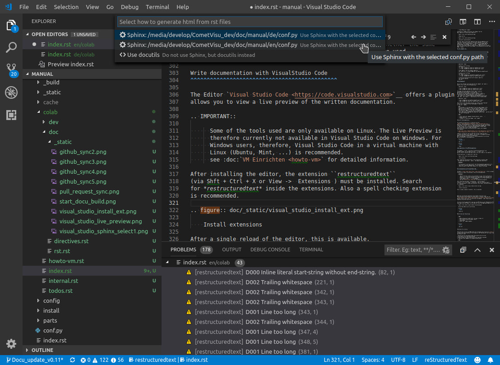

**************************
Help the CometVisu project
**************************

Participation in the CometVisu project is easily possible and also
very welcome! Not only developers who would like to contribute new
features or bugfixes are addressed, but also users who want to incorporate
their own experience in improving the documentation.

.. important ::

    As CometVisu is developed by a bunch of people without any native
    english spoken person. Therefore Help an reviewing the english
    documentation is highly appreciated.

General preparations
-------------------------

Basically, there is no difference in the procedure, between changes
to the source code and changes to the documentation, so the preparations
are described here in a general way. The steps described below
must be done once.

Both the source code and the documentation are maintained in
the official Github repository of the CometVisu project:
`<https://github.com/CometVisu/CometVisu>`__

In order to work together you need a free account at Github. If
this is created, one must *fork* the CometVisu project.
To do this, follow these steps:

#. login on github.com
#. goto `<https://github.com/CometVisu/CometVisu>`__
#. press "Fork"-Button click on the top right and follow the instructions

This is a private copy of the CometVisu repository created
in which you can make your own changes. Of course it is easier
if you have the files on your local machine to edit them there.
You have to clone your private copy of the CometVisu repository.
To work locally with the files you need a *git client*.
In this description we are using the version for the command line, but
there are also versions available that use a graphical user interface.
Since the procedures and terms are similar
for all clients, the command line client will be used as reference
in the further course. To 'clone' the repository, follow these steps:

#. open a shell
#. go to a folder in which the subfolder of the project is to be created
#. ``git clone https://github.com/<your-account>/CometVisu.git`` (<your-account> replace with your username)
#. go into the project folder and reload the submodules (icons and
   Qooxdoo framework) as follows
#. ``git submodule init``
#. ``git submodule update``

that's it, the local working copy is in the *CometVisu* subfolder.
With this all preparations have been made.

General approach
----------------

If you want to make a change, you should follow the procedure
described here. Even if it seems unnecessarily complicated at
first glance, especially if you just want to do minor changes. The
experience shows that you have less problems in the long run, if you
always stick to this workflow and it is thus becoming a habit. And
this is how the workflow looks, first as an overview without details:

1. create new *branch*
2. make the changes you want to do
3. Save changes to the local repository (this is something other
   than "save file")
4. Steps 2. + 3. can be repeated as many times as you think
   you have made all the changes
5. Load changes to the private Github repository
6. request that the changes be incorporated into the official repository

And now again the same steps in detail:

1. Switch to the directory with the local repository on the command line
   ``git checkout -b new-branches`` (The name of the new branch can be chosen
   freely, as long as it is not existing yet)
2. Edit and save the desired files with an editor of your choice
3. ``git commit -a -m "Short description of the change"`` (Formulate the
   description in English if possible).
   With ``git status`` you can first check which changes are all *commited*
4. Steps 2. + 3. can be repeated as many times as many times as you
   want until you have made all intended changes
5. ``git push``
6. Go to the github page of the private repository and click on
   *new pull request*. On the following page *Comparing changes*
   to the right of the button *head fork:<username>/CometVisu*
   there is the button *compare:<branch-name>*. Click on it and
   select the branch with the changes. Then you get an overview
   with the changes and can click on the green button named
   *Create pull request* (green button top left).
   Then you can describe again, which changes the pull request
   contains. In general, this is already pre-filled and you can
   by clicking on "Create pull request" (green button bottom right).
   This creates the pull request

Now you have to wait until one of the maintainers of the CometVisu project
reviewed the pull request. In addition, some automated checks are performed
on the pull request to detect potential problems. If everything is alright,
the pull request is merged *by one of the the maintainers* and so the changes
are becoming part of the CometVisu project. If the maintainer has suggestions
for improvement, he will do so through comments in the pull request. If
this is the case, the advantage of the extra branch created in step 1
will now come into play. You just have to execute steps 2, 3 and 5 to
execute the correction requests of the maintainer. Thus, the changes are
automatically part of the existing pull request.

Once all changes have been agreed and accepted, the branch can be deleted.
``git branch -D name-of-the-branche``

If you e.g. Starting with new changes in a new branch, you can switch
between the branches as you like and even edit multiple pull requests
and changes at the same time without mixing them in terms of content.
You can always switch to another branch after a commit (see step 3)
``git checkout name-of-the-branche``.

Keep repositories in sync
----------------------------

With github.com
^^^^^^^^^^^^^^^

In order to keep the *already merged* changes made by other developers
synchronous with their own fork, a pull request must be made
from the private repository.
*This branch is ... commits ahead of CometVisu: develop.* Shows
how many changes have been made since the last sync. Next to it
is the link to the *Pull Request*, which in the following page
shows the changes that can be *merged* into the private repository.

.. figure:: doc/_static/pull_request_sync.png

    Pull request for synchronization between main and private repository

.. figure:: doc/_static/github_sync2.png

    Comparison of the changes

.. IMPORTANT::

    Important in this comparison is that your own *base fork*
    is on the left and the official *head fork* is on the right.

.. figure:: doc/_static/github_sync3.png

    Create Merge pull request

Accepting all changes synchronizes the changes from the
main repository to the private repository.

.. figure:: doc/_static/github_sync4.png

    Merge confirm

.. figure:: doc/_static/github_sync5.png

    Successful synchronization

The local copy of the private repository must then be updated as well.
To do this, you have to switch to the branch *develop* in the local
repository (``git checkout develop``), where all the changes made by
the developers *are merged*. The ``git pull`` command synchronizes
the local and private repository. Now that all repositories are in sync
again, you can continue with new changes to the documentation as described
under 1. above.

Via the command line
^^^^^^^^^^^^^^^^^^^^^^

Of course you can also keep the local clone of his repository in sync
via command line commands. To make this as easy as possible, you need
to configure the *remotes* of your local clone accordingly.

.. HINT::
    For the following examples it is assumed that the user name is
    ``gh-user`` and the CometVisu repository has been cloned via SSH
    (``git clone git@github.com:gh-user/CometVisu.git``). If cloned
    over HTTPS (``https://github.com/CometVisu/CometVisu.git``) the
    URLs will look different.

Abstract
""""""""

.. code-block:: bash

    # query current settings
    git remote -v
    >>> origin	git@github.com:gh-user/CometVisu.git (fetch)
    >>> origin	git@github.com:gh-user/CometVisu.git (push)

    # Get updates from the original repository
    git remote set-url origin git@github.com:CometVisu/CometVisu.git

    # check current settings
    git remote -v
    >>> origin	git@github.com:CometVisu/CometVisu.git (fetch)
    >>> origin	git@github.com:gh-user/CometVisu.git (push)

    # synchronize develop branch with original repository
    git checkout develop
    git pull

Detailed approach
"""""""""""""""""

The current settings can be queried with the command ``git remote -v``.
Usually, this returns the following values:

.. code-block:: bash

    origin	git@github.com:gh-user/CometVisu.git (fetch)
    origin	git@github.com:gh-user/CometVisu.git (push)

This means that when updating (*fetch*,*pull*) and also
*pushing* git uses the user's fork on github.
But you want to load changes to the main repository into
the local clone as easily as possible. To do this, change the
*fetch* URL of the remotes with the following command:
``git remote set-url origin git@github.com:CometVisu/CometVisu.git``.
After that, ``git remote -v`` should deliver the following output:

.. code-block:: bash

    origin	git@github.com:CometVisu/CometVisu.git (fetch)
    origin	git@github.com:gh-user/CometVisu.git (push)

This fulfills the requirements and you can create a local *develop*
branch (this contains the latest developments) simply by
a ``git pull`` update.

.. HINT::
   This procedure is only advisable if you only make changes to the
   CometVisu on one computer. If you use several computers at the
   same time, you will inevitably have to make the changes you have
   from the other computer in your own fork *pushed* got into the
   local clone. For this you can set up a second remote with
   ``git remote add fork git@github.com:gh-user/CometVisu.git`` and then *pull*
   ``git pull fork develop``

.. TODO::

    * other useful git commands (branches delete, status, ...)
    * merge-conflicts
    * Flowchart for workflow change -> pull request

Help with the documentation
---------------------------

The CometVisu documentation is produced using the
`Sphinx - Python Documentation Generator <http://www.sphinx-doc.org/>`__
generated. The documentation is therefore written in the reStructuredText
format (RST for short). This is a simplified markup language that is easy
to read in plain text form and has the advantage of being simple
to be converted to other formats [RST-Wiki]_.
For more detailed information about the syntax of the RST format
please consult those links:

* `Cheat sheet <http://openalea.gforge.inria.fr/doc/openalea/doc/_build/html/source/sphinx/rest_syntax.html>`__
* `Sphinx Documentation <http://www.sphinx-doc.org/en/stable/rest.html>`__

A general introduction that provides both the most important basics
of syntax and special ones. However, this section is intended to provide
specifics used in the CometVisu documentation.
With the knowledge of this section, it should be possible to write your
own contributions to the documentation.

.. toctree::
    :maxdepth: 2

    doc/rst

.. toctree::
    :hidden:

    todos

Local generation of the HTML documentation
^^^^^^^^^^^^^^^^^^^^^^^^^^^^^^^^^^^^^^^^^^

The command ``./cv doc`` translates the German documentation from
the RST to HTML. For the English version, ``./cv doc -l en``
must be called. Therefore you have to be in the root folder of the CometVisu.

If every went well, it should start like this.

.. figure:: doc/_static/start_docu_build.png

    Start building

After completing the build process, there should be a new docu under
``doc/manual/de/_build/html/`` and/or ``doc/manual/de/_build/html/``

.. IMPORTANT::

    If the project is set up correctly, but the documentation generation still
    fails due to not fulfilled dependencies, it must be checked whether the same
    Python versions (in particular Python 2 vs. Python 3) are used.

Write documentation with VisualStudio Code
^^^^^^^^^^^^^^^^^^^^^^^^^^^^^^^^^^^^^^^^^^^^^

The Editor `Visual Studio Code <https://code.visualstudio.com>`__ offers a plugin that
allows you to view a live preview of the written documentation.

.. IMPORTANT::

      Some of the tools used are only available on Linux. The Live Preview is
      therefore currently not available in Visual Studio Code on Windows. For
      Windows users, therefore, Visual Studio Code in a virtual machine with
      Linux (Ubuntu, Mint, ...) is recommended.
      see :doc:`Set up VM <howto-vm>` for detailed information.

After installing the editor, the extension ``restructuredtext``
(via Shft + Ctrl + X or View ->  Extensions ) must be installed. Search
for *restructuredtext* inside the extensions. Also a spell checking extension
is recommended.

.. figure:: doc/_static/visual_studio_install_ext.png

    Install extensions

After a single reload of the editor, the extension is available.

For the Live Preview to work, Python must be installed.
A guide to create the necessary prerequisites can be found here:
`Install Sphinx <https://github.com/vscode-restructuredtext/vscode-restructuredtext/blob/master/docs/sphinx.md>`__.
To install the required tools, use the
``sudo -H pip install -r utils/requirements.txt`` command
Run CometVisu directory.

If Sphinx is setup correctly, you can see the configurations
available at the footer.

By clicking on the footer you can choose between the *de* or *en* config to be
used for the preview. So if you work on the english docu make sure
*en* is selected, else you will not see your correct preview.

    Select a Sphinx config

If everything is set up correctly, you can open an RST file from the
documentation and open the Live Preview window with `` Ctrl + Shift r``.
Changes to the RST file should then be automatically displayed in
preview windows with a short delay.

.. figure:: doc/_static/visual_studio_live_preview.png

   Editor with live-preview

.. toctree::
    :hidden:

    howto-vm

Help with the development
----------------------------

.. TODO::

    * Description of the basic structure, where to find something.
    * Introduction to the build system with * grunt *
    * Style-Guide
    * JSDoc incl. widget-examples
    * ..

.. toctree::
    :glob:

    dev/test

Create an error report
-----------------------

Bug reports should be made by creating an issue on
`github.com <https://github.com/CometVisu/CometVisu/issues>`__
respectively. Preferred language is English here. The bug report
should consist of the following parts as detailed as possible
are formulated

1. Error reports should be after What steps are necessary
   to cause the misconduct
2. A detailed error description
3. What would the correct behavior look like from the
   author's point of view?
4. [Optional] a log file with recorded error

.. HINT::

    With uncertainties regarding the error can first in
    `KNX-User-Forum <https://knx-user-forum.de/forum/supportforen/cometvisu>`__
    or at `Gitter <https://gitter.im/CometVisu/CometVisu>`__ ask for help.

Bug reports with replay files
^^^^^^^^^^^^^^^^^^^^^^^^^^^^^

Beginning with version 0.11.0, there is an additional way to make
troubleshooting easier for developers and to improve the bug reports.
Users can record the behavior of the CometVisu and provide a so-called
replay file (preferably attached to the issue as an attachment).

.. HINT::

    The recording of the replay files can be activated with the URL parameter ``reporting = true``
    (see: :ref:`URL-Parameter <reporting>`). Once the error has been corrected,
    the log replay can be downloaded by entering the ``downloadLog()`` command
    in the browser console (open with F12 key). In addition to the automatic
    download of the file, its content is also shown in the console.
    So you can control which data is contained in the file.

The replay files contain the configuration file, all communication with the
backend and the user interactions (for example, clicks on widgets, etc.).
Therefore, the user must agree to publish this data. It may therefore be
advisable to create bugs with a modified configuration file, e.g. not
containing sensitive data.
The big advantage of these replay files, however, is that the developers
can see a mock up of the original setup when playing these files. This allows the developer
to see the error directly, fix it and test is the bug-fix works.

Of course, there are also limitations, because not everything can be
recorded by the replay files. If a user e.g. has adapted the existing designs and/or
uses own icons/images, that are not part of the CometVisu, those files will not be
part of the replay file and are missing when the file gets replayed.

.. [RST-Wiki] https://de.wikipedia.org/wiki/ReStructuredText
