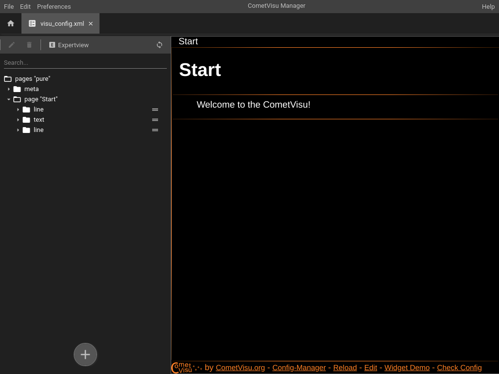
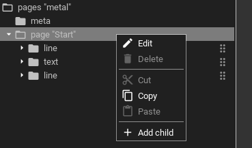

.. _editor:

Graphical editor
================

The graphical editor can be opened at the :ref:`manager <manager>` where as an
alternative also a text based editor can be opened. With the editor you can
modify a configuration without knowing anything of the :ref:`XML syntax <xml-format>`.

Overview
--------

The editor consists out of two areas:

On the left side the structure of the configuration is shown, on the right side a preview is shown.
Above the structure there is a search field that allows a textual search for elements in the structure.
Above that there is a tab-bar that provides a quick-access to some functions:

The options of the tab-bar are:

Edit
  Opens the edit dialog for the attributes of the selected element. If the buttons is greyed-out there is either
  currently no element selected or the selected element is not editable.

Delete
  Deletes the selected element. If the button is greyed-out there is either no element selected or
  the selected element must not be deleted.

Expertview
  Shows additional attributes in the element edit dialog.

Refresh
  Reloads the preview (the preview is not reloaded automatically after a change has been made, that has
  to be done manually)

Operation
---------

You can expand an element by double-clicking on or. Additional functions are available by an context menu,
that can be opened by right-clicking on an element or be long-pressing on it (e.g. when there is no possibility
to right-click, e.g. on a touch screen)

A context menu will appear with options for:

Edit
  Opens the edit dialog for the attributes ob the element (if there are editable attributes available).

Delete
  Delete the element.

Cut
  Cut out the element.

Copy
  Copy the element.

Paste
  Paste the cut or copied element.

Add child
  Add a new child element to the currently selected element.

Elements can also be moved around via drag & drop. The icon with the two parallel lines on the right of each element
indicates that this element can be moved. If that icon is missing that element is not allowed to be moved.
Adding a new element is also possible by starting a drag on the + button at the bottom and dropping it on the target
position.