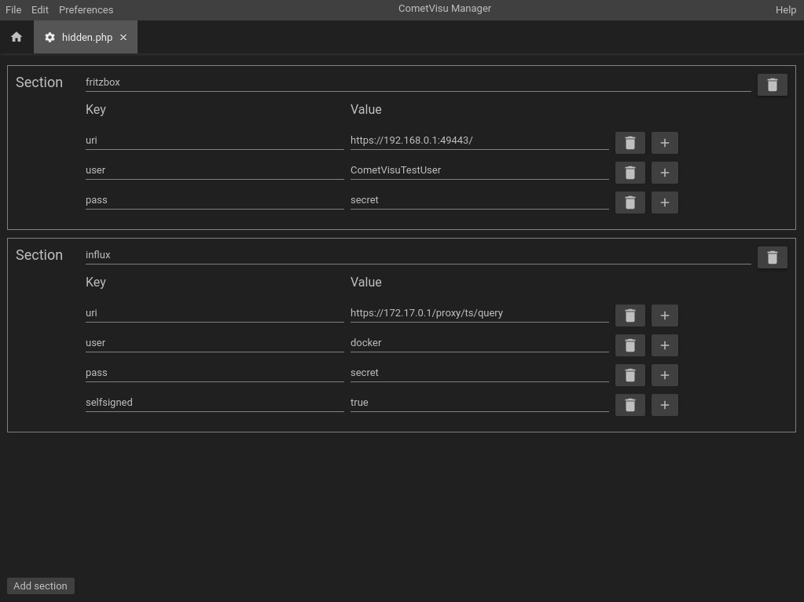

.. _hidden-config:

Hidden configurations
=====================

Background
-----------

The Hidden Configurations are configuration data that is not transferred to
the client and stays on the server. Therefore, these are "hidden" from the
user, but are readable on the server itself in plain text.
Even in the manager, this information is readable in plain text.

This does not create a secure environment for itself. However, this can
create a secure environment in which the web server must be configured so
that the user does not gain access to the manager.

.. IMPORTANT::

    If a :ref:`Error Log <reporting>` is passed to the developers in the
    support, the content of the hidden configuration is not included and
    thus remain hidden from the developers.

If and in what form widgets and plugins require information from the
hidden configuration is described in their respective documentation.

Construction
------------

The hidden configurations are stored in the file ``config/hidden.php``.
This file can be edited via a normal text editor as well as via the
:ref:`Manager <manager>`.

The content consists of several entries containing a *name* with several
*key* and *value* pairs. In the file itself, this information is
stored as a PHP array:

.. literalinclude:: ../../../../source/resource/config/hidden.php
   :language: php

Manager
-------

Conveniently, the content of the hidden configuration can
be edited via the :ref:`Manager <manager>`.

Known ``Name`` Entries
----------------------

Even if the choice for the ``name`` is basically free, there are
usual entries for it, which are recommended to be used. Thus, some
widgets or plug-ins without an explicit configuration can look in the usual
name for entries, which can reduce the configuration effort.

=================  ====================================================================  =======
Name               Verwendung                                                            Default
=================  ====================================================================  =======
fritzbox           :ref:`tr064`
influx             :ref:`diagram`                                                        X
proxy.whitelist    :ref:`Image component of the tile-structure <tile-component-image>`
=================  ====================================================================  =======
