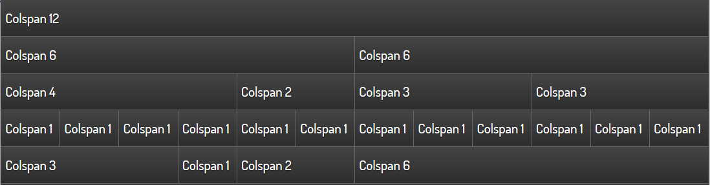
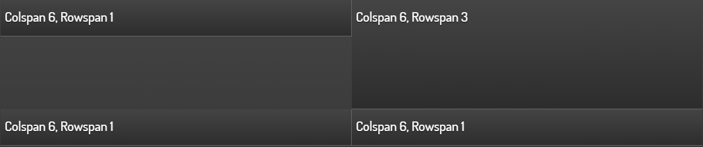

.. _layout:

====================================
Functions for controlling the layout
====================================

.. TODO::

    * Distinction between standard construction vs. 2D pages

Each page element (= page of the visualization) is basically
divided into 12 columns. This also applies when using a navbar
on the left or right side. In this case, the page element
occupies a narrower area on the screen, but still has 12 columns.

The most important element for influencing the overall layout
is the `` layout`` child element, which is available in all
visible widgets. In the following example, the line widget
lists all the attributes that are explained in more detail
in the following sections:

.. elements-information:: line

The attribute colspan
---------------------

Colspan determines how many columns the widget should occupy
on a large display. The default value is ``colspan="6"``,
if not specified. This sets the widget width to half the page size.
Thus, two widgets fit next to each other, only then is the next row
started with the next widget.

The Colspan attribute may also contain non-integer information, but
it should be noted (for visual reasons) that the sum of the colspan
definitions per row returns 12.

   Simple text widgets with different colspan values

The special case ``colpan="0"`` creates a widget with the minimum
width of the content.

For each widget, ``colspan-m`` or ``colspan-s`` can also be used to
specify a widget width for smaller displays. This is necessary because
in practice the font size and the size of the control surfaces
(e.g. button size) scale differently than the actual display size.

Furthermore, ``colspan-m`` and ``colspan-s`` can also affect the layout
in portrait format, if the same config is used on several devices
or if the display should be rearranged on a device when the
screen is rotated.

.. IMPORTANT::

    Whether a display is recognized as normal, medium or small
    depends not on the physical resolution of the display, but on
    the viewport size, which is defined for each device based
    on the display size (screen size). An overview
    provides eg.`<viewportsizes.com>`__

An example is shown below in which the widgets are arranged
differently on 3 display sizes.

.. code-block:: xml

    <text>
        <layout colspan="3" colspan-m="6" colspan-s="12" rowspan="1"/>
        <label>Colspan 3/6/12, Rowspan 1</label>
    </text>
    <text>
        <layout colspan="3" colspan-m="6" colspan-s="12" rowspan="1"/>
        <label>Colspan 3/6/12, Rowspan 1</label>
    </text>
    <text>
        <layout colspan="3" colspan-m="6" colspan-s="12" rowspan="1"/>
        <label>Colspan 3/6/12, Rowspan 1</label>
    </text>
    <text>
        <layout colspan="3" colspan-m="6" colspan-s="12" rowspan="1"/>
        <label>Colspan 3/6/12, Rowspan 1</label>
    </text>

.. figure:: _static/Layout_colspan_screensize_large.png

   Representation at a resolution of 1100x640

.. figure:: _static/Layout_colspan_screensize_medium_640x400.png

   Representation at a resolution of 640x400 (Smartphone in landscape mode)

.. figure:: _static/Layout_colspan_screensize_small_400x640.png

   Representation at a resolution of 400x640 (Smartphone in portrait mode)

The attribute rowspan
---------------------

``Rowspan`` determines the number of lines a widget occupies. Currently
only integer statements are allowed for ``rowspan``. Most widgets
do not require ``rowspan`` because the default value ``rowspan="1"``
is sufficient.

Necessary or meaningful may be the specification for the following widgets:

-  Image
-  Web
-  Rsslog- and Rss-plugin
-  Diagram-plugin
-  Group

In the example below, the ``rowspan="5"`` forces the image widget
to be the same as the five individual widgets on the left.

.. figure:: _static/Layout_rowspan_mitImage.png

   Image-Widget with rowspan="5"

Because the widget arrangement is one after the other in rows,
using different values for ``rowspan`` can create empty areas.

   Empty areas in interaction with the rowspan element

In such cases, the use of the Group widget in conjunction with
the nowidget attribute can be remedied.

   Control of the arrangement with an invisible group(Attribut ``nowidget="true"``)

Below the xml code for the screenshot with the correct arrangement.

.. code-block:: xml

    <group nowidget="true">
        <layout colspan="6"/>
        <text>
            <layout colspan="6" rowspan="1"/>
            <label>Colspan 6, Rowspan 1</label>
        </text>
        <text>
            <layout colspan="6" rowspan="1"/>
            <label>Colspan 6, Rowspan 1</label>
        </text>
        <text>
            <layout colspan="6" rowspan="1"/>
            <label>Colspan 6, Rowspan 1</label>
        </text>
    </group>
    <text>
        <layout colspan="6" rowspan="3"/>
        <label>Colspan 6, Rowspan 3</label>
    </text>

