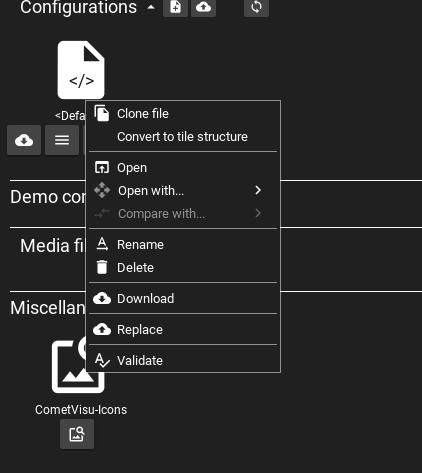
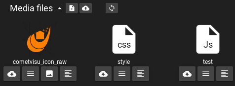

.. _manager:

The CometVisu Manager
=====================

The manager uses a simple graphical interface to manage (create,
edit, replace, delete) various configuration files.
In addition you can manage the :ref:`hidden configurations <hidden-config>`
as well as media files (for example backdrops).

.. hint::
    The manager can be opened by pressing the keys "Ctrl+M" together in a running CometVisu
    or by adding the url parameter ``manager=1`` to the CometVisu URL.

.. figure:: _static/manager.png

The available functions are accessible via menus, toolbars or buttons. The main page of the manager
is composed of the following components (from top to bottom):

* Menubar for general functions.
* Tab-bar to show the currently opened files.
* Tab-bar to change the view between a table-based and an preview-based display of the available files.
* A list of configuration files with an own tab-bar for special functions.
* A list of demo configuration files (has to be expanded by clicking on the title).
* A list of media files (if available)
* Special functions, like the hidden-configuration of an overview of all icons.

Available CometVisu Configurations
----------------------------------

Shows all available configurations files, split into the editable "normal" configurations files and
the non-editable demo configurations. Below every configuration there is a list of buttons that provide
a quick access to the most commonly used functions. You can download, view or edit the file with these buttons.
Additional functions are accessible by a contextmenu that can be opened with a click on the right mouse button
or a click on the 2nd button below each file.

Clone file
  Creates a copy of that file with a different name.

Open
  Opens the file in the pre-configured editor (this can be configured in the "Preferences"-menu on the very top)

Open with
  Config files can be opened or edited in 2 different editors.

Compare with
  If available when a configuration file has already been edited. You can compare the current version
  with al older to see what has been changed.

Rename
  Change the filename.

Delete
  Delete the file.

Download
  Download of the configuration so that it can be modified or to get a backup on the
  local machine.

Replace
  Upload of a configuration to replace an existing one.

Check
  Checks the validity of the configuration, i.e. whether the syntax of the
  :ref:`XML file <xml-format>` is valid.

Available media files
---------------------

Your own configuration can be extended by additional files. Typical examples
are backdrop images or custom CSS rules to modify an existing design. Text-based files like
CSS- or Javascript files can be edited directly with the build-in text editor, other files, like images, can be
uploaded, replaced or deleted.

Depending on the type of file there are different options available. Images a shown as thumbnail and can be opened
in a large viewer or downloaded. Special text-based image formats like SVG can be edited in the text editor.

Hidden configuration
--------------------

Some plugins require addition configuration settings that shouldn't be
transmitted to the browser. This is described in more detail at the
:ref:`hidden configuration <hidden-config>` section of the manual.

CometVisu-Icons
---------------

Shows a list of all available icons that can be filtered by the icon name.

.. figure:: _static/manager_icons.png
