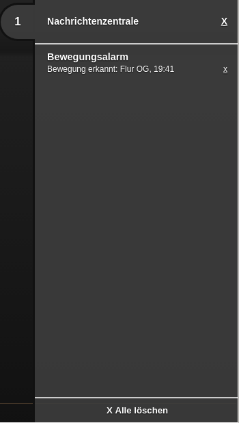

.. _notifications:

Notifications
=============

.. api-doc:: cv.core.notifications.Router

Description
------------

The ``state-notification`` element in the meta-area of the
configuration allows to create notifications when a new value
for a widget is uploaded from the backend. These notifications
can be displayed as a pop-up or as an entry in the
notification center.

As soon as there are messages in the notification center, the
number of messages is displayed at the top right of the browser
window and in the favicon (in the browser tab). If messages of
higher priority are underneath, this is indicated by a colored
background.

.. code-block:: xml
    :caption: A simple example shows a message in the message center when the living room lamp is on
        
     <meta>
        <notifications>
            <state-notification target="notificationCenter" unique="true">
                <title-template>Light Livingroom</title-template>
                <message-template>switched on at {{ time }} o'Clock</message-template>
                <condition>1</condition>
                <addresses>
                    <address transform="OH:switch">Light_FF_Living</address>
                </addresses>
            </state-notification>
        </notifications>
        ...
    </meta>

.. HINT::

    The ``<address>`` elements used here are exactly the same, as they are used in the widgets.
    In the examples on this page addresses for the openHAB backend are used. An equivalent example for the default
    backend would be: ``<address transform="DPT:1.001">12/0/3</address>``

**Explanation:**

Via the ``address`` element (several are possible) it is specified
that a message is generated for incoming status updates for this
address. A message consists of a title and the message content. The two
elements ``title-template`` and ``message-template`` determine the
content of the two message parts. The templates are
`mustache <'https://github.com/janl/mustache.js>`__ templates, where
specific placeholders can be placed anywhere in the text. The following
placeholders are available:

=========== =================================================
Name        Content
=========== =================================================
``address`` Address from which the status update came
``value``   Value of the status update
``date``    Date of receipt
``time``    Time of receipt
=========== =================================================

The example would generate the following message:

.. code-block:: text

    Light Livingroom
    switched on at 12.45 o'Clock

Via ``target="notificationCenter"`` it is determined that this
notification will be displayed in the message center at the left
edge of the visu. Another possible value would be ``popup`` to
display the message as a popup.

``unique="true"`` specifies that the message will be displayed only
once, and only if the value of the status update equals ``<condition>``
set ``ON``, it means the message is displayed when the lamp is
turned on, when it is turned off, the message is automatically deleted.

Explanation of the attributes in the state-notification element
^^^^^^^^^^^^^^^^^^^^^^^^^^^^^^^^^^^^^^^^^^^^^^^^^^^^^^^^^^^^^^^

.. parameter-information:: state-notification

Further examples
----------------

Complex example with mapping
^^^^^^^^^^^^^^^^^^^^^^^^^^^^

.. code-block:: xml
    :caption: Complex example with notifications for movements incl. Mapping

    <meta>
        <mappings>
            <mapping name="Motion_name">
                <entry value="Motion_FF_Corridor">Floor OG</entry>
                <entry value="Motion_FF_Kitchen">Kitchen</entry>
                <entry value="Motion_FF_Dining">Dining room</entry>
            </mapping>
            ...
        </mappings>
        ...
        <notifications>
            <state-notification name="motion" target="notificationCenter" unique="true" severity="high">
                <title-template>motion alarm</title-template>
                <message-template>motion detected: {{ address }}, {{ time }}</message-template>
                <condition>1</condition>
                <addresses address-mapping="Motion_name">
                    <address transform="OH:switch">Motion_FF_Dining</address>
                    <address transform="OH:switch">Motion_FF_Corridor</address>
                    <address transform="OH:switch">Motion_FF_Kitchen</address>
                </addresses>
            </state-notification>
        </notifications>
    </meta>

This example shows a notification when one of the motion detectors
provides a movement with high priority (``severity="high"``,
turns orange).

To bring the somewhat cryptic address name into a readable
format, a :ref:`Mapping <mapping>` is used. If the motion
detector named *Motion_FF_Corridor* now signals a movement,
the message would have the following content:

    Example of a message in the message center

Speech 
^^^^^^

.. code-block:: xml
    :caption: Output of the message via the text-to-speech engine of the browser

        <meta>
            <mappings>
                <mapping name="Motion_name">
                    <entry value="Motion_FF_Corridor">Floor OG</entry>
                    <entry value="Motion_FF_Kitchen">Kitchen</entry>
                    <entry value="Motion_FF_Dining">Dining room</entry>
                </mapping>
                ...
            </mappings>
            ...
            <notifications>
                <state-notification name="motion" target="speech">
                    <message-template>Motion at {{ address }}</message-template>
                    <condition>1</condition>
                    <addresses address-mapping="Motion_name">
                        <address transform="OH:switch">Motion_FF_Dining</address>
                        <address transform="OH:switch">Motion_FF_Corridor</address>
                        <address transform="OH:switch">Motion_FF_Kitchen</address>
                    </addresses>
                </state-notification>
            </notifications>
        </meta>

This example generates speech output via the text-to-speech engine
built into modern browsers. In this case, if one of the motion
detectors identified by the three ``address`` entries returns ``ON``,
the following message is output.

.. code-block:: text

    Motion at Floor OG
