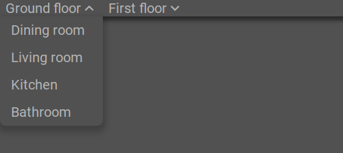

.. _tile-component-menu:

Menu
....

.. api-doc:: cv.ui.structure.tile.components.Menu

This component creates a navigation menu from a model. Currently the following models are available:

=============== =======================================
``pages``       :ref:`tile-nav-menu`
``menuItems``   :ref:`tile-item-menu`
=============== =======================================

.. _tile-nav-menu:

Navigation menu from page structure
^^^^^^^^^^^^^^^^^^^^^^^^^^^^^^^^^^^

    Navigation menu from page structure

.. widget-example::

        <settings design="tile" selector="nav">
            <screenshot name="tile-nav-menu-mobile-closed" screen-width="400">
                <caption>Menu on small screens, closed</caption>
            </screenshot>
            <screenshot name="tile-nav-menu-mobile-open" screen-width="400" clickpath="cv-menu > a.menu" waitfor="cv-menu.responsive li">
                <caption>Menu on small screens, opened</caption>
            </screenshot>
        </settings>
        <header>
            <nav>
                <cv-menu model="pages"/>
            </nav>
        </header>
        <main>
            <cv-page id="eg" name="Ground floor">
                <cv-page id="ez" name="Dining room" />
                <cv-page id="wz" name="Living room" />
                <cv-page id="ku" name="Kitchen" />
                <cv-page id="bad" name="Bathroom" />
            </cv-page>
             <cv-page id="og" name="First floor">
                <cv-page id="sz" name="Bedroom" />
                <cv-page id="kz1" name="Child 1" />
                <cv-page id="kz2" name="Child 2" />
                <cv-page id="badOg" name="Bathroom" />
            </cv-page>
        </main>

There are different ways to display the menu, controlled by the ``appearance`` attribute.
The possible values are

======================  =======================
Type of representation  Explanation
======================  =======================
text                    Default, focus is on the page name, the icon is displayed next to the name in the same size.
icons                   Focus is on the icon, large icon and smaller page name below. Requires an icon for each page on the top navigation level.
dock                    Only possible in the `<footer>`, appearance like "icons" but the menu is displayed in the center above the page content.
======================  =======================

.. widget-example::

      <settings design="tile" selector="nav">
            <screenshot name="tile-nav-menu-icons" clickpath="cv-menu > ul > li:first-child > .details" waitfor="cv-menu > ul > li:first-child > .details > ul" margin="0 -800 200 0">
                <caption>Icons</caption>
            </screenshot>
        </settings>
        <header>
            <nav>
                <cv-menu model="pages" appearance="icons"/>
            </nav>
        </header>
        <main>
            <cv-page id="eg" name="Ground floor" icon="knxuf-control_building_modern02_okg_eg">
                <cv-page id="ez" name="Dining room" />
                <cv-page id="wz" name="Living room" />
                <cv-page id="ku" name="Kitchen" />
                <cv-page id="bad" name="Bathroom" />
            </cv-page>
             <cv-page id="og" name="First floor" icon="knxuf-control_building_modern02_okg_og">
                <cv-page id="sz" name="Bedroom" />
                <cv-page id="kz1" name="Child 1" />
                <cv-page id="kz2" name="Child 2" />
                <cv-page id="badOg" name="Bathroom" />
            </cv-page>
        </main>

.. widget-example::

      <settings design="tile" selector="nav">
            <screenshot name="tile-nav-menu-dock" selector="cv-menu" waitfor="cv-menu > ul > li:first-child > a > i" margin="10 10 10 10">
                <caption>Dock in footer</caption>
            </screenshot>
        </settings>
        <main>
            <cv-page id="eg" name="Ground floor" icon="knxuf-control_building_modern02_okg_eg">
                <cv-page id="ez" name="Dining room" />
                <cv-page id="wz" name="Living room" />
                <cv-page id="ku" name="Kitchen" />
                <cv-page id="bad" name="Bathroom" />
            </cv-page>
             <cv-page id="og" name="First floor" icon="knxuf-control_building_modern02_okg_og">
                <cv-page id="sz" name="Bedroom" />
                <cv-page id="kz1" name="Child 1" />
                <cv-page id="kz2" name="Child 2" />
                <cv-page id="badOg" name="Bathroom" />
            </cv-page>
        </main>
        <footer>
            <nav>
                <cv-menu model="pages" appearance="dock"/>
            </nav>
        </footer>

.. _tile-item-menu:

Menu from single menu items
^^^^^^^^^^^^^^^^^^^^^^^^^^^

The following example adds a menu with two items to a tile. This provides the possibility to add additional settings to a tile.
The first menu entry opens a popup (which is not further defined in this example), the second acts as a switch.

.. widget-example::

        <settings design="tile">
            <screenshot name="tile-context-menu-closed" selector="cv-widget">
                <caption>Tile with menu button</caption>
            </screenshot>
            <screenshot name="tile-context-menu-open" selector="cv-widget" margin="0 50 0 0" clickpath="cv-menu" waitfor="cv-menu.open > ul.context-menu">
                <caption>Menu opened</caption>
            </screenshot>
        </settings>
        <cv-widget>
            <cv-tile>
                <cv-menu model="menuItems">
                    <cv-menu-item name="Favorites" action="popup" icon="ri-star-line">
                        <cv-popup title="Favorites" modal="true"></cv-popup>
                    </cv-menu-item>
                    <cv-menu-item name="Mute" action="toggleState" icon="ri-volume-mute-line">
                        <cv-address transform="DPT:1.001" mode="readwrite">1/4/0</cv-address>
                    </cv-menu-item>
                </cv-menu>
            </cv-tile>
        </cv-widget>

Allowed attributes
^^^^^^^^^^^^^^^^^^

.. parameter-information:: cv-menu tile

Allowed child elements and their attributes
^^^^^^^^^^^^^^^^^^^^^^^^^^^^^^^^^^^^^^^^^^^

.. elements-information:: cv-menu tile
