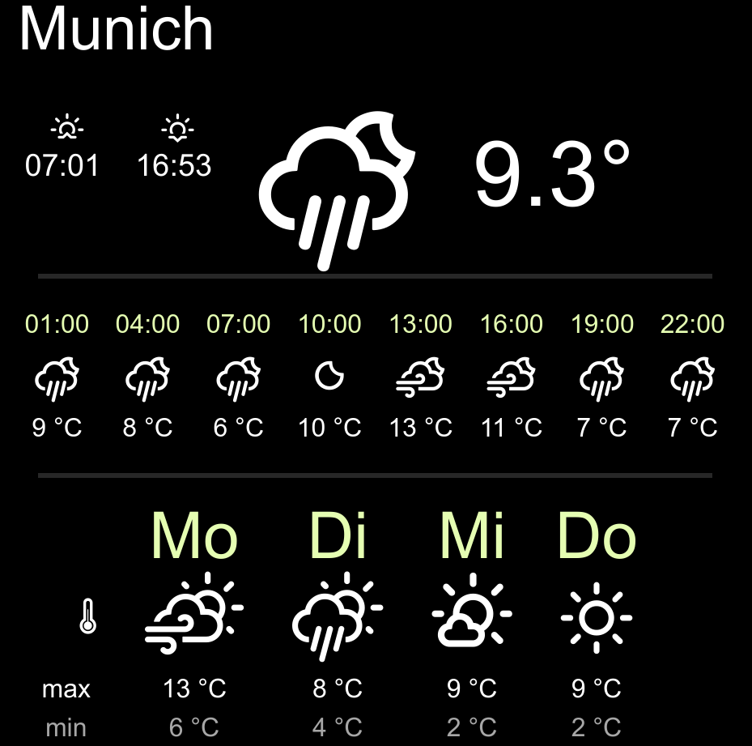

.. _openweathermap:

The openweathermap plugin
=========================

.. api-doc:: OpenweatherMap

Description
-----------

.. ###START-WIDGET-DESCRIPTION### Please do not change the following content. Changes will be overwritten

This plugins integrates OpenWeatherMap data.

.. ###END-WIDGET-DESCRIPTION###

Settings
--------

For a general understanding of how the configuration files are structured and what elements and attributes are
it is recommended to read this section first: :ref:`visu-config-details`.

The behaviour and appearance of the openweathermap plugins can be influenced by using certain attributes and elements.
The following tables show the allowed attributes and elements and their possible values.
The screenshots show, how both can be edited in the :ref:`editor <editor>`.

Attributes underlined by ..... are mandatory, all the others are optional and be omitted.

Allowed attributes in the openweathermap-element
^^^^^^^^^^^^^^^^^^^^^^^^^^^^^^^^^^^^^^^^^^^^^^^^^^^

.. parameter-information:: openweathermap

.. IMPORTANT::
    The value of the attribute `appid` has to be replaced by your own key!

The OpenweatherMap uses the web service of https://openweathermap.org/ to fetch
the current weather date and forecast. To be able to access this data you need
a key that can be obtained free of charge at the homepage and which must be
inserted at the `appid` attribute.

Allowed child-elements and their attributes
^^^^^^^^^^^^^^^^^^^^^^^^^^^^^^^^^^^^^^^^^^^

None.

Examples
--------

It is possible to manually edit the :ref:`visu_config.xml <xml-format>` and add an entry
for the openweathermap plugin.

.. CAUTION::
    Make sure that you only use UTF-8 encoded characters by settings the encoding in your
    XML-editor to UTF-8 mode!

.. IMPORTANT::
    The value of the attribute `appid` has to be replaced by your own key!

This minimal example code will create this screen shot:

.. code-block:: xml

    <meta>
        <plugins>
            <plugin name="openweathermap" />
        </plugins>
    </meta>
    ...
    <openweathermap q="Munich" appid="..." />

.. ###START-WIDGET-EXAMPLES### Please do not change the following content. Changes will be overwritten

.. ###END-WIDGET-EXAMPLES###
