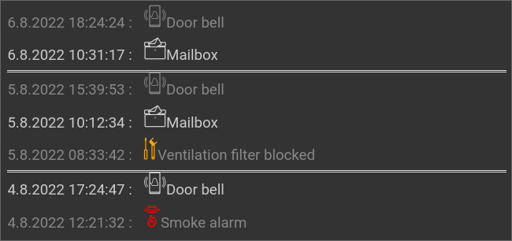

.. _rsslog:

The RSSLog plugin
=================

.. api-doc:: cv.plugins.RssLog

.. spelling:word-list::

    Ausgang
    Eingang
    formated
    inbetween
    itemack
    mysql
    Selektor
    sqlite
    todo

Description
-----------

The RSSLog plugin adds interactive log messages to the visu page which are
based on the RSS feed technology.

These log messaged can be used for both, a static event log (e.g. when the
door bell was ringed or when a fault happened in the installation), as well
as an interactive one. There the entries can be confirmed by the user as it
is relevant for a todo list.

A click on the log list opens a popup screen. In this screen you can see
more entries and it is possible - for the interactive version - to confirm
entries.

Settings
--------

For a general understanding of how the configuration files are structured and what elements and attributes are
it is recommended to read this section first: :ref:`visu-config-details`.

The behaviour and appearance of the RSSLog plugin can be influenced by using certain attributes and elements.
The following tables show the allowed attributes and elements and their possible values.
The screenshots show, how both can be edited in the :ref:`editor <editor>`.

Attributes underlined by ..... are mandatory, all the others are optional and be omitted.

Allowed attributes in the rsslog-element
^^^^^^^^^^^^^^^^^^^^^^^^^^^^^^^^^^^^^^^^

.. parameter-information:: rsslog

.. widget-example::
    :editor: attributes
    :scale: 75
    :align: center

    <settings>
      <fixtures>
        <fixture source-file="doc/manual/en/config/widgets/plugins/rsslog/_static/fixtures/rsslog_simple.json" target-path="resource/plugins/rsslog/rsslog.php?limit=6&amp;j=1" mime-type="application/json"/>
      </fixtures>
    </settings>
    <caption>Attributes in the editor (simple view) [#f1]_</caption>
    <meta>
      <plugins>
        <plugin name="rsslog" />
      </plugins>
    </meta>
    <rsslog src="plugins/rsslog/rsslog.php" refresh="300" limit="6" mode="last">
      <layout rowspan="6" colspan="6"/>
      <address transform="DPT:1.001" mode="readwrite">12/7/1</address>
    </rsslog>

Allowed child-elements and their attributes
^^^^^^^^^^^^^^^^^^^^^^^^^^^^^^^^^^^^^^^^^^^

.. elements-information:: rsslog

.. widget-example::
    :editor: elements
    :scale: 75
    :align: center

    <settings>
      <fixtures>
        <fixture source-file="doc/manual/en/config/widgets/plugins/rsslog/_static/fixtures/rsslog_simple.json" target-path="resource/plugins/rsslog/rsslog.php?limit=6&amp;j=1" mime-type="application/json"/>
      </fixtures>
    </settings>
    <caption>Element in the editor</caption>
    <meta>
        <plugins>
            <plugin name="rsslog" />
        </plugins>
    </meta>
    <rsslog src="plugins/rsslog/rsslog.php" refresh="300" limit="6" mode="last">
        <layout rowspan="6" colspan="6"/>
        <address transform="DPT:1.001" mode="readwrite">12/7/1</address>
    </rsslog>

.. note::

    Generally there is no technical possibility that a server of a RSS feed
    tells the client to update it due to new content. I.e. the client has
    no information about when it is time to update the content. The RSSLog
    reloads the content based on the ``refresh`` attribute, but any new
    data written to the database inbetween will not be shown till the next
    refresh.

    But when the optional ``<address>`` element is given the RSSLog plugin
    will reload the data as soon as any value is written to that address.
    The attribute ``delay`` defines a delay before the data is fetched to
    be able to compensate possible any time that the logic engine needs to
    store it first.

XML Syntax
----------

Alternatively it is possible to manually add the rsslog plugin entry to the
:ref:`visu_config.xml <xml-format>`.

.. CAUTION::
    In the config only the UTF-8 charset is allowed. So an editor that is
    set to UTF-8 mode must be used.

Simple example: static list
^^^^^^^^^^^^^^^^^^^^^^^^^^^

The entries of this example can be created by these URLs:

.. code::

    http://server/resource/plugins/rsslog/rsslog.php?&c=Door%20bell
    http://server/resource/plugins/rsslog/rsslog.php?&c=Mailbox
    http://server/resource/plugins/rsslog/rsslog.php?&c=Ventilation%20filter%20blocked
    http://server/resource/plugins/rsslog/rsslog.php?&c=Smoke%20alarm

.. widget-example::

    <settings>
        <fixtures>
            <fixture source-file="doc/manual/en/config/widgets/plugins/rsslog/_static/fixtures/rsslog_simple.json" target-path="resource/plugins/rsslog/rsslog.php?limit=6&amp;j=1" mime-type="application/json" />
        </fixtures>
        <screenshot name="rsslog_simple">
            <caption>RSSLog, simple example</caption>
        </screenshot>
    </settings>
    <meta>
        <plugins>
            <plugin name="rsslog" />
        </plugins>
    </meta>
    <rsslog src="plugins/rsslog/rsslog.php" refresh="300" limit="6" mode="last">
        <layout rowspan="6" colspan="6"/>
        <address transform="DPT:1.001" mode="readwrite">12/7/1</address>
    </rsslog>

Simple example: static list with mapping
^^^^^^^^^^^^^^^^^^^^^^^^^^^^^^^^^^^^^^^^

The entries of this example can be created by these URLs:

.. code::

    http://server/resource/plugins/rsslog/rsslog.php?&c=Door%20bell&mapping=StateDoorBell
    http://server/resource/plugins/rsslog/rsslog.php?&c=Mailbox&mapping=StateMail
    http://server/resource/plugins/rsslog/rsslog.php?&c=Ventilation%20filter%20blocked&mapping=StateService
    http://server/resource/plugins/rsslog/rsslog.php?&c=Smoke%20alarm&mapping=StateSmokedetector

.. widget-example::

    <settings>
        <fixtures>
            <fixture source-file="doc/manual/en/config/widgets/plugins/rsslog/_static/fixtures/rsslog_simple_mapping.json" target-path="resource/plugins/rsslog/rsslog.php?limit=7&amp;j=1" mime-type="application/json" />
        </fixtures>
        <screenshot name="rsslog_simple_mapping">
            <caption>RSSLog, simple example with mapping</caption>
        </screenshot>
    </settings>
    <meta>
        <plugins>
            <plugin name="rsslog" />
        </plugins>
        <mappings>
            <mapping name="StateMail">
                <entry value="0"><icon name="message_postbox_mail"/> </entry>
            </mapping>
            <mapping name="StateDoorBell">
                <entry value="0"><icon name="message_bell_door"/> </entry>
            </mapping>
            <mapping name="StateService">
                <entry value="0"><icon name="message_service" color="#FFA500"/> </entry>
            </mapping>
            <mapping name="StateSmokedetector">
                <entry value="0"><icon name="secur_smoke_detector" color="#FF0000"/> </entry>
            </mapping>
        </mappings>
    </meta>
    <rsslog src="plugins/rsslog/rsslog.php" refresh="300" limit="7" mode="last">
        <layout rowspan="6" colspan="6"/>
        <address transform="DPT:1.001" mode="readwrite">12/7/1</address>
    </rsslog>

Simple example: interactive list
^^^^^^^^^^^^^^^^^^^^^^^^^^^^^^^^

The entries of this example can be created by these URLs:

.. code::

    http://server/resource/plugins/rsslog/rsslog.php?&c=Change%20fish%20tank%201%20water&t[]=fish&mapping=StateConfirm&state=0
    http://server/resource/plugins/rsslog/rsslog.php?&c=Change%20fish%20tank%202%20water&t[]=fish&mapping=StateConfirm&state=0
    http://server/resource/plugins/rsslog/rsslog.php?&c=Replace%20ventilation%20filter&t[]=ventilation&mapping=StateConfirm&state=0

.. widget-example::

    <settings>
        <fixtures>
            <fixture source-file="doc/manual/en/config/widgets/plugins/rsslog/_static/fixtures/rsslog_interactive.json" target-path="resource/plugins/rsslog/rsslog.php?limit=6&amp;j=1" mime-type="application/json"/>
        </fixtures>
        <screenshot name="rsslog_interactive">
            <caption>RSSLog, interactive list</caption>
        </screenshot>
    </settings>
    <meta>
        <plugins>
            <plugin name="rsslog" />
        </plugins>
        <mappings>
            <mapping name="StateConfirm">
                <entry value="0"><icon name="info_warning" color="#EE0000"/> </entry>
                <entry value="1"><icon name="info_ack" color="#00AA00"/> </entry>
            </mapping>
        </mappings>
    </meta>
    <rsslog src="plugins/rsslog/rsslog.php" refresh="300" limit="6" mode="last">
        <layout rowspan="6" colspan="6"/>
        <address transform="DPT:1.001" mode="readwrite">12/7/1</address>
    </rsslog>

Complex example with multiple categories
^^^^^^^^^^^^^^^^^^^^^^^^^^^^^^^^^^^^^^^^

Using tags it is possible have multiple categories. In the display each tag
will be added to the HTML ``class`` attribute so that it can be formatted
by CSS rules. This example uses this feature for the colors of the different
garbage bin colors.

The entries of this example can be created by these URLs:

.. code::

    http://server/resource/plugins/rsslog/rsslog.php?&c=Put%20out%20the%20bio%20garbage%20bin&t[]=brown&mapping=StateConfirmGarbage&state=0
    http://server/resource/plugins/rsslog/rsslog.php?&c=Put%20out%20the%20yellow%20garbage%20bin&t[]=yellow&mapping=StateConfirmGarbage&state=0
    http://server/resource/plugins/rsslog/rsslog.php?&c=Put%20out%20the%20paper%20garbage%20bin&t[]=blue&mapping=StateConfirmGarbage&state=0
    http://server/resource/plugins/rsslog/rsslog.php?&c=Refuel&t[]=car&mapping=StateConfirmFuel&state=0

The two oldest entries were already confirmed by the user.

.. widget-example::

    <settings>
        <fixtures>
            <fixture source-file="doc/manual/en/config/widgets/plugins/rsslog/_static/fixtures/rsslog_complex.json" target-path="resource/plugins/rsslog/rsslog.php?limit=6&amp;j=1" mime-type="application/json"/>
        </fixtures>
        <screenshot name="rsslog_complex">
            <caption>RSSLog, complex example</caption>
        </screenshot>
    </settings>
    <meta>
        <plugins>
            <plugin name="rsslog" />
        </plugins>
        <mappings>
            <mapping name="StateConfirmGarbage">
                <entry value="0"><icon name="message_garbage_collection"/> </entry>
                <entry value="1"><icon name="info_ack" color="#00AA00"/> </entry>
            </mapping>
            <mapping name="StateConfirmFuel">
                <entry value="0"><icon name="scene_gas_station" color="#FF0000"/> </entry>
                <entry value="1"><icon name="scene_gas_station"/> </entry>
            </mapping>
        </mappings>
    </meta>
    <rsslog src="plugins/rsslog/rsslog.php" refresh="300" limit="6" mode="last">
        <layout rowspan="6" colspan="6"/>
        <address transform="DPT:1.001" mode="readwrite">12/7/1</address>
    </rsslog>

External interaction with the data
----------------------------------

The RSSLog plugin of the CometVisu is just for the display of the data of the
database. It must be filled by an external logic engine. For that it is highly
recommended to not access the database directly but use the same HTTP API that
the RSSLog plugin is using.

All calls are simple HTTP GET requests that a logic engine can generate easily.

API documentation
^^^^^^^^^^^^^^^^^

Parameter for all calls:

.. list-table::
    :widths: 20 80
    :header-rows: 1

    *   - Key
        - Value
    *   - ``database``
        - Entry in the :ref:`hidden config <hidden-config>` where
          information about the database connection is stored.

Relevant entries in the hidden config are:

.. list-table::
    :widths: 20 80
    :header-rows: 1

    *   - Key
        - Value
    *   - ``type``
        - Database type: ``sqlite`` or ``mysql``.
    *   - ``file``
        - For sqlite: file (including path) for the database.
    *   - ``host``
        - For mysql: host of the database.
    *   - ``port``
        - For mysql, optional: port of the database.
    *   - ``user``
        - For mysql: user name to log in to the database.
    *   - ``pass``
        - For mysql: password to log in to the database.
    *   - ``db``
        - For mysql: name of the database.
    *   - ``logs``
        - Optional: name of the ``Logs`` table.
    *   - ``version``
        - Optional: name of the ``Version`` table.

New entry
.........

.. list-table::
    :widths: 20 80
    :header-rows: 1

    *   - Key
        - Value
    *   - ``c``
        - Content
    *   - ``h``
        - Optional: a header or title for the entry. This is only relevant
          for the RSS feed, but not for the RSSLog plugin.
    *   - ``t[]``
        - Optional: tag to filter.

          It is possible to pass multiple tags when they are separated by
          a comma (e.g. ``t[]=tag1,tag2``).

          The values of the tags are added to the HTML ``class`` attribute of
          the value defined in the ``mapping``, so that it can be formated
          by custom CSS rules.
    *   - ``state``
        - Optional: status of the entry (``0`` or ``1``).

          This status can be changed interactively by a click on the entry.
    *   - ``mapping``
        - Optional: Selection of the mapping for the display. This must be
          defined in the ``<meta>`` section of the configuration and can be
          used to show an icon at the entry. This mapping is also using the
          state of the entry.

Example: ``rsslog.php?c=Fish&t[]=blue,yellow``

.. note::

    New entries are usually generated by the logic engine by a request of this
    URL. Examples are shown below.

    It is also possible to allow the user of the CometVisu to create manually
    a new entry. For that the :doc:`URL trigger <../../urltrigger/index>`
    can be used with a URL following this schema.

Return log as RSS feed
......................

.. list-table::
    :widths: 20 80
    :header-rows: 1

    *   - Key
        - Value
    *   - ``f``
        - Optional: filter; return only entries fitting for this filter
    *   - ``state``
        - Optional: return only entries with this state
    *   - ``limit``
        - Optional: number of entries to return
    *   - ``showmeta``
        - Optional: when ``true`` the the title will be extended with meta
          information

Example: ``rsslog.php?f=yellow&state=0&limit=5``

Show log on a HTML page
.......................

.. list-table::
    :widths: 20 80
    :header-rows: 1

    *   - Key
        - Value
    *   - ``dump``
        - (no value)

Example: ``rsslog.php?dump``

Delete old entries
..................

.. list-table::
    :widths: 20 80
    :header-rows: 1

    *   - Key
        - Value
    *   - ``r``
        - UNIX timestamp (seconds since 1.1.1970) of the oldest entry to keep
    *   - ``f``
        - Optional: filter; only entries fitting this filter will be deleted

Example: ``rsslog.php?r=213&f=yellow``

.. note::

    To prevent the database growing too big old entries should be regularly
    deleted.

    For that this URL can be called on a schedule like by a CRON job. E.g. to
    delete all entries older than a year this terminal command could be used:

    .. code::

        wget http://server/resource/plugins/rsslog/rsslog.php?r=`date +%s -d "1 year ago"`

    Manually the most simple way is to use the :ref:`info page <info-page>`.

Delete one entry
................

.. list-table::
    :widths: 20 80
    :header-rows: 1

    *   - Key
        - Value
    *   - ``d``
        - ID of the entry

Example: ``rsslog.php?d=123``

Return content in JSON format
.............................

.. list-table::
    :widths: 20 80
    :header-rows: 1

    *   - Key
        - Value
    *   - ``j``
        - (no value)

Example: ``rsslog.php?j``

Update the status
.................

.. list-table::
    :widths: 20 80
    :header-rows: 1

    *   - Key
        - Value
    *   - ``u``
        - ID of the entry
    *   - ``state``
        - New value of the state

Example: ``rsslog.php?u=123&state=1``

.. _info-page:

Show info page
..............

The info page shows information about the configuration and the database like
the number of stored entries. It also shows links to delete older entries.

.. list-table::
    :widths: 20 80
    :header-rows: 1

    *   - Key
        - Value
    *   - ``info``
        - (no value)

Example: ``rsslog.php?info``

Example: API access from the Linux shell
^^^^^^^^^^^^^^^^^^^^^^^^^^^^^^^^^^^^^^^^

The well known tools ``wget`` and ``curl`` can be used to send a HTTP GET
request from the shell.

With these commands it is possible to create a new entry, in this example
with the content ``bell`` and the database defined in the hidden config
entry ``rsslog_db``:

.. code-block:: bash

    wget http://server/resource/plugins/rsslog/rsslog.php?database=rsslog_db&c=bell

Example: API access with Node-RED
^^^^^^^^^^^^^^^^^^^^^^^^^^^^^^^^^

At Node-RED the ``http request`` can be used to create a new entry.

In this example each ring of the door bell shall be used to create a new entry.
For this it is listened on the KNX and when a ``true`` is sent on the right GA
the URL to create a new entry is called:

.. figure:: _static/node-RED_simple.png

    Simple Node-RED flow.

.. figure:: _static/node-RED_simple_config.png

    Configuration of the ``http request`` for the simple Node-RED flow.

It is also possible to define the text for the entry dynamically:

.. figure:: _static/node-RED_dynamic.png

    Node-RED flow with dynamic setting of the RSSLog text.

.. figure:: _static/node-RED_dynamic_config.png

    Configuration of the ``http request`` for the dynamic Node-RED flow.

Example: API access with the Timberwolf server
^^^^^^^^^^^^^^^^^^^^^^^^^^^^^^^^^^^^^^^^^^^^^^

The `Timberwolf server <https://timberwolf.io/>`_ provides a HTTP-API to
be able to send HTTP GET requests and interact with the RSSLog API.

Static API call
...............

Most simple is a mechanism where each KNX message to a GA will create an API
call.

This example assumes that the GA 4/3/200 will send a ``On`` with each door
bell ring. It is also assumed that the CometVisu is accessed by the proxy
and the path ``/visu/``.

First the HTTP-API subsystem must be created:

Then in the "Resource Manager" a new entry must be created by
"Add new HTTP-API Server":

.. figure:: _static/TWS_add_server.png

For this server "Add resource" must be used to create the connection
to the RSSLog api ("Follow HTTP Redirects" must be activated):

.. figure:: _static/TWS_add_ressource.png

The link between the KNX subsystem and the HTTP-API call is done by selecting
"Write to HTTP". The setting for the "Trigger" must be adjusted:

Finalized will this by "Add" in the column "Connections (sources)":

At the end it will look like:

.. figure:: _static/TWS_static_final.png

Dynamic API call
................

The example will be more complex when the door bell sends a "On" for each
ring but all the time a "Off" otherwise so that the data must be filtered first.
In this example also the text should not be hard coded in the URL anymore but
be dynamically passed from the logic.

The HTTP-API must be configured as described for the static call, but the
text for the entry must be replaced by the place holder ``<title>``:

At this dialog the "Selector" must have the same palace holder and "Format"
must be changed to "Text":

.. figure:: _static/TWS_add_dynamic_object.png

At "Objects & Logic" in the "Logic Manager" by "Add Logic" a
"Multiplexer(string)" must be added. The "Eingang 1" must be changed
at "Function: Parameter" and the "Value" must be set to the desired text
of the entry, in this case ``bell``.
At the "Selektor" the "Function: Parameter" must be changed to the value ``0`` .
By ``+`` a "Inhibit" input must be created. This must be connected to the KNX
object of the door bell and the input must be inverted (click on the dotted
circle so that it is displayed filled).
The Inhibit input as well as the "Ausgang" must be set to "A" for "Always"
and the output be connected with the object of the HTTP-API:

.. figure:: _static/TWS_logic.png

.. note::

    The text for the entry will be included in the URL directly, i.e. the
    text must follow the rules of an URL and thus be "escaped". For example
    space characters must be replaced by ``%20``.

.. rubric:: Footnotes

.. [#f1] In the simple view some things might be not visible. The expert view
         will show all entries.
