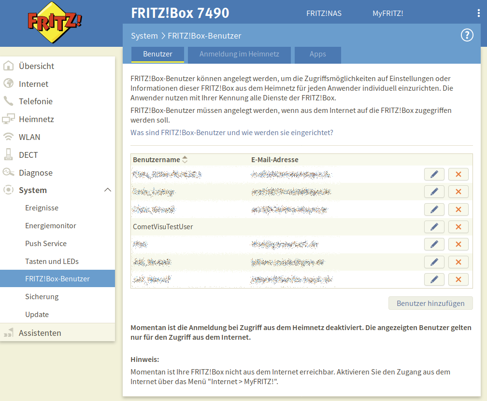

.. _tr064:

The tr064 Plugin
=================

.. api-doc:: tr064/CallList

.. TODO::

    automatic screenshot creation (from dummy data)

Description
-----------

The plugin is an interface to routers that implement the TR-064 protocol, like
the widely used Fritz!Box. The ``calllist`` widget from this plugin displays
a call list that contains the name of the callers (when known to the router)
as well as the records of the answering machine.

.. widget-example::
    :hide-source: true

        <settings>
          <screenshot name="calllist">
          </screenshot>
        </settings>
        <meta>
          <plugins><plugin name="tr064"/></plugins>
        </meta>
        <calllist device="tr064device">
          <layout colspan="6" rowspan="6" />
        </calllist>

Settings
--------

For a general understanding of how the configuration files are structured and what elements and attributes are
it is recommended to read this section first: :ref:`visu-config-details`.

The behaviour and appearance of the powerspectrum plugins can be influenced by using certain attributes and elements.
The following tables show the allowed attributes and elements and their possible values.
The screenshots show, how both can be edited in the :ref:`editor <editor>`.

Attributes underlined by ..... are mandatory, all the others are optional and be omitted.

Allowed attributes in the calllist-element
^^^^^^^^^^^^^^^^^^^^^^^^^^^^^^^^^^^^^^^^^^

.. parameter-information:: calllist

.. widget-example::
    :editor: attributes
    :scale: 75
    :align: center

    <caption>Attributes in the editor (simple view) [#f1]_</caption>
    <meta>
        <plugins>
            <plugin name="tr064" />
        </plugins>
    </meta>
    <calllist device="fritzbox">
        <layout colspan="4" />
    </calllist>

Allowed child-elements and their attributes
^^^^^^^^^^^^^^^^^^^^^^^^^^^^^^^^^^^^^^^^^^^

.. elements-information:: calllist

.. widget-example::
    :editor: elements
    :scale: 75
    :align: center

    <caption>Element in the editor</caption>
    <meta>
        <plugins>
            <plugin name="tr064" />
        </plugins>
    </meta>
    <calllist device="fritzbox">
        <layout colspan="4" />
        <label>TR-064 Calllist</label>
        <address transform="DPT:1.001" mode="read">1/1/0</address>
    </calllist>

XML syntax
----------

Alternatively it is possible to manually add the tr064 plugin entry to the
:ref:`visu_config.xml <xml-format>`.

.. CAUTION::
    In the config only the UTF-8 charset is allowed. So an editor that is
    set to UTF-8 mode must be used.

The minimale example code for the calllist widget to create the shown 
screenshot is:

.. code-block:: xml

    <?xml version="1.0" encoding="UTF-8"?>
    <meta>
        <plugins>
            <plugin name="tr064" />
        </plugins>
    </meta>
    <page name="TR-064" type="text">
        <calllist device="fritzbox">
            <label>calllist</label>
        </calllist>
    </page>
    

.. widget-example::

    <settings>
        <screenshot name="calllist_simple">
            <caption>calllist, einfaches Beispiel</caption>
        </screenshot>
    </settings>
    <meta>
        <plugins>
            <plugin name="tr064" />
        </plugins>
    </meta>
    <calllist device="fritzbox">
        <label>calllist</label>
    </calllist>

Prerequisites / setup of the server
-----------------------------------

To be able to use the plugin the server must support PHP with the extension
of the SoapClient package.

On debian based systems it means that the ``php-soap`` package must be 
installed.

Setup of the Fritz!Box
----------------------

To get access to the call list of the Fritz!Box a user with according permissions
must be created (or an existing user account must be used). This is possible
on the user page:

The user itself needs the rights to access the call list:

.. figure:: _static/fritzbox_user.png

The plugin needs to know the credentials to be able to use this user. This
uses the :ref:`"hidden configuration" <hidden-config>` infrastructure which
can be accessed by the :ref:`CometVisu manager <manager>` [#f2]_.

.. figure:: _static/hidden_config_en.png

The used name must be given in the calllist widget in the attribute ``device``.

The key and value pairs of the hidden configuration" are:

+-----------+-----------------------------------------------------+-------------------------------+
|Key        |Value                                                |Example                        |
+===========+=====================================================+===============================+
|uri        |The URI to access the TR-064 interface               |``https://192.168.0.1:49443/`` |
+-----------+-----------------------------------------------------+-------------------------------+
|user       |The username for the TR-064 access                   |``CometVisuTestUser``          |
+-----------+-----------------------------------------------------+-------------------------------+
|pass       |The password for the TR-64 access                    |``pa3bvNM4j9z4``               |
+-----------+-----------------------------------------------------+-------------------------------+
|selfsigned |Allow self signed certificates when ``true``         |``false``                      |
+-----------+-----------------------------------------------------+-------------------------------+

Apart from the manager it is possible to edit the file ``config/hidden.php``
manually and add a line like::

    <?php
    // File for configurations that shouldn't be shared with the user
    $hidden = array(
      'fritzbox' => array('uri' => 'https://192.168.0.1:49443/', 'user' => 'CometVisuTestUser', 'pass' => 'pa3bvNM4j9z4')
    );
    ?>

.. hint::

    When the connection to the router is secured by SSL (i.e. the URI starts with
    ``https``) it is usual that ``selfsigned`` must be set to ``true`` as a
    router in the home network will work usually with a self signed certificate.

    The error message
    ``{"faultstring":"Could not connect to host","faultcode":"HTTP"}`` can be a
    hint that ``selfsigned`` should be set to ``true``.

.. rubric:: Footnotes

.. [#f1] In the simple view some things might be not visible. The expert view
         will show all entries.

.. [#f2] The "hidden configuration" contains configuration data that is not
         transmitted to the client any stay on the server. So there information
         is "hidden" to the user. On the server it is still readable in clear
         text. This is also true for the manager.
         
         This by itself does not create a secure environment, but it supports
         building one. There at least the manager must be inaccessible to the
         user.
