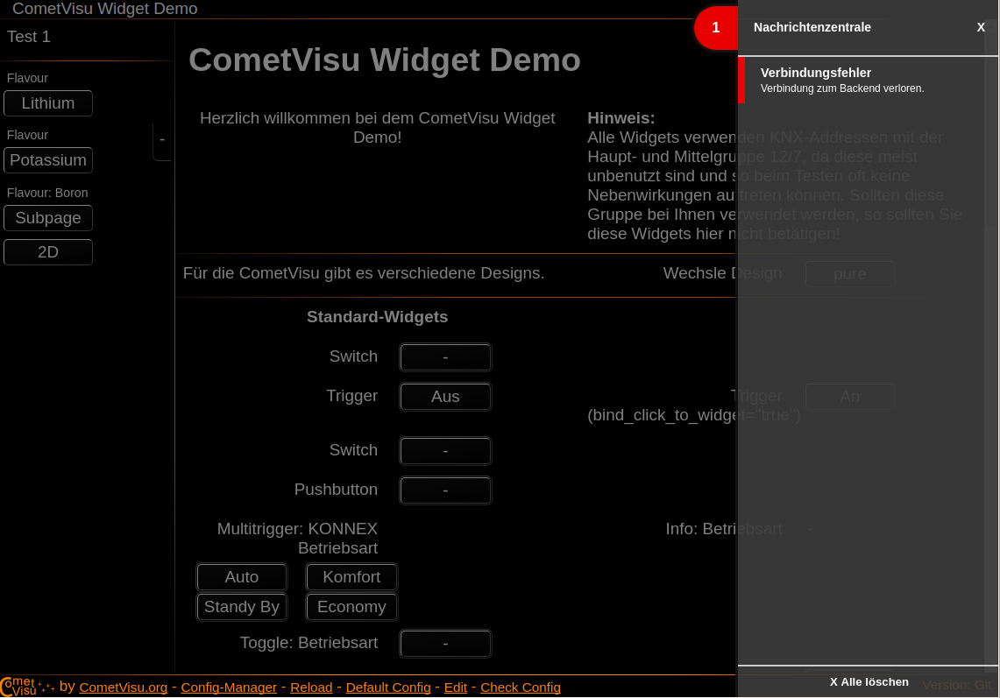

****************************
Information for developers
****************************

This page provides an introduction to the internal context and background of CometVisu and is aimed primarily at developers.

Basics of the software
-----------------------

CometVisu has been built on the `Qooxdoo framework <http://www.qooxdoo.org>`__
since version 0.11. The Qooxdoo Framework offers its own object-oriented class
system (including advanced features such as: interface mixins, class separator,
singletons, simple type-checks for properties, etc.) with which a complex yet
structured software system can be built.

It also provides a full toolchain (Qooxdoo generator) that automatically
resolves class dependencies and builds either developer versions (source
version) or releases (build versions).

Differences in the Javascript support of the different browsers are
automatically compensated and the generator creates different build
versions for the 4 most important browser engines for the releases.

Other Qooxdoo features that CometVisu uses:

*   `Parts <http://www.qooxdoo.org/current/pages/development/parts_using.html>`__:
    Parts of the code that are not always needed are offloaded to *Parts*,
    which are reloaded when needed. The CometVisu uses this for plugins
    and widget packages (although there is currently only the *Pure* widget
    package, others are possible).

Since the CometVisu provides its own widgets including layout and
CSS-based design, the complete UI part of Qooxdoo is not used.
This provides its own layout manager and widgets with non-CSS-based
design. However, it would be possible to implement a new Qooxdoo-UI
based widget package, which can be used in parallel.

Start Behavior
--------------

The process of loading the Visu runs according to the CometVisu
protocol in the following steps:

.. uml::
    :caption: Start communication between CometVisu and backend
    :align: center

    autonumber

    CometVisu -> Backend: Load configuration file
    Backend -> CometVisu: Send configuration file with optional headers
    CometVisu -> Backend: Login
    Backend -> CometVisu: Confirmation of the login with optional backend configuration
    CometVisu -> Backend: Read values from the backend

#.  Loading the configuration file ``visu_config*.xml``
#.  The server can deliver this file with 2 optional headers
    that provide the CometVisu with more information about the backend:

    * ``X-CometVisu-Backend-Name``: The name of the backend to use.
    * ``X-CometVisu-Backend-KNXD-Url``: URL of the knxd login resource
    * ``X-CometVisu-Backend-MQTT-Url``: URL of the MQTT login resource
    * ``X-CometVisu-Backend-ioBroker-Url``: URL of the ioBroker websocket API
    * ``X-CometVisu-Backend-OpenHAB-Url``: Only openHAB: path to the REST-API      
    * ``X-CometVisu-Backend-LoginUrl``: Deprecated: Path under which the client can log in.

#.  The CometVisu authenticates itself at the backend (at present
    no backend implements a real authentication)
#.  The backend confirms the authentication and returns information
    as JSON:

    ``v``: Is the protocol version

    ``s``: Session ID

    ``c``: The optional backend configuration

    .. code-block:: json

        {
            "v":"0.0.1",
            "s":"0",
            "c": {
                "name":"openhab2",
                "transport":"sse",
                "baseURL":"/rest/cv/",
                "resources": {
                    "read":"r",
                    "rrd":"rrdfetch",
                    "write":"w"
                }
            }
        }
#.  The CometVisu starts to query the values from the backend,
    initially all necessary values and in the second step only
    changes of the values are listened to.

Transport layers
----------------

The transport layers are responsible for communication between CometVisu
and the backend from the moment of the successful login. The main task
is to retrieve values from the backend (read request) and send value
changes to the backend (write request).

Currently CometVisu supports two different transport layers:

* :ref:`Long polling <long-polling>`: is used by the default backend
* :ref:`Server sent events <sse>`: is used by the openHAB backend

.. toctree::

    transport/long-polling
    transport/sse

Caching
-------

The CometVisu uses its own caching mechanisms to accelerate the
initial loading. Most of the time is needed to load the XML
configuration file from the server, then parse it and generate
the HTML code that represents the actual Visu in the browser.

Since the content of the configuration file usually rarely
changes, it is wise to not reloading and parsing it each time.
Therefore, after the first parsing, the generated HTML and the
internal data structures are stored in the *LocalStorage* of
the browser. The next time the Visu is loaded, this data is read
out and the interface is displayed immediately. Only then the Visu
asks the configuration file from the server and compares whether
there has been changes. If this is not the case, the currently
loaded file is discarded, otherwise the parse and save process
is performed again and the data from the cache is discarded.

Caching can be influenced by the URL parameter :ref:`enableCache`.

The Notification Router
-----------------------

There is an internal ``NotificationRouter`` which is used for
different purposes. The main function of this router is to receive
messages and forward them to the right recipient. Possible
receivers are e.g. the ``NotificationCenter`` and the
``PopupHandler``. Both then take care of displaying the message,
either in the message center (which appears on the right and
displays a list of messages) or as a pop-up.

A message always has a *Topic*, which serves the thematic
assignment, a title, text and various configuration options.

The following *Topics* are currently used:

* ``cv.error``: generic errors
* ``cv.config.error``: Errors that occurred while reading in the config file
* ``cv.state.*``: Namespace for all in the :ref:`notifications <notifications>` messages used

A message receiver (``NotificationHandler``) can now register for one or more such topics:

.. code-block:: javascript

    cv.core.notifications.Router.getInstance().registerMessageHandler(this, {
        'cv.config.error': {
            type: "error",
            icon: "message_attention"
        },
        'cv.error': {
           type: "error",
           icon: "message_attention"
        }
    });

Wildcards are also possible:

.. code-block:: javascript

    cv.core.notifications.Router.getInstance().registerMessageHandler(this, {
        'cv.*': {}
    });

Error handling
--------------

The NotificationRouter is also used to display all uncaught errors during the
runtime of the Visu. These errors appear as a pop-up and allow the user to
directly open an issue on Github with a pre-filled form containing the most
important information. This feature is only active in the build versions
(including the releases), and during development, the errors continue to
be displayed on the Javascript console of the browser.

Further errors, depending on the type, are displayed either as a pop-up or
as a message in the message center. An important example would be connection
problems with the backend. These are displayed as long as the problem
persists and disappear automatically once the problem is resolved.

.. figure:: _static/noticenter_hidden.png
    :scale: 70%
    :align: center

    Closed messaging center with a critical error message

    Open news center with a critical error message

The ``NotificationRouter`` is also used for the
:ref:`notifications <notifications>`.
