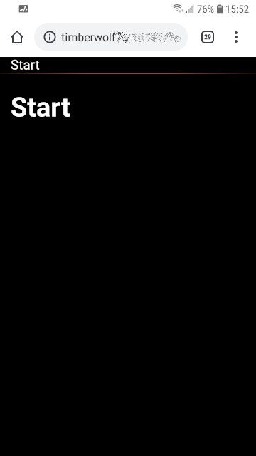
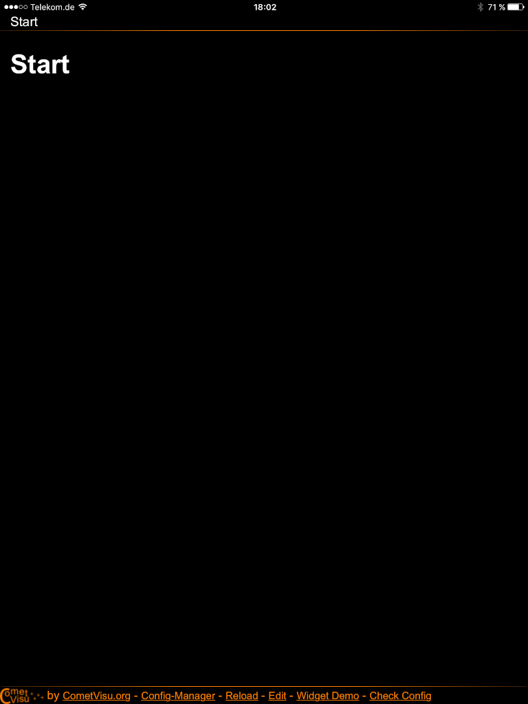

****************
CometVisu as app
****************

Background
==========

To be able to use the CometVisu comfortably on mobile devices it can be added
to the device similarly like an app out of the app store.

Android
=======

To add the CometVisu on an Android based system a few simple steps are necessary:

Open CometVisu
--------------

As a first step the CometVisu must be opened in the browser:

    CometVisu in the browser (Chrome)

Browser menu
------------

When the desired configuration and page is shown in the browser menu (⋮) the
entry "Add to Home screen" must be selected:

.. figure:: _static/app_android_browser_menu.png

    Browser menu

App name
--------

The name of the App on the Home screen can then be given in the dialog window:

.. figure:: _static/app_android_dialog1.png

    Dialog to choose the App name

Confirmation
------------

With "OK" the final confirmation is done:

.. figure:: _static/app_android_dialog2.png

    Confirmation dialog

Home screen
-----------

When successful the Home screen shows the App to access the CometVisu:

.. figure:: _static/app_android_homescreen.png

    Home screen with CometVisu App

App
---

When the App was launched by this icon the chosen configuration and page is
shown. Also the full screen is used as the address bar of the browser is not
displayed anymore:

.. figure:: _static/app_android_final.png

    CometVisu when started as an App - without the address bar

Apple iOS devices
=================

To add the CometVisu on an iOS based system like an iPhone or iPad a few simple
steps are necessary:

Open CometVisu
--------------

As a first step the CometVisu must be opened in the browser:

.. figure:: _static/app_ios_browser.png

    CometVisu in the browser (Safari)

Browser menu
------------

When the desired configuration and page is shown in the browser menu the
entry "Add to Home Screen" must be selected:

.. figure:: _static/app_ios_browser_menu.png

    Browser menu

App name
--------

The name of the App on the Home Screen can then be given in the dialog window:

.. figure:: _static/app_ios_dialog.png

    Dialog to choose the App name

Home Screen
-----------

When successful the Home Screen shows the App to access the CometVisu:

.. figure:: _static/app_ios_homescreen.png

    Home Screen with CometVisu App

App
---

When the App was launched by this icon the chosen configuration and page is
shown. Also the full screen is used as the address bar of the browser is not
displayed anymore:

    CometVisu when started as an App - without the address bar

