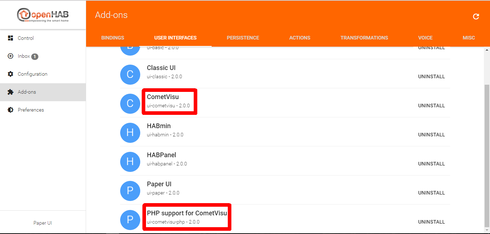

Installation on a Debian System with openHAB2
=============================================

Overview
--------

For the operation of CometVisu with openHAB the following things are needed:

1.  Server with working openHAB installation (all examples refer to
    an openHAB installation on a Debian based system via the supplied
    package manager ``apt``, with other distributions the paths used
    in this manual may have to be adapted.
2.  An unpacked release of CometVisu on the server
3.  The openHAB extension *CometVisu*
4.  The openHAB extension *PHP support for CometVisu*, if the editor
    of the CometVisu is to be used
5.  The configuration option ``webFolder`` with the path to CometVisu

.. HINT::

    There is no additional web server, such as Apache or similar needed
    with PHP support installed. The above points are all that is necessary
    for successful startup.

It is assumed that point 1 has already been met and only the following
points are discussed below.

2. CometVisu Installation on the Server
---------------------------------------

The CometVisu can be downloaded here:
https://github.com/CometVisu/CometVisu/releases. The unpacked package
contains the folder *cometvisu/release*, which must be copied to
the server in the following path */var/www/cometvisu*. In
addition, appropriate rights must still be set for the openHAB user
and some configuration directories must be created.

All this can be done by the following console commands:

.. code-block:: console

    # Copy the release directory to the right place
    cp -r cometvisu/release /var/www/cometvisu

    # Customize user rights for openHAB
    chown -R openhab:openhab /var/www/cometvisu

    # Customize configuration directories
    mkdir -p /etc/openhab2/cometvisu/resource/config
    mkdir -p /etc/openhab2/cometvisu/resource/designs

    # Customize user rights for openHAB
    chown -R openhab:openhab /etc/openhab2/cometvisu

The two directories */etc/openhab2/cometvisu/resource/config* and
*/etc/openhab2/cometvisu/resource/designs* will contain the CometVisu
configurations and are protected from upgrades by the separate
location. Only if these directories are not present, CometVisu
will search the configuration in */var/www/cometvisu/resource/config*.

3.-5. openHAB Configuration
---------------------------

So that openHAB can communicate with the CometVisu, the
corresponding extension is to be installed via the PaperUI
(http: // openhab_address: 8080) -> Add-ons -> User
Interfaces -> CometVisu. If you also want to use the CometVisu
editor, install the extension *PHP support for CometVisu*.

   PaperUI - Add-ons - User Interfaces

The openHAB configuration file cometvisu.cfg, like all other
configurations of the openHAB extensions, is located under
*/etc/openhab2/services/* and should contain the following entries:

.. code-block:: ini

    # Path on the server where the CometVisu is located
    webFolder=/var/www/cometvisu/

    # Relative path in the browser under which the CometVisu should be accessible
    webAlias=/cometvisu

The CometVisu can then be reached directly under the URL
``http://openhab_address:8080/cometvisu/?Config = <name>`` in
the browser, where ``<name>`` is the name of
the ``visu_config_ <name> Derives .xml``.
