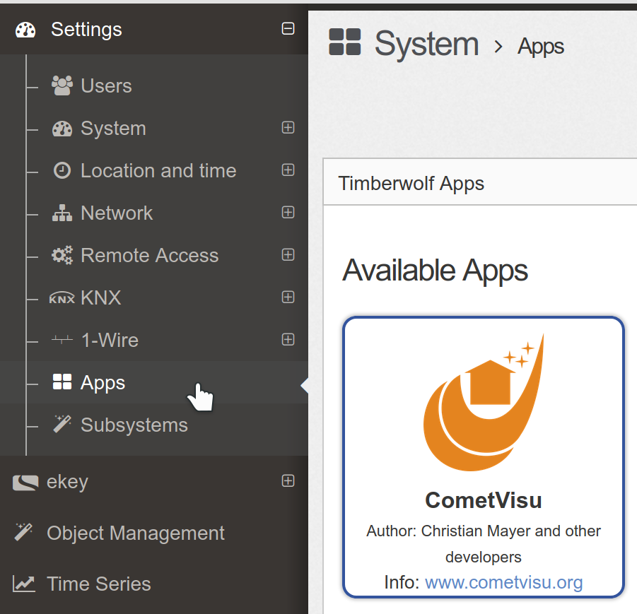
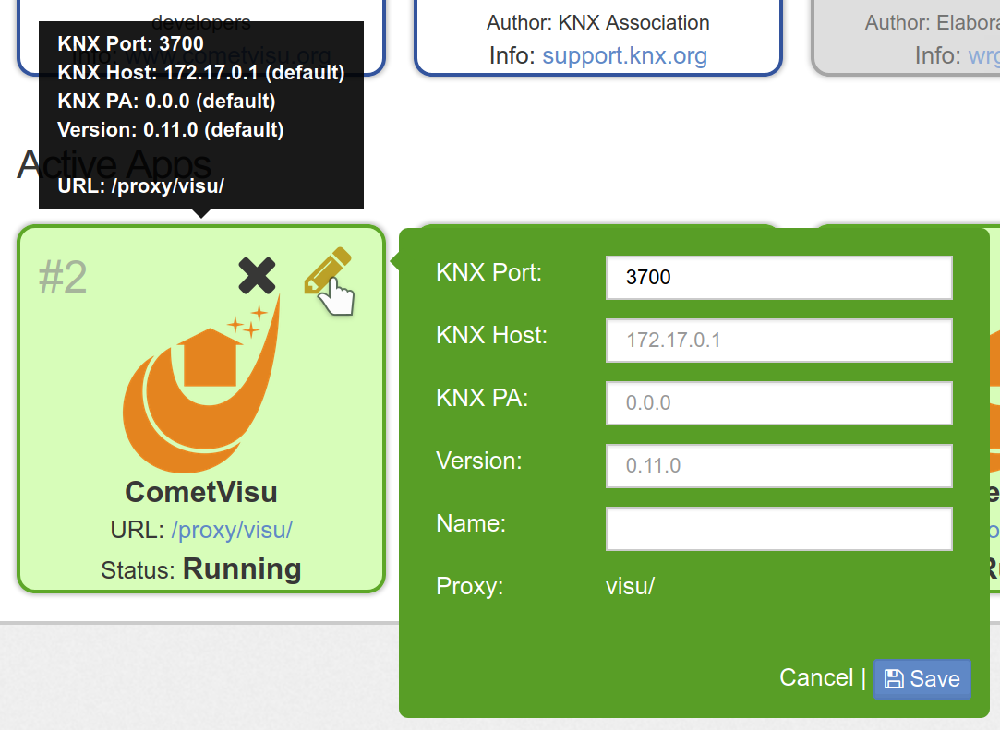
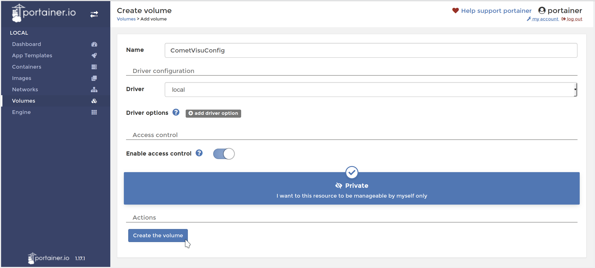
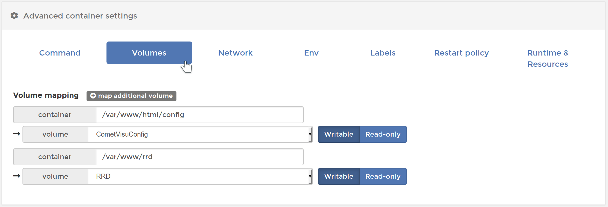
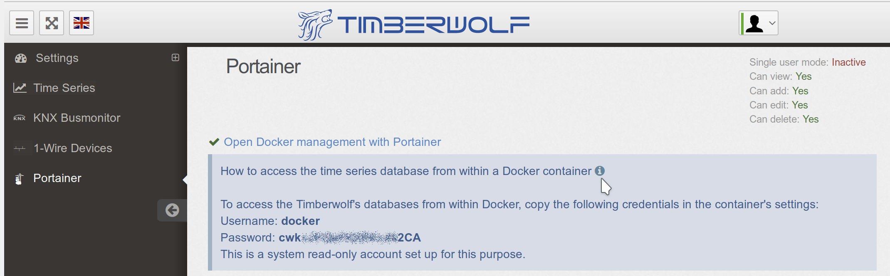
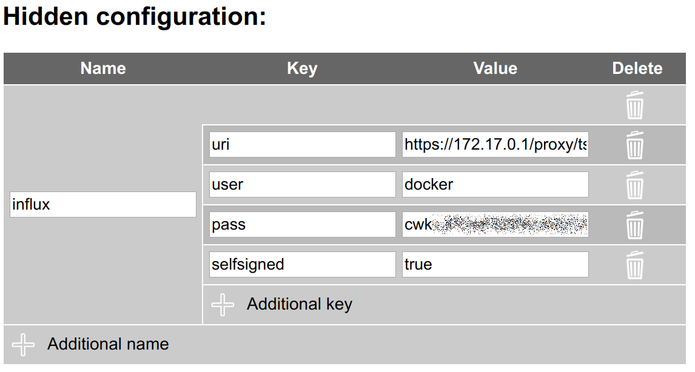
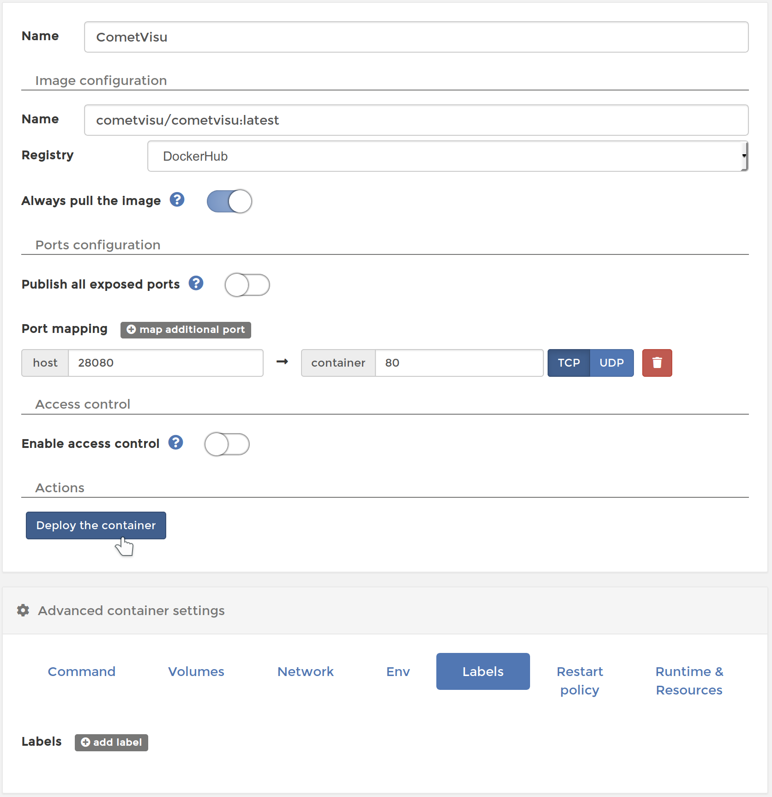

.. _timberwolf:

Installation on the Timberwolf server with the app
==================================================

The easiest way to install the CometVisu on the `Timberwolf <https://wiregate.de/>`__-Server is by using the
supplied app.

   Selection of the CometVisu app on the Timberwolf user interface

When it was installed by clicking on the green "+" the CometVisu will be listed on the "active apps" section.
Behind "URL" is the link shown that can be used to directly access the CometVisu.

Update
------

   Installed CometVisu app

The app can be configured by using the pen symbol. Most important is the row "Version". The version number given
there will be installed. By changing this number it is possible to switch to this version number.

Installation on the Timberwolf with Portainer
=============================================

The advanced method to install the CometVisu on the Timberwolf server (only necessary in rare occasions, the
installation by app is recommended) is to use the Docker administration interface `Portainer<https://portainer.io/>`.
This instruction can be used mostly also for other systems that are based on Docker and Portainer.

Installation
------------

With this tutorial the CometVisu will be available on the Timberwolf
server via HTTPS under the address ``https://<my timberwolf>/proxy/visu/``.

Basically, these steps are also suitable as a reference for installations
via portainer on other systems, but the steps must be adapted
in detail, as there usually no proxy is available, which makes
the CometVisu accessible via HTTPS.

Create Volumes
^^^^^^^^^^^^^^

Volume for Config Files
"""""""""""""""""""""""

First, create a volume to store the configuration files and
keep them while rebooting and updating the container.

Necessary steps are: *Volumes* → *Add Volume* → Name:
``CometVisuConfig`` → *Create the Volume*

   Create Volume with Portainer

This volume can be filled from the outside with the config
files or best by using the :ref:`Config-Manager <manager>`.

Volume for RRD
""""""""""""""

This step is optional and only necessary if you want to use the
:ref:`Diagram Plugin <diagram>` with RRD files. When using the
InfluxDB this step can be skipped.

The steps for creating the *Volume for Config Files* must
be repeated, but the name ``CometVisuRRD`` is hereby meaningfully chosen.
The filling of this container must be external, e.g. by
another container that simultaneously incorporates this RRD container.

**Important:** The internal format of the RRD files is architecture specific.
Thus, the RRG files from WireGate (32 bit architecture) can not be
used directly on the Timberwolf (64 bit architecture) [1].

Creating a Container
^^^^^^^^^^^^^^^^^^^^

Under: *Containers* → *Add Container*

- Name: ``CometVisu``
- Image configuration: Name: ``cometvisu/cometvisu:latest`` for the big servers
  (TWS2xxx) or ``cometvisu/cometvisu:latest-arm`` for the rail mounted smaller
  servers
- Port mapping: host ``18080``, container ``80``
- Advanced container settings:

  - Volumes: Volume mapping

    - ``container``: ``/var/www/html/config`` ⭢ ``volume``: ``CometVisuConfig`` *(bis einschließlich Version 0.10.2)*
    - ``container``: ``/var/www/html/resource/config`` ⭢ ``volume``: ``CometVisuConfig`` *(ab Version 0.11)*
    - ``container``: ``/var/www/rrd`` ⭢ ``volume``: ``RRD`` *(Optional, wenn RRD genutzt werden soll)*

  - Env: Environment variables

    - ``name``: ``CGI_URL_PATH`` with ``value``: ``/proxy/visu/cgi-bin/``
    - Depending on the local environment, additional customizations may
      be required, as specified in the section of the
      :ref:`Docker Container <dockerenvironment>`.

      So it may be necessary to set a value for ``KNX_PA`` other than the
      default ``1.1.238`` if this physical address is already occupied
      or if another line is to be used as ``1.1``.

      It is also important that the port of the KNX interface is correct. At the
      Timberwolf it can be looked up at *Settings* → *KNX* → *Interfaced*:

      .. figure:: _static/timberwolf_knx_port.png
          :scale: 50 %

      Should it be different to the default of ``3700`` then the environment
      variable ``KNX_INTERFACE`` should be changed accordingly, in this
      example to ``iptn:172.17.0.1:3674``.

  - Restart policy: ``Unless stopped``

.. figure:: _static/portainer_container_add.png
   :scale: 50 %

   Create Container at Portainer

   Configure Container *Volumes* at Portainer

.. figure:: _static/portainer_container_env_add.png
   :scale: 50 %

   Configure Container *Env* at Portainer

.. figure:: _static/portainer_container_restart_add.png
   :scale: 50 %

   Configure Container *Restart policy* at Portainer

Then create the container by pressing *Deploy the container*.

Proxy setup
^^^^^^^^^^^

At the Timberwolf Frontend:
*Settings* → *Remote Access* → *Reverse Proxy*

- URL: ``visu/``, Target ``http://127.0.0.1:18080/``

Accept with *Add*

.. figure:: _static/timberwolf_proxy_add.png
   :scale: 50 %

   Add Timberwolf Proxy-Entry

CometVisu is now available: ``https://<mein timberwolf>/proxy/visu/``

InfluxDB access
^^^^^^^^^^^^^^^

.. HINT::
  The InfluxDB access as well as the hidden config was introduced with
  version 0.11.0 and isn't available in earlier versions.

To access the time series in the InfluxDB its credentials must be added to the
:ref:`hidden configuration <hidden-config>` of the :ref:`manager <manager>`.
To get them you must click at the Timberwolf server in the *Portainer*
menu on the ``i`` after the line *"How to access the time series database from
within a Docker container"* and note the Username and Password.

   Timberwolf InfluxDB credentials

In the :ref:`hidden configuration <hidden-config>` of the
:ref:`manager <manager>` you must create an entry with the properties:

- Name: ``influx``
- Key and value:

  - ``uri``: ``https://172.17.0.1/proxy/ts/query`` (Should you have not followed
    this manual and used a different network setting you might need to change
    here the IP address accordingly)
  - ``user``: Username from the credentials
  - ``pass``: Password from the credentials
  - ``selfsigned``: ``true``

   Timberwolf InfluxDB credentials in the manager

Updates
-------

Replace Container
^^^^^^^^^^^^^^^^^

Under *Containers* → ``CometVisu`` pressing the button *Duplicate / Edit*
to invoked the menu for refreshing the container.

Here's to make sure *Always pull the image* is active.

Under *Advanced container settings* → *Labels* the labels should
be deleted in order to be able to recognize later which CometVisu
container version is installed.

If you want to change from version 0.10.2 to a version from the 0.11
series, then under *Volumes* the config path from
``/var/www/html/config`` to ``/var/www/html/resource/config``.

*Actions* → *Deploy the Container*  will now replace the container
with the latest version.

   Replace Container at Portainer with a new version

Afterwards the security question has to be confirmed.

.. figure:: _static/portainer_container_replace_confirm.png

   Confirmation to replace the container at portainer with a new version

Cleanup
^^^^^^^

When a container is replaced with a new one, the old one remains as
*Unused* in the system and continues to occupy space. This can
be deleted under *Images*.

By marking the image to be deleted (recognizable by the label
*Unused* and the corresponding tag) the image can be removed with *Remove*.

.. figure:: _static/portainer_image_remove.png
   :scale: 50 %

   Portainer Dialog to remove an image

Development version
-------------------

Basically, the same steps as for the release have to be carried
out for the current development version. Although theoretically
the same configuration volume can be used as for the productive
version, a separate volume (for example ``CometVisuTestConfig``)
should be created, as the format of the config files may change
incompatibly due to future updates.

As described under :ref:`Docker <docker>` has the newest
Development version the day ``testing``. Thus, under
*Creating the container* as ``name`` ``cometvisu/cometvisu:testing``
or ``cometvisu/cometvisu:testing-arm`` to use.

In order to have a uniform environment for error reporting, etc.
the testing version should be installed with these parameters:

- Container:

  - Name: ``CometVisuTest``
  - Image configuration: Name: ``cometvisu/cometvisu:testing`` or ``cometvisu/cometvisu:testing-arm``
  - Port mapping: host ``28080``, container ``80``
  - Advanced container settings:

    - Volumes: Volume mapping

      - ``container``: ``/var/www/html/resource/config`` ⭢ ``volume``: ``CometVisuTestConfig``
      - ``container``: ``/var/www/rrd`` ⭢ ``volume``: ``RRD`` *(Optional)*

    - Env: Environment variables ``name``: ``CGI_URL_PATH`` with ``value``: ``/proxy/visutest/cgi-bin/``

- Proxy:

  - URL: ``visutest``, Target ``http://127.0.0.1:28080/``

----

.. [1]
  In order to transfer the contents of an RRD file ``RRD_Name``
  from one architecture to another, the command has to be
  executed on the source system (eg, WireGate)

  .. code-block:: bash

     rrdtool dump /var/www/rrd/RRD_Name.rrd > RRD_Name.xml

  On the target system (for example, a container on the Timber Wolf)
  is then the command

  .. code-block:: bash

     rrdtool restore -f RRD_Name.xml RRD_Name.rrd

  executed to create a new RRD-File.

  If you work with a localization on the source system that
  uses numbers with a comma as the decimal separator
  (as usual in German), then it may be that the RRD export is
  done with a comma instead of a point and thus the import fails.
  Here export would then be performed with generic ``LANG=C``.

  To convert a larger amount of RRD files this can be done
  through a loop:

  .. code-block:: bash

     LANG=C; for f in *.rrd; do rrdtool dump ${f} > ${f}.xml; done

  or

  .. code-block:: bash

     for f in *.xml; do rrdtool restore ${f} ${f}.rrd; done
