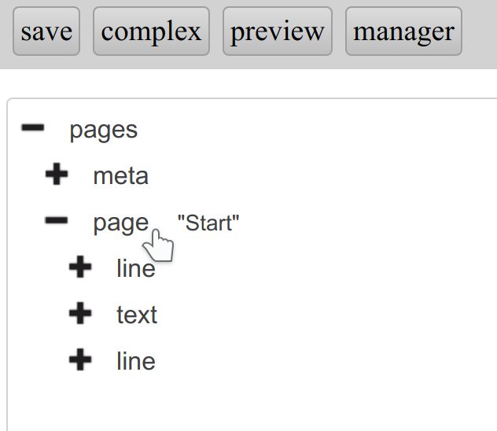
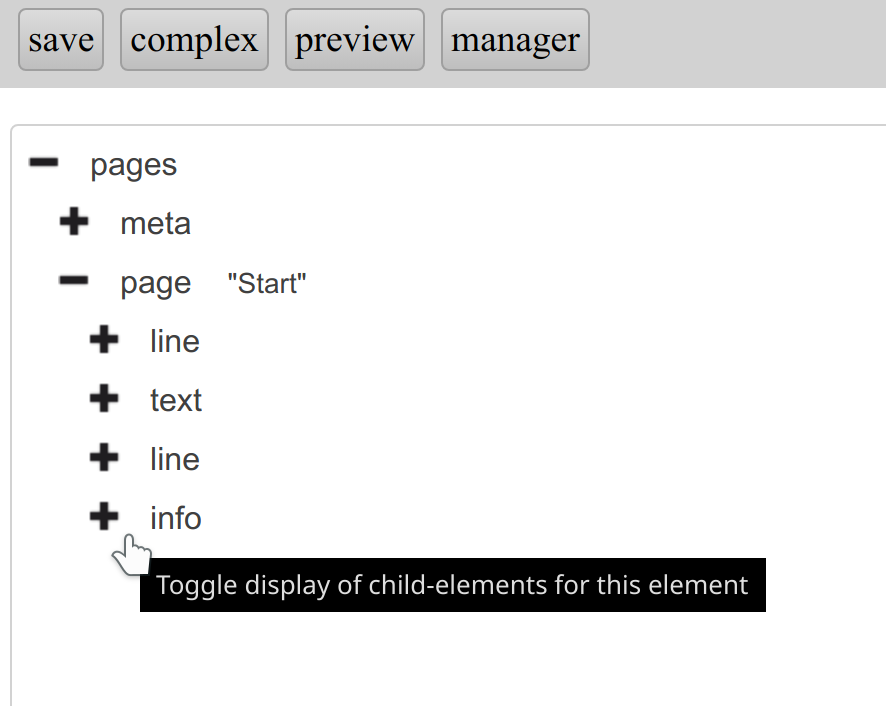
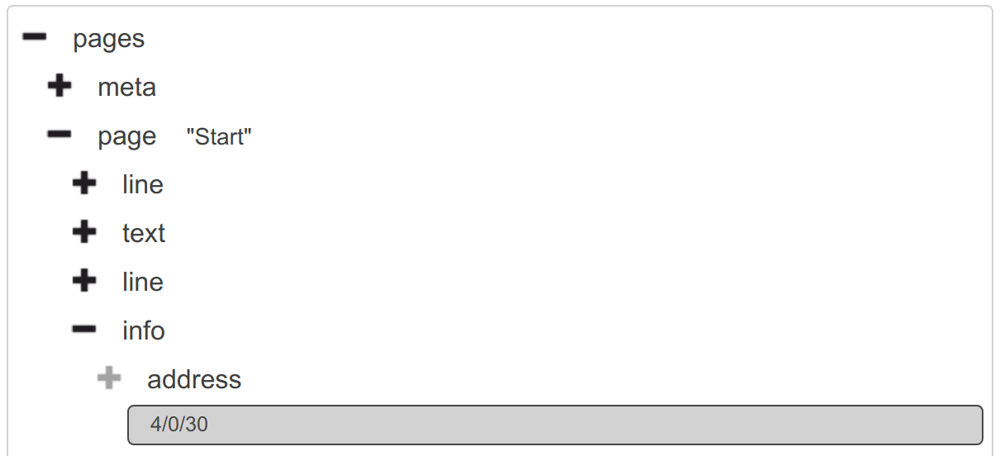
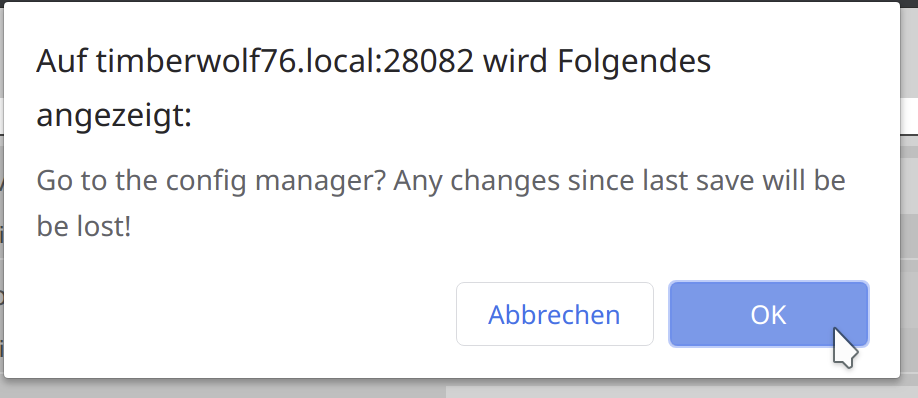

Tutorial: First steps - a visu in half a minute
===============================================

This tutorial shows how to create a first (quite simple, though) visualisation
within half a minute.

Video
-----

.. raw:: html

    

      <iframe width="560" height="315" src="https://www.youtube-nocookie.com/embed/YK86XVVkfDk" style="position:absolute;width:100%;height:100%" frameborder="0" allow="accelerometer; autoplay; encrypted-media; gyroscope; picture-in-picture" allowfullscreen></iframe>
    

Single steps
------------

The actions shown in the video are repeated here step by step.
As an example the visu will contain a heating control for the living room that
is defined by:

========= ====== =========
Value     GA     Datatype
========= ====== =========
Current   4/0/30 DPT:9.001
Target    3/3/30 DPT:9.001
========= ====== =========

.. IMPORTANT::

  It is highly unlikely that your own smart home installation will use the same
  addresses as this tutorial. Please check and change the addresses accordingly
  when you are repeating this tutorial for your self!

First visu - in less than half a minute
~~~~~~~~~~~~~~~~~~~~~~~~~~~~~~~~~~~~~~~

.. spelling::

    Editieren
    Wohnzimmertemperatur
    wärmer
    kälter
    Öffnen

At the :ref:`manager <manager>` "Editieren" of the default config has to be
chosen:

.. figure:: _static/first_steps01.png
   :scale: 50 %

Left click on the "+" in front of ``pages`` shows the child elements:

.. figure:: _static/first_steps02.png
   :scale: 50 %

A right click at ``page "Start"``...

... shows the context menu there:

.. figure:: _static/first_steps04.png
   :scale: 50 %

A left click on ``add child`` shows the menu to insert a child element.

Select in this menu the :ref:`info widget <info>`...

.. figure:: _static/first_steps05.png
   :scale: 50 %

... and add the info widget by "+" as child element to the
:ref:`page <page>` "Start":

.. figure:: _static/first_steps06.png
   :scale: 50 %

Left click on the "+" in front of ``info``...

... to show the pre-created ``address``-element:

.. figure:: _static/first_steps08.png
   :scale: 50 %

Insert the address (GA) for the current temperature (4/0/30)...

.. figure:: _static/first_steps09.png
   :scale: 50 %

... and confirm with enter:

By left clicking on ``address``...

.. figure:: _static/first_steps11.png
   :scale: 50 %

... the attribute menu for the ``address`` element will appear on the right
of the element tree:

.. figure:: _static/first_steps12.png
   :scale: 50 %

At ``transform`` the data type ``DPT:9.001`` has to be inserted:

.. figure:: _static/first_steps13.png
   :scale: 50 %

With "preview" the current state of the config can be shown and tested:

.. figure:: _static/first_steps14.png
   :scale: 50 %

As shown in the video the first visu was created within 23 seconds, although
it's still very basic.

Whey your installation matches the tutorial addresses (or you exchanged the GA
as it was recommended early on) you should be able to see the temperature:

.. figure:: _static/first_steps15.png
   :scale: 50 %

Clicking again on "preview" you'll come back to the editor:

.. figure:: _static/first_steps16.png
   :scale: 50 %

Refinement
~~~~~~~~~~

To come from a simple number to a usable visualisation it should be extended
a bit. As a first step the shown number will be enhanced to display one
digit after the decimal point as well as the unit "°C".

After a left click at ``info``...

.. figure:: _static/first_steps17.png
   :scale: 50 %

... the attribute :ref:`format <format>`...

.. figure:: _static/first_steps18.png
   :scale: 50 %

... has to be filled with the value ``%.1f °C``:

.. figure:: _static/first_steps19.png
   :scale: 50 %

For displaying a description a ``label`` has to be added.

Right click at ``info`` and left clicking at ``add child``...

.. figure:: _static/first_steps20.png
   :scale: 50 %

... allows to add the ``label`` element:

.. figure:: _static/first_steps21.png
   :scale: 50 %

In the element tree a ``#text`` element is required below the ``label``:

.. figure:: _static/first_steps22.png
   :scale: 50 %

This has to be filled with the label for the info widget, in this tutorial
with "Wohnzimmertemperatur", the German word for "living room temperature":

.. figure:: _static/first_steps23.png
   :scale: 50 %

To be able to adjust the target temperature an
:ref:`infotrigger widget <infotrigger>` has to be added to the ``page "Start"``:

.. figure:: _static/first_steps24.png
   :scale: 50 %

This must be linked to the ``address``, in this tutorial the ``3/3/30``:

.. figure:: _static/first_steps25.png
   :scale: 50 %

The data type for the ``transform`` attribute is again ``DPT:9.001``:

.. figure:: _static/first_steps26.png
   :scale: 50 %

The attributes of the ``infotrigger`` itself must be filled with:

============= ============ ==============================================
Attribute     Value        Meaning
============= ============ ==============================================
``upvalue``   ``0.5``      temperature change for up or rather "wärmer"
``downvalue`` ``-0.5``     temperature change for down or rather "kälter"
``uplabel``   ``wärmer``   button label for up ("warmer")
``downlabel`` ``kälter``   button label for down ("colder")
``change``    ``absolute`` direct ("absolute") change of the value
``format``    ``%.1f °C``  one decimal digit with attached " °C"
============= ============ ==============================================

.. figure:: _static/first_steps27.png
   :scale: 50 %

Finally adding the label to the widget:

.. figure:: _static/first_steps28.png
   :scale: 50 %

By ``save``...

.. figure:: _static/first_steps29.png
   :scale: 50 %

... the configuration will be saved:

.. figure:: _static/first_steps30.png
   :scale: 50 %

Back to the ``manager``...

.. figure:: _static/first_steps31.png
   :scale: 50 %

... a warning is shown that the last changes will get lost. This isn't relevant
in our case as all changes were saved by us immediately before:

At the manager does "Öffnen"...

.. figure:: _static/first_steps33.png
   :scale: 50 %

... open the final visualisation in the browser:

.. figure:: _static/first_steps34.png
   :scale: 50 %
